# РОССИЙСКИЙУНИВЕРСИТЕТДРУЖБЫНАРОДОВ

Факультетфизикоматематическихиестественныхнаук

Кафедраприкладнойинформатикиитеориивероятностей

ОТЧЕТ

ПОЛАБОРАТОРНОЙРАБОТЕNo 1 дисциплина: Архитектуракомпьютера

### Студент: Ромеро Гаспар Фернандо Алексей

### Группа: НКАбд-02-25

```text
МОСКВА
2026г.
```

---

## Оглавление

1. Цельзаботы
2. Теоретическоевведение

> 2.1.Командаdmesg
> 2.2.Утилитаgrep
> 2.3.Система Linuxиеекомпоненты

> •Ядро Linux
> •Процессориегохарактеристики
> •Оперативнаяпамять
> •Гипервизоры
> •Файловыесистемы

> 2.4.Fedora Linux
> 2.5.Virtual Box

3. Выполнениелабораторнойработы

3.1.Анализпоследовательностизагрузкисистемыспомощьюdmesg

> •Версияядра Linux
> •Частотапроцессора
> •Модельпроцессора
> •Объёмдоступнойоперативнойпамяти
> •Типобнаруженногогипервизора
> •Типфайловойсистемыкорневогораздела
> •Последовательностьмонтированияфайловыхсистем

4. Выполнениесамостоятельнойработы

### 4.1.Ответынаконтрольныевопросы

•Информацияопользовательскойучетнойзаписи •Терминальныекомандыипримерыихприменения •Настройкафайловойсистемы •Просмотрподключенныхфайловыхсистем •Завершениезаблокированногопроцесса

5. Выводы
6. Списоклитературы

---

## Цельработы

Целью данной лабораторной работы является ознакомлениеспроцессом загрузки операционной системы Linux иполучение информации об аппаратных исистемных характеристиках компьютера спомощью команды dmesg. Входе работы необходимо научиться анализировать последовательность загрузки системы, извлекать информациюо версии ядра, частотеимодели процессора, объёме доступной оперативной памяти, типе гипервизора, типефайловойсистемыкорневогоразделаипоследовательностимонтирования файловыхсистем. Крометого, требуется закрепитьнавыкиработыскомандамитерминалаи утилитой grep для фильтрации выводов. Также необходимо ответить на контрольные вопросы, касающиеся учётных записей пользователей, файловых систем иуправления процессамив Linux.

---

## Теоретическоевведение

Вданномразделепредставленыосновныеконцепции, необходимыедляпонимания

работыкомандикомпонентов Linuxсистемы, которыерассматриваютсяврамках лабораторнойработы. Приэтомиспользуется среда Fedora Linux, запущеннаяна Oracle VM Virtual Box.

## 2.1 Командаdmesg

Команда dmesg (сокращение от display message «отобразить сообщение») применяется для анализа или управления кольцевым буфером ядра системы. Этот буфер представляет собой область памяти, где ядро хранит все диагностические сообщения, созданные смомента запуска системы. Содержащаяся влогах информация включает сведенияопроцессе загрузки, обнаружении аппаратных устройств, загрузке драйверови любыхдругихсобытиях, происходящихнауровнеядра. Привыполнениикомандыdmesgбез параметров отображается весь содержимое буфера. Для простоты анализа обычно используются такие инструменты, как less для постраничного отображения или grep для фильтрацииопределенныхстрок, чтопозволяетизолироватьсоответствующуюинформацию, например, оверсииядраилидоступнойпамяти.

## 2.2 Использоватьgrep

Команда dmesg (сокращение от display message «отобразить сообщение») применяется для анализа или управления кольцевым буфером ядра системы. Этот буфер представляет собой область памяти, где ядро хранит все диагностические сообщения, созданные смомента запуска системы. Содержащаяся влогах информация включает сведенияопроцессе загрузки, обнаружении аппаратных устройств, загрузке драйверови любыхдругихсобытиях, происходящихнауровнеядра. Привыполнениикомандыdmesgбез параметров отображается весь содержимое буфера. Для простоты анализа обычно используются такие инструменты, как less для постраничного отображения или grep для фильтрацииопределенныхстрок, чтопозволяетизолироватьсоответствующуюинформацию, например, оверсииядраилидоступнойпамяти.

### 2.3 Система Linuxиеекомпоненты

---

Linuxэто семейство открытых операционных систем, основанных на ядре Linux.

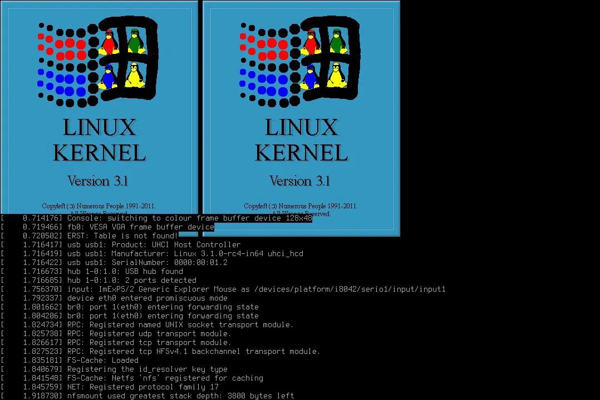

Дляанализаданнойпрактикикрайневажнопониматьключевыекомпонентыэтойсистемы

## 2.3.1 Ядро Linux


Ядро (kernel) это ключевой компонент операционной системы. Оно служит связующимзвеноммеждупрограммнымиаппаратным обеспечением, управляя системными ресурсами, такими как память, процессыиустройства вводавывода. При запуске системы ядро первым загружаетсявпамятьиостается там до завершения работы. Информацияо версии ядраодно из первых сообщений, которое появляется при выполнении команды dmesg. Fedora использует актуальные иобновленные ядра, что обеспечивает широкую совместимостьссовременнымоборудованием.

---

## 2.3.2 Процессориегохарактеристики

Процессор (CPU) отвечает за выполнение программных инструкций. Важная информацияопроцессоре, включая его модель, архитектуруитактовую частоту, доступна системе через файлы, такие как /proc/cpuinfo. Тактовая частота определяет скорость выполнения инструкций, амодельиархитектуравозможностиинабор поддерживаемых инструкций. Получениеэтихданныходнаизключевыхзадачданнойпрактики.

ВVirtual Box возможности процессора могут быть ограничены взависимости от

конфигурациивиртуальноймашины.

## 2.3.3 Оперативнаяпамять

Оперативная память (Random Access Memory, RAM) это энергозависимое хранилище, используемое системой для выполнения программ иобработки активных данных. Ядро Linux осуществляет сложное управление памятью, задействуя такие механизмы, как виртуальная память. Файл /proc/meminfo предоставляет подробную статистику по использованию памяти, втом числе общий объем доступной памяти (Mem Total). Эта информация критически важна для оценки производительности системы. В Virtual Box объем оперативной памяти, выделенный виртуальной машине, можно настроить, ионнапрямуювлияетнавыводданногокомандногозапроса.

## 2.3.4 Гипервизоры

Гипервизор это программный слой, обеспечивающий создание изапуск виртуальныхмашин. Онформируетвиртуальную среду, имитирующуюреальное аппаратное обеспечение, что позволяет запускать несколькооперационныхсистем наодномфизическом компьютере. KVM (Kernel-based Virtual Machine) это решение для виртуализации, встроенное непосредственно вядро Linux. В данном лабораторном исследовании используется гипервизор Oracle VMVirtual Boxтип 2гипервизора, работающий поверх операционной системы хоста. Его присутствиеифункционирование можно выявить по сообщениямядра. Определениетипа гипервизорастандартная задачаприанализе запуска системы, особенновсерверныхсредахилиоблачныхинфраструктурах.

---

## 2.3.5 Файловыесистемы

Файловая система определяет структуру иметоды, используемые операционной системой для хранения, организацииивосстановления данных на накопителе, например жестком диске. Linux поддерживает множество файловых систем, каждая из которых обладает уникальными характеристикамииоптимальна для определенных задач. Ключевым параметром является файловая система корневой директории (/), скоторой начинается загрузка системы."Последовательность монтирования"относится кпорядку, вкотором различные разделыиустройства подключаютсякиерархии файловой системы, процесс, который также регистрируетсявбуфере ядраиможет быть проверенспомощью dmesg. Fedoraпоумолчаниюиспользуетфайловуюсистему Btrfsилиext 4, взависимостиотверсии.

## 2.4 Fedora Linux


Fedoraэто дистрибутив Linux откомпании Red Hat, известный своим акцентом на инновации ииспользование передовых технологий. ВFedora применяется система управленияпакетами DNF (Dandified YUM), атакжеиспользуютсясамыеактуальныеверсии ядраипрограммного обеспечения. Фокус на безопасностиистабильности делает эту ОС идеальным выбором для разработкииадминистрирования систем. Вданном лабораторном исследованиибудет использоваться Fedora для анализавыводакомандыdmesg, что позволит задействоватьсовременныйядромодульиширокийспектраппаратнойподдержки.

## 2.5 Virtual Box

---

Oracle VMVirtual Boxэто открытое программное обеспечение для виртуализации, позволяющее запускать гостевые операционные системы внутри хостсистемы. Это гипервизор второго типа, то есть он работает как приложениеврамках хостсистемы, в отличие от гипервизоров первого типа, которые функционируют непосредственно на аппаратном уровне. Virtual Box предоставляет Fedora полностью виртуализированную среду, позволяющую изолировать лабораторную систему от основнойибезопасно тестировать различныеконфигурации. Обнаружение Virtual Boxядромсистемы отражаетсявсообщениях dmesg, связанныхсгипервизором.

## Выполнениелабораторнойработы

Вданном разделе описан процесс анализа последовательности запуска операционной системы Fedora Linux на виртуальной машине Oracle VM Virtual Boxспомощью команд, выполняемыхвтерминале. Для доступаккруглому буферу ядра использовался инструмент dmesg, адляфильтрациинужнойинформацииутилитаgrep.

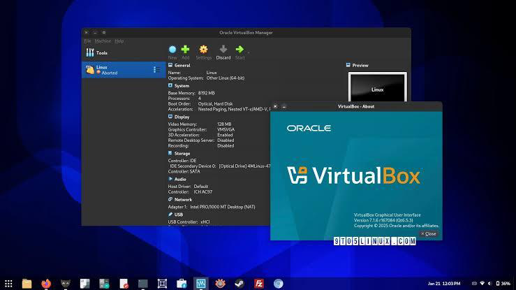

## 3.1 Настройкасреды

Чтобы начать практику, в Fedora был открыт терминаливыполнена команда dmesg для отображения содержимого буфера ядра. Поскольку вывод является обширным, он был

---

### объединенсlessдляпостраничнойнавигации:

Этот вывод содержит полный журнал событийсмомента запуска системы, включая

инициализациюаппаратныхкомпонентовизагрузкудрайверов.

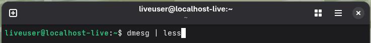

Для извлечения запрошенной информации применялся фильтр grepсконкретными

поисковымистроками.

## 3.2 Анализпоследовательностизагрузкисистемыспомощьюdmesg 3.2.1 Версияядра Linux

Чтобыузнатьверсиюядра Linux, былавыполненаследующаякоманда:

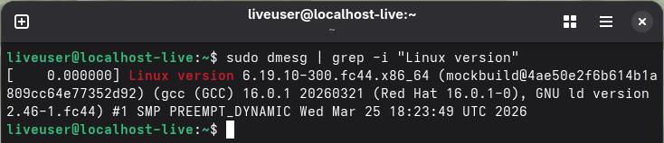

В выходных данных отображалась подробная информация оверсии ядра,

используемомкомпилятореидатесборки.

## 3.2.2 Частотапроцессора

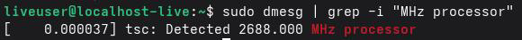

Чтобы получить частоту процессора, выходной сигнал dmesg был отфильтрованс

### соответствующейстрокой:

### `

---

Этакомандаотображаеттактовуючастотупроцессора, обнаруженнуюядромвовремя загрузки. ВVirtual Box эта частота соответствует частоте процессора хостсистемы или можетбытьограниченанастройкамивиртуальноймашины.

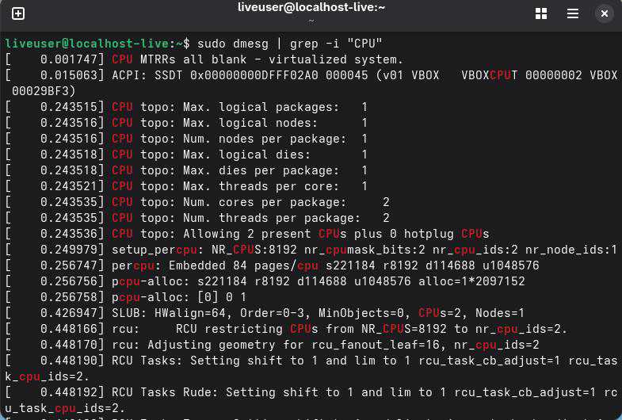

## 3.2.3 Модельпроцессора

Дляопределениямоделипроцессорабылиспользованследующийзапрос:

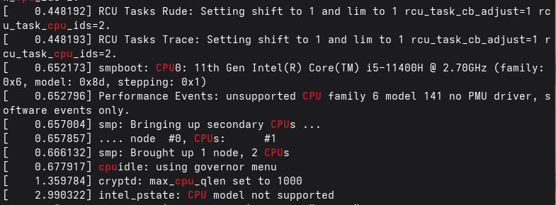

Результат содержит информациюопроизводителе, семействеиконкретной модели

---

процессора.

## 3.2.4 Объемдоступнойоперативнойпамяти

Чтобы узнать объем доступной оперативной памяти, выходные данные dmesg были

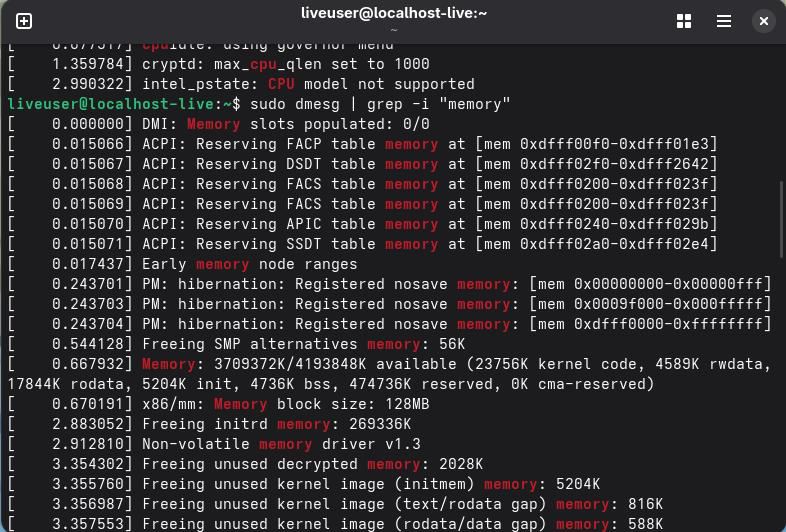

### отфильтрованыпоключевомуслову"память":

### `

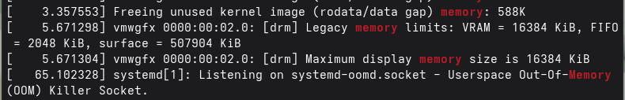

Навыходеотображаетсяинформацияобобщейидоступнойпамятивсистеме. Объем видимой оперативной памяти будет соответствовать объему, выделенному виртуальной машинев Virtual Box.

## 3.2.5 Типгипервизора

Чтобы определить тип гипервизора, ввыходных данных dmesg был выполнен поиск

---

### соответствующейстроки:

Если система запущена на виртуальной машине, эта команда отобразит тип

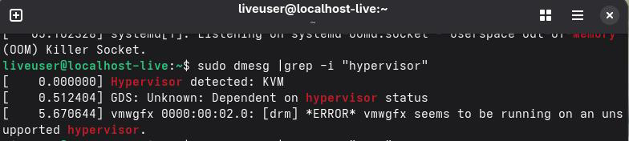

обнаруженногогипервизора (например,"Virtual Box").

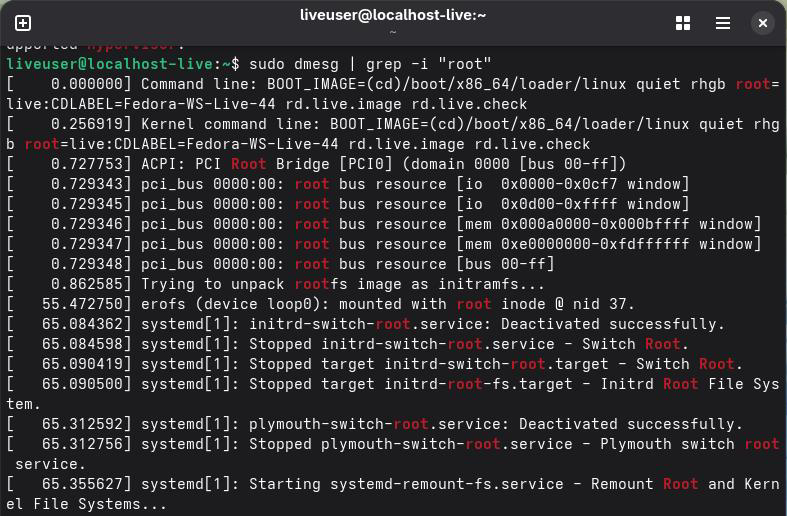

## 3.2.6 Файловаясистемакорневогоразделадиска

Чтобы определить тип файловой системы корневого раздела, был выполнен поиск

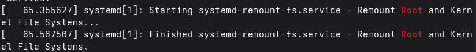

### сообщений, связанныхскорневымподключением:

---

Вывод включает информациюотипе файловой системы (например, ext 4 или btrfs),

используемойкорневымразделом Fedora.

## 3.2.7 Последовательностьустановкифайловыхсистем

Чтобы отобразить последовательность монтирования файловых систем, выходные

данныеdmesgбылиотфильтрованысословом"монтировать":

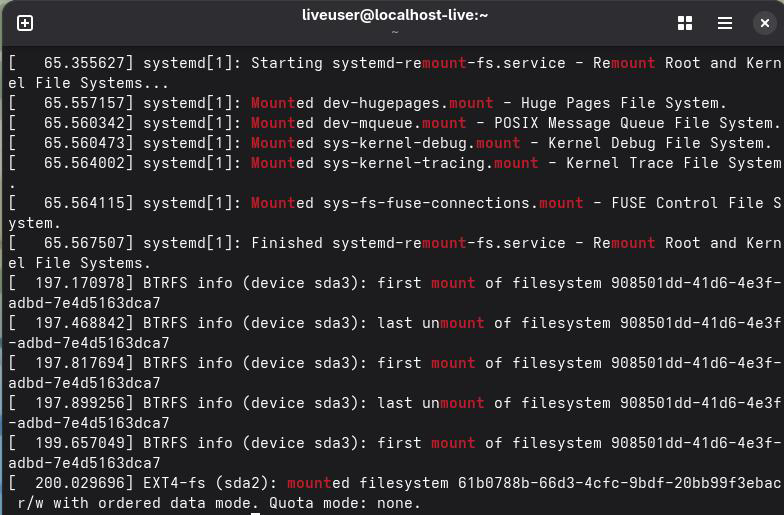

Эта команда отображает порядок монтирования различных файловых систем в

процессезагрузки Fedora.

## Ответынаконтрольныевопросы

Вданномразделепредставленыответынаконтрольныевопросы, предложенныев

лабораторномзадании. Этиответысоставленынаосновезнаний, полученныхвходе практики, атакжеизученнойлитературы.

---

## 4.1 Ответынаконтрольныевопросы

## 4.1.1 Информацияопользовательскойучетнойзаписи

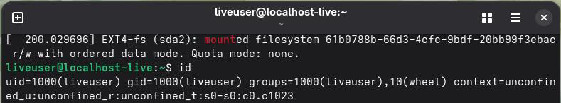

```text
Учетная запись пользователяв Linux хранитвсюнеобходимую информацию, чтобы человек
мог взаимодействоватьссистемойичтобы система могла безопасно управлять своими
ресурсамииразрешениями. Основнаяинформацияхранитсявразличныхсистемныхфайлах,
такихкак/etc/passwd, /etc/shadowи/etc/group.
```

Наиболееважнымиданными, содержащимисявучетнойзаписипользователя, являются:

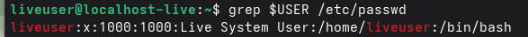

·Имя пользователя (логин): Уникальный идентификатор, который пользователь использует длявходавсистему. ·Идентификатор пользователя (UID): Уникальный номер, который система использует для внутреннейидентификациипользователя. ·Идентификатор основной группы (GID) номер основной группы, ккоторой принадлежит пользователь. ·Домашний каталогпутькдомашнему каталогу пользователя, вкотором хранятся его файлыинастройки. ·Оболочка: интерпретаторкоманд, запускаемыйпривходевсистему (например,/bin/bash). ·Пароль (зашифрованныйихранящийсявфайле/etc/shadow). ·Срокдействияпароляидругаяинформацияосрокеслужбыучетнойзаписи. ·Второстепенныегруппы, ккоторымпринадлежитпользователь (указанывфайле/etc/group). ·Ограничениядоступаиразрешениядляфайловидиректорий.

## 4.1.2.Терминальныекомандыипримерыихприменения

---

Ниже приведены наиболее распространенные команды терминала ипримеры их

### использования:

### а) Чтобыполучитьпомощьоткоманды

```text
Чтобыполучитьсправкупокоманде, используютсяследующиекоманды:
·man: Отображаетполноеруководствопокоманде.
·--help: Отображаетсводнуюсправку.
```

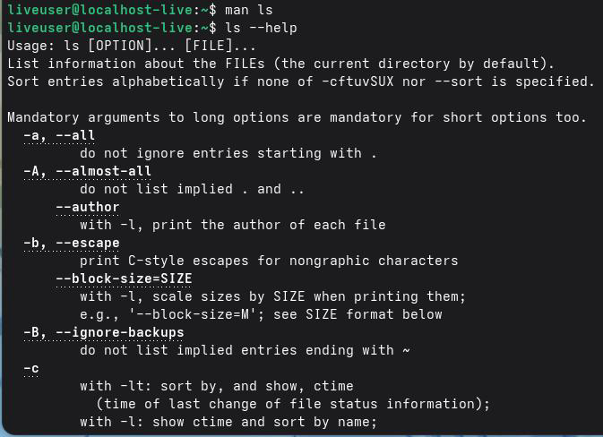

### Примеры:

### б) Длянавигациипофайловойсистеме

Чтобыперейтивдругойкаталог, используйтекомандуcd.

### Примеры:

---

### в) Дляпросмотрасодержимогокаталога

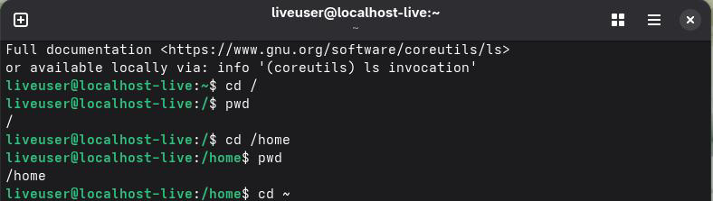

Чтобывывестисписоксодержимогокаталога, используетсякомандаls. Примеры:

### г) Длярасчетаразмера каталога

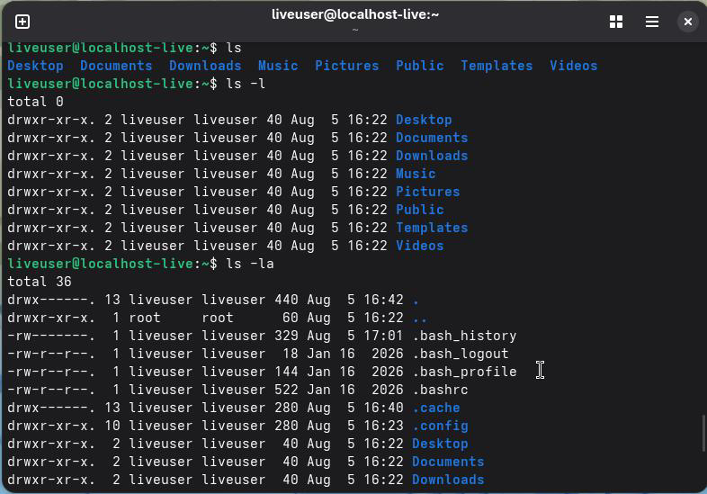

Длявычисленияразмеракаталогаиспользуетсякомандаdu (использованиедиска). Примеры:

---

e) Длясозданияиудалениядиректорийифайлов

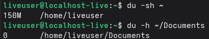

Создание: Удаление:

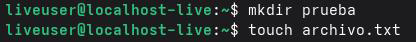

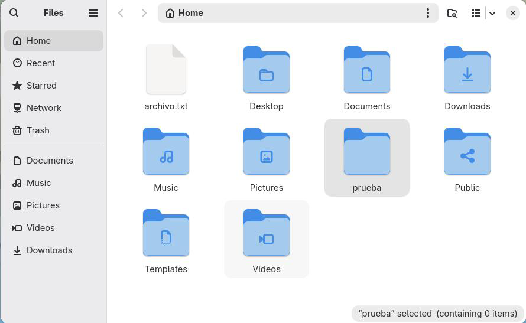

·rmdir: удаляетпустойкаталог. ·rm: удаляетфайлыиликаталоги.

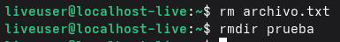

### Примеры:

---

### ``

f) Дляназначенияразрешенийфайламикаталогам

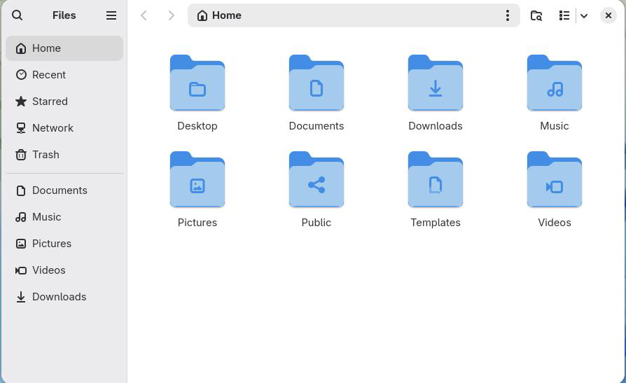

Чтобыназначитьразрешенияфайламикаталогам, используетсякомандаchmod.

### Примеры:

g) Дляпросмотраисториикоманд

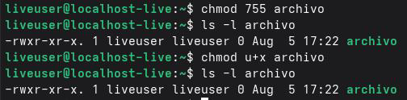

Чтобыпросмотретьисториювыполненныхкоманд, используетсякомандаhistory.

### Примеры:

---

## 4.1.3.Настройкафайловойсистемы

Файловая система (filesystem) это структураиметод, используемые операционной системой для хранения, организациииуправления файламиикаталогами назапоминающем устройстве, такомкакжесткийдиск, твердотельныйнакопительили USBнакопитель.

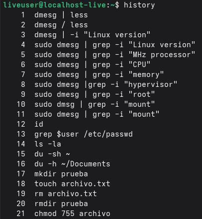

Примерыраспространенныхфайловыхсистемв Linux:

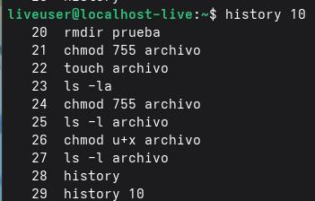

\*ext 4: Это наиболее часто используемая файловая системавдистрибутивах Linux, включая Fedora. Это четвертая версия семейства ext (расширенная файловая система).Он поддерживает файлы большого размера, обеспечивает хорошую стабильность и производительность, атакже предоставляет такие функции, как ведение журнала (журнал изменений), чтобыпредотвратитьповреждениеданныхвслучаесбоясистемы.

·Btrfs: Это Modernaипродвинутая файловая система, также известная как"Butter FS "или"B-tree FS".Этофайловаясистемапоумолчаниювнекоторыхдистрибутивах Fedora. Он предлагает расширенные функции, такие как моментальные снимки (snapshots), сжатие, контрольнаясуммаданных (checksums) иподдержкавстроенныхтомов RAID.

·XFS: Это высокопроизводительная файловая система, предназначеннаявпервую очередь для обработки файлов большого размераикрупномасштабного хранилища. Это файловая система по умолчаниюв Red Hat Enterprise Linux (RHEL) и Cent OS, атакже используетсяв Fedoraдлянекоторыхконфигураций.

·FAT 32: Это простая файловая система, совместимаясбольшинством операционных систем (Windows, mac OS, Linux). Он обычно используется на съемных запоминающих устройствах (USB, SDкартах) изза его широкой совместимости. Однако он имеет ограничения на максимальный размер файла (4 ГБ) ине поддерживает права доступак файламв Linux.

·NTFS: Этофайловаясистемапоумолчаниюв Windows. Системы Linuxмогут читать

изаписыватьвразделы NTFSспомощьютакихдрайверов, какntfs-3g.

## 4.1.4.Просмотрподключенныхфайловыхсистем

Чтобы узнать, какие файловые системывнастоящее время смонтированыв Linux,

### используютсяследующиекоманды:

·mount Отображениевсехсмонтированныхфайловыхсистем. ·df-h: Показывает используемоеидоступное дисковое пространствовподключенных

файловыхсистемахвудобочитаемомформате.

·lsblk Списокблочныхустройств (дисков) иподключенныхразделов. ·findmnt: Отображаетдеревомонтированияфайловыхсистем.

### Примерыиспользования:

---

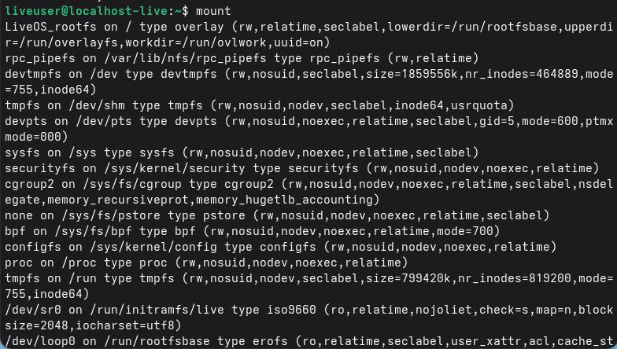

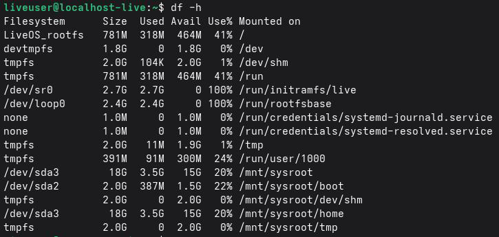

---

## 4.1.5.Завершениезаблокированногопроцесса

Чтобы удалить процесс, который не отвечает или заблокирован, используются

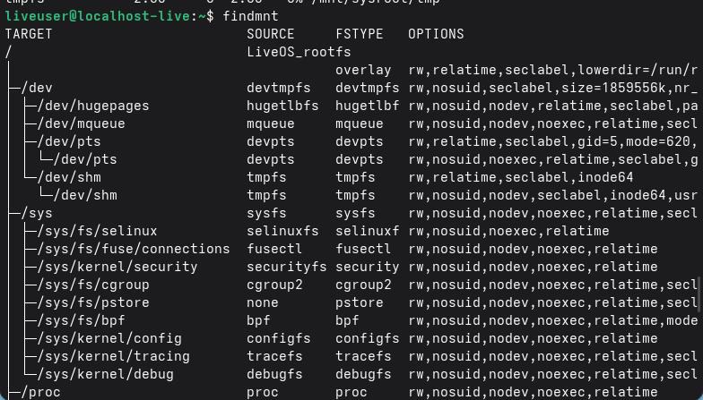

### следующиешаги:

1.Идентифицировать процесс: Найти PID (идентификатор процесса)

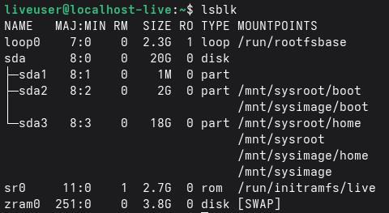

заблокированногопроцесса.

> 2.Завершитепроцесс:
> Идентификация PID:
> `'bash

---

psaux|grep-i"имя_процесса"#Поискпроцессапоимени top#Отображениезапущенныхпроцессоввреальномвремени htop#Улучшеннаяверсияtop (болееинтерактивная) `

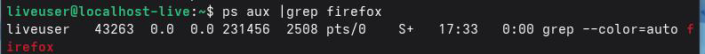

### Завершениепроцесса:

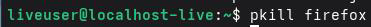

\*убить: Отправляетсигналозавершениипроцесса. ·pkill Завершаетпроцесспоимени. ·killall Завершаетвсепроцессысопределеннымименем.

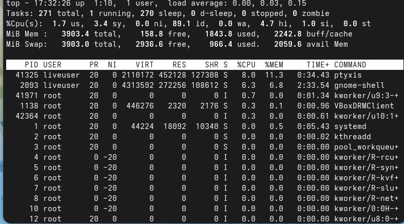

### Примеры:

---

## Выводы

Входе лабораторной работыяосвоил анализ системных настроек Linuxспомощью команды dmesgифильтрациюданныхспомощьюgrep. Мнеудалось получитьинформацию оверсии ядра, процессоре, оперативной памяти, менеджере виртуализации ифайловой системе. Кроме того, яукрепил навыки работы стерминалом инаучился извлекать системные данныеввиртуальной среде Virtual Boxс Fedora. Все поставленные цели были достигнуты, атеоретическиезнанияуспешнозакрепленынапрактике.

---

## Списоклитературы

## 6.-man7.org.(2026).dmesg (1) Справочнаястраницапо Linux, из https://man7.org/linux/man-pages/man 1/dmesg.1.html

Страницы Debian Manpages.(2025). grep (1) Справочнаястраницапо Linux,
изhttps://manpages.debian.org/testing/grep/grep.1.en.html

Лабекс.(2024).Команда Linuxdmesgспрактическимипримерами, из
https://labex.io/tutorials/linux-linux-dmesg-command-with-practical-examples-
422644

## Проект Fedora. (2026).Документация Fedora Linux. Источник: https://docs.fedoraproject.org/en-US/docs/

## Oracle. (2026).Документация Oracle VMVirtual Box. Источник: https://www.virtualbox.org/wiki/Documentation

Центрподдержки Oracle. (2025).Управлениелокальнымифайловыми
системами. Источник: https://docs.oracle.com/en/operating-systems/oracle-
linux/8/fsadmin/fsadmin-about_file_systems.html

Linux Audit. (2016).Пониманиеинформацииопамятивсистемах Linux.
Источник: https://linux-audit.com/understanding-memory-information-on-linux-
systems/

Спроситеоб Убунту.(2023).Какпроверитьскоростьпроцессоравdmesg.,
изhttps://askubuntu.com/questions/1300066/how-to-check-cpu-speed-from-
dmesg

Red Hat. (2025).Общиесведенияофайловыхсистемах.de
https://access.redhat.com/documentation/en-us/red_hat_enterprise_linux/9/html-
single/managing_file_systems/index

---

## Архивыядра Linux. (2026).Документация Btrfs.de https://btrfs.wiki.kernel.org/

Краснаяшляпа.(2025).Используякомандумонтирования.de
https://access.redhat.com/documentation/en-
us/red_hat_enterprise_linux/8/html/mounting_file_systems/assembly_mounting-
file-systems
man7.org. (2026). kill (1) страницаруководствапо Linux.de
https://man7.org/linux/man-pages/man 1/kill.1.html