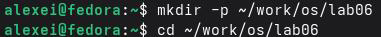
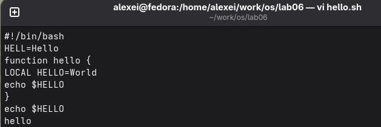
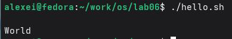
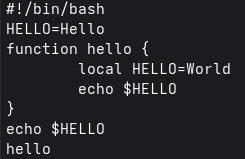
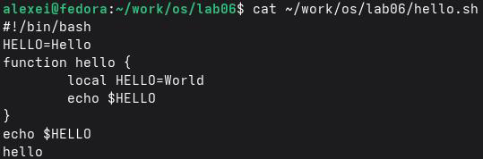

# РОССИЙСКИЙУНИВЕРСИТЕТДРУЖБЫНАРОДОВ

Факультетфизикоматематическихиестественныхнаук

Кафедраприкладнойинформатикиитеориивероятностей

ОТЧЕТ

ПОЛАБОРАТОРНОЙРАБОТЕNo 10 дисциплина: Архитектуракомпьютера

### Студент: Ромеро Гаспар Фернандо Алексей

### Группа: НКАбд-02-25

```text
МОСКВА
2026г.
```

---

## Оглавление

> 1. Цельработы
> 2. Теоретическиесведения
> 2.1. Режимыработыредактораvi
> 2.1.1. Командныйрежим
> 2.1.2. Режимвставки
> 2.1.3. Режимпоследнейстроки
> 2.2.Командыуправлениякурсором
> 2.3. Командыпозиционирования
> 2.4. Командыперемещенияпофайлу
> 2.5. Командыперемещенияпословам
> 2.6. Командыредактирования
> 2.6.1. Вставкатекста
> 2.6.2. Вставкастрок
> 2.6.3. Удалениетекста
> 2.6.4. Отменаиповтордействий
> 2.7. Командырежимапоследнейстроки
> 2.8. Опцииредактораvi

3. Заданиеипоследовательностьвыполненияработы
3.1.Созданиеновогофайлаconvi

4. Редактированиесуществующегофайлсvi
5. Контрольныевопросы
6. Выводы
7. Списоклитературы

---

## Цельработы

Целью данной лабораторной работы является знакомствосоперационной системой

Linux иполучение практических навыков работы средактором vi, установленным по умолчаниюпрактическивовсехдистрибутивах Linux.

---

## Теоретическиесведения

Вэтомразделепредставленытеоретическиеосновытекстовогоредактораvi, одного

изнаиболееширокоиспользуемыхредактороввсистемах Unix/Linux, известногосвоей эффективностьюиприсутствующегопрактическивовсехоперационныхсистемахэтого семейства.

## 2.1 Режимыработыредактораvi

vi (Visual Display Editor) это интерактивный текстовый редактор, работающийв

### трёхосновныхрежимах:

 Командныйрежим (Commandmode): Эторежимпоумолчаниюпри открытии vi. Вэтом режиме каждое нажатие клавиши интерпретируется как команда редактирования или навигации. Например, нажатие клавишиjперемещает курсор на одну строку вниз. Этот режимпозволяетбыстровыполнятьоперации, невводядлинныекоманды.  Режим вставки (Insert mode): Вэтом режиме введённый вами текст вставляетсявфайл. Вы можете получить кнему доступ из режима командной строки, нажимая такие клавиши, какi (вставка перед курсором), a (вставка после курсора) илиo (вставка новой строки ниже).Клавиша Esc позволяетвлюбой момент вернутьсяврежим командной строки.

 Режим последней строки (Last line mode): Также известный как режим Ex, он активируется нажатием клавиши: изрежима командной строки. Вэтом режиме курсор перемещаетсявнижнюю строку экрана, где можно вводить более сложные команды, такие как сохранение файла (: w), выход из редактора (: q) или поискизамена текста (:%s/pattern/replacement/g).

## 2.2.Командыуправлениякурсором

Вкомандном режиме курсор управляется спомощью специальных клавиш для

эффективнойнавигациибезиспользованиямыши:  h Перемещаеткурсорнаодинсимволвлево.  l Перемещаеткурсорнаодинсимволвправо.

---

 j Перемещаеткурсорнаоднустрокувниз.  k Перемещаеткурсорнаоднустрокувверх.

## 2.3.Командыпозиционирования

Этикомандыпозволяютперемещатькурсорвпределахфайланабольшиерасстояния:

 0или^Перемещаеткурсорвначалотекущейстроки.  $Перемещаеткурсорвконецтекущейстроки.  GПеремещаеткурсорвконецфайла.  n GПеремещаеткурсорнастрокуномерn.  H, M, LПеремещает курсорвначало, середину или конец видимой области экрана соответственно.

## 2.4.Командыперемещенияпофайлу

Длябыстройнавигациипофайлуиспользуйтеследующиекоманды:

```text
 Ctrl-f Переходнаоднустраницувперед.
 Ctrl-b Переходнаоднустраницуназад.
 Ctrl-d Переходнаполстраницывперёд.
 Ctrl-u Переходнаполстраницыназад.
```

## 2.5.Командыперемещенияпословам

Навигацияпословамнеобходимадляэффективногоредактирования:

 w Перемещаеткурсорвначалоследующегослова.  b Перемещаеткурсорвначалопредыдущегослова.  e Перемещаеткурсорвконецтекущегоилиследующегослова.

## 2.6.Командыредактирования 2.6.1.Вставкатекста

---

Длявставкитекстаиспользуйтеследующиекомандывкомандномрежиме:

 i Вставляеттекстпередкурсором.  IВставляеттекствначалостроки.  a Вставляет текстпослекурсора.  AВставляет текствконецстроки.

## 2.6.2.Вставкастрок

 o Вставляетновуюстрокунижетекущейстрокиипереходитврежимвставки.  OВставляетновуюстрокувышетекущейстрокиипереходитврежимвставки.

## 2.6.3.Удалениетекста

Командыудаленияпозволяютудалятьсимволы, словаилицелыестроки:

 x Удаляетсимволподкурсором.  dw Удаляетслово, начинающеесяоткурсора.  dd Удаляетвсюстроку.  DУдаляеттекстоткурсорадоконцастроки.

## 2.6.4.Отмена

 u Отменяетпоследнеевыполненноедействие.

## 2.7.Командырежимапоследнейстроки

Этотрежимпозволяетвыполнятьболеесложныекоманды, нажимаядвоеточие(:).

: w Сохраняетизменениявфайле. : q Выходизредактора. : wq Сохраняетивыходитизредактора. : q! Выходбезсохраненияизменений.

---

: setnu Отображаетномерастрок. : setic Игнорируетрегистрприпоиске.

## 2.8.Опцииредактораvi

Редактор vi позволяет настраивать свое поведение спомощью команды `: set`в



### режимепоследнейстроки:

 `: set all`Отображаетполныйсписоквсехдоступныхпараметров.  `: setnu`Включаетотображениеномеровстрок.  `: setnonu`Отключаетотображениеномеровстрок.  `: set ic`Включаетпоискбезучета регистра.  `: set list`Отображает невидимые символы, такие как табуляцияисимволы конца строки.

## Заданиеипоследовательностьвыполненияработы

Вэтомразделепредставленызадания, которыенеобходимовыполнить, иподробные


инструкциипоработесредакторомviдлясозданияиредактированияфайловв операционнойсистеме Linux.

## 3.1.Созданиеновогофайлаconvi

> Шаг 1: Создайтекаталогдлялабораторнойработы
> Шаг 2: Создайтефайлhello.shспомощьюvi
> Шаг 3: Войдитеврежимвставкиизапишитесодержимое

---

 Нажмитеклавишуi, чтобывойтиврежимвставки.  Введитеследующийкод:

### Шаг 4: Сохранитефайливыйдитеизvi



 Нажмите Esc, чтобывыйтиизрежимавставки.  Нажмите:, чтобывойтиврежимпоследнейстроки.  Введитеwqинажмите Enter, чтобысохранитьивыйти.

### Шаг 5: Сделайтефайлисполняемым


Шаг 6: Запуститескрипт, чтобыубедитьсявегоработоспособности

## 3.2.Редактированиесуществующегофайлсvi



Шаг 1: Откройтефайлhello.shдляредактирования

> bash
> vi~/work/os/lab 06/hello.sh

---

### Шаг 2: Изменитеслово HELLна HELLO

 Поставьтекурсорвконецслова HELLнавторойстроке.  Нажмите'a', чтобывойтиврежимвставкипослекурсора.  Наберите'o', чтобызавершить HELLO.  Нажмите'Esc', чтобывернутьсявкомандныйрежим.

### Шаг 3: Удалитеслово LOCAL

 Поставьтекурсорнадсловом LOCALначетвёртой строке.  Нажмите'dw', чтобыудалитьслово.  Нажмите'i', чтобывойтиврежимвставки.  Наберите'local'(строчнымибуквами).  Нажмите'Esc', чтобывернутьсявкомандныйрежим.

### Шаг 4: Добавьтеновуюстрокувконецфайла

 Поставьтекурсорнапоследнююстрокуфайла.  Нажмите'o', чтобысоздатьновуюстрокуниже.  Введите'echo$HELLO'.  Нажмите Esc, чтобывернутьсявкомандныйрежим.

### Шаг 5: Удалитепоследнююстроку

 Поставьтекурсорнапоследнююстроку.  Нажмитеdd, чтобыудалитьстроку.

### Шаг 6: Отменитепоследнеедействие

 Нажмитеu, чтобыотменитьудаление (удалённаястрокапоявитсяснова).

### Шаг 7: Сохранитеизмененияивыйдите

 Нажмите: длявходаврежимпоследнейстроки.

---

 Введитеwqинажмите Enter, чтобысохранитьивыйти.

### Шаг 8: Проверьтесодержимоеокончательногофайла

## Контрольныевопросы

Вэтомразделепредставленыответынаконтрольныевопросыоредактореvi, которые



позволятвампроверитьвашепониманиережимовегоработы, командифункций.

1.Дайтекраткуюхарактеристикурежимамработыредактораvi.

### Редакторviимееттриосновныхрежимаработы:

### Режим Описание



Командныйрежим (Commandmode) Это режим по умолчанию при открытии

vi. Он позволяет перемещаться по файлу и выполнятькомандыредактирования (копировать, вставлять, удалять ит.д.). Нажатия клавиш интерпретируютсякаккоманды, анекактекст.

Режимвставки (Insertmode) Этот режим позволяет вставлять текств

### файл. Он активируется из командного режима

---

нажатием клавиш, таких как i, a, oит.д. Клавиша Escвозвращаетвасвкомандныйрежим.

Режимпоследнейстроки (Last linemode) Этот режим активируется нажатием

```text
клавиши: из командного режима. Он позволяет
выполнять более сложные команды, такие как
сохранение файлов (: w), выход (: q), поиск (:/),
замена(:%s/.../.../g) инастройкапараметров(: set).
```

2.Каквыйтиизредактора, несохраняяпроизведённыеизменения?

Чтобывыйтиизредакторабезсохраненияизменений, необходимо:

1. Нажать Esc, чтобыубедиться, чтовынаходитесьвкомандномрежиме.
2. Нажать: дляпереходаврежимпоследнейстроки.
3. Набратьq! инажать Enter.

> bash
> : q!

Восклицательныйзнак (!) принудительнозавершаетработубезсохраненияизменений,

внесенныхсмоментапоследнейзаписи.

3.Назовитеидайтекраткуюхарактеристикукомандампозиционирования.

### Команда Описание

0 Перемещаеткурсорвначалотекущейстроки. $ Перемещаеткурсорвконецтекущейстроки. G Перемещаеткурсорвконецфайла. n Gили: n Перемещаеткурсорнастрокуномерn. H Перемещаеткурсорнапервуюстрокуэкрана (Home). M Перемещаеткурсорнасреднююстрокуэкрана (Middle). L Перемещаеткурсорнапоследнююстрокуэкрана (Last).

4.Чтодляредактораviявляетсясловом?

---

Вviслово определяется как последовательность буквенноцифровых символов (букв, цифр иподчеркиваний). Последовательность небуквенноцифровых символов (знаки

препинания, пробелыит.д.) такжесчитаетсяотдельнымсловом.

### Например, встроке HELL=Hello:

 HELLэтослово  =этослово (небуквенноцифровойсимвол)  Helloэтослово (конец) файла?

5.Каким образом из любого места редактируемого файла перейтивначало

 Перейтикначалуфайла: нажмитеggили 1G (вкомандномрежиме).  Перейтикконцуфайла: нажмите G (вкомандномрежиме).

### Такжеможноиспользоватьрежимпоследнейстроки:

: 1дляпереходакпервойстроке. :$дляпереходакпоследнейстроке.

6. Назовите идайте краткую характеристику основным группам команд

редактирования.

Группа Основныекоманды Описание

Вставка i, I, a, A, o, O Вставляеттекстдо/послекурсора, в

начало/конецстрокиилинановуюстроку.

Удаление x, dw, dd, D Удаляетсимволы, слова, целыестрокиили

откурсорадоконцастроки.

Копирование yy Копирует (вытаскивает) текущуюстроку

(используетсясpдлявставки).

Вставка p, P Вставляетскопированныйилиудаленный

текстпосле (p) илиперед (P) курсором.

Отмена u Отменяетпоследнеевыполненноедействие.

---

```text
Поиск /pattern,? pattern Ищетшаблонвперед(/) илиназад(?).
```

7.Необходимозаполнитьстрокусимволами$.Каковывашидействия?

Чтобызаполнитьстрокузнакомдоллара($), выможете:

1. Установитькурсорвначалостроки.
2. Перейтиврежимвставки, нажавклавишуi.
3. Набратьнужноеколичествознаковдоллара($).
4. Нажатьклавишу Esc, чтобывернутьсявкомандныйрежим.

### Болеебыстрыйвариант:

1. Установитькурсорвначалостроки.
2. Нажатьклавишуr, азатемзнакдоллара($)(заменяетодинсимвол).
3. Длязаменынесколькихсимволовиспользуйтеклавишу R (режимзамены) и
  многократнонабирайтезнак$.

8.Какотменитьнекорректноедействие, связанноеспроцессомредактирования?

Чтобы отменить некорректное действие, используйте команду `u` вкомандном

режиме. Прикаждомнажатии`u`последнеевыполненноедействиеотменяется.  `u`отменяетпоследнеедействие.  `U`отменяет все изменения, внесенныевтекущую строкусмомента установки курсора.

9.Знатьидаватьхарактеристикиобщихгруппверхнихстрок.

Группа Команды Описание Сохранить/Выход: w,: q,: wq,: q!

Сохраняет, выходит, сохраняет ивыходит, выходит без сохранения.

### Позиционирование: n

### Перемещает курсор на

строкуномерn.

---

```text
Найти/Заменить:/pattern,:%s/pattern/replacement Ищет шаблон или выполняет
```

/g глобальнуюзамену.

Параметры: set nu,: set ic,: set list Отображает номера строк,

игнорирует регистр при поиске, отображаетневидимыесимволы.

### Информация: set all

### Отображает все настроенные

параметры.

10.Какопределить, неперемещаякурсора, позицию, вкоторойзаканчивается строка?

Вviкоманда$(вкомандномрежиме) перемещает курсорвконец текущей строки, но

### есливынехотитеперемещатькурсор, выможете:

1. Нажать g_ переместит курсор кпоследнему символу строки, не являющемуся
пробелом.

2. Врежимепоследнейстрокикоманда: set listотображаетсимвол$вконцекаждойстроки,
визуальноуказывая, гдеоназаканчивается.

11.Выполнитеанализопцийредактора vi (сколькоих, какузнатьихназначение ит.д.).

Чтобыувидеть все доступные параметрывvi, используйте команду`: set all`врежиме последнейстроки. Этоотобразитполныйсписоквсехпараметровиихтекущихзначений.

Некоторыеизнаиболеераспространенныхпараметров:

Параметры Описание nu/number Отображаетномерастрок. ic/ignorecase Игнорируетрегистрприпоиске. list Отображаетневидимыесимволы (табуляция, символыконцастроки). ai/autoindent Включаетавтоматическоевыравнивание. ws/wrapscan Позволяетпродолжитьпоисксначалафайла.

Чтобыотключитьпараметр, используйте`no`передименем, например:

---

> bash
> : setnonu

12.Какопределитьрежимработыредактораvi?

### Чтобыопределитьтекущийрежимработыvi:

 Режим команд: Внизу экрана не отображается специальный индикатор. Клавиши не вводяттекст.

```text
 Режимвставки: Внизуотображаетсяиндикатор, например,--INSERTили--INSERT-.
 Режим последней строки: Внизу отображается символ двоеточия (:), где можно вводить
команды.
```

13.Постройтеграфвзаимосвязирежимовработыредактораvi.

### Переходы:

 Режимкоманд→Режимвставки: спомощью`i`,`a`, `o`, `I`,`A`, `O`ит.д.  Режимвставки→Режимкоманд: спомощью`Esc`.  Режимкоманд→Режимпоследнейстроки: спомощью`:`.  Режимпоследнейстроки→Режимкоманд: нажатием`Enter` послевыполнениякоманды (или`Esc`).

> Командныйрежим
> (режимпоумолчанию)

> Режимвставки
> (Вставка текста)

> Режимпоследней
> строки
> (Командыс:)

> Выйтииз
> редактора
> (: wq или: q!)

---

## Выводы

Входе выполнения лабораторной работыя познакомилсясоперационной системой Linux иприобрел практические навыки работысредактором vi. Яизучил три режима работы редактора: командный, вставкиипоследней строки, атакже научился переключатьсямежду ними. Яосвоил основные команды навигации (h, j, k, l, 0,$, G), редактирования (i, a, o, dd, dw, x, u) иработысфайлами (: w,: q,: wq,: q!).Ясоздалиотредактировал файл hello.sh, применяя изученные команды для модификации текста, удаленияивставки строк, атакже отмены действий. Все поставленные задачи выполнены, полученные навыки являются основойдляэффективнойработыстекстовымифайламивкоманднойстроке Linux.

---

## Списоклитературы

 Ближневосточныйтехническийуниверситет.(с.ф.).Режимыработы.
https://user.ceng.metu.edu.tr/~ucoluk/ceng111/lab_manual/node17.html
 Национальныйуниверситет Чэнчи.(с.ф.).Явидел«簡易使用說明».
https://www.cs.nccu.edu.tw/~lien/UNIX/VI/BASIC/hardcopy.htm
 SCOInc.(бездаты).Настройка Ви.
http://osr600doc.sco.com/en/FD_create/_Configuring_vi.html

 ТУГрац.(с.ф.).vi Команды.https://www.staff.tugraz.at/reinfried.o.peter/unix/vi.html
 Кентскийгосударственныйуниверситет.(с.ф.).Базовыйvi.
https://www.cs.kent.edu/~durand/CS0F06/Help/h_vi.html

 Git Hub.(2024).Введениевредакторvi.https://github.com/r3kste/ID2090
 Ближневосточныйтехническийуниверситет.(s.f.).Режимыработы.
https://user.ceng.metu.edu.tr/~ucoluk/ceng111/lab_manual/node17.html