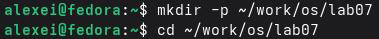
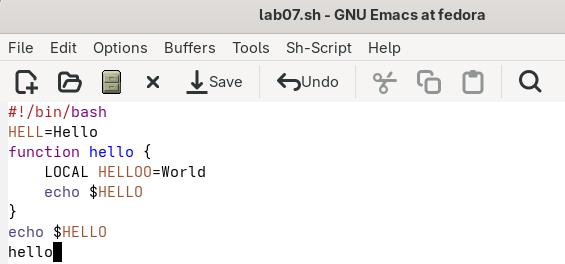

# РОССИЙСКИЙУНИВЕРСИТЕТДРУЖБЫНАРОДОВ

Факультетфизикоматематическихиестественныхнаук

Кафедраприкладнойинформатикиитеориивероятностей

ОТЧЕТ

ПОЛАБОРАТОРНОЙРАБОТЕNo 11 дисциплина: Архитектуракомпьютера

### Студент: Ромеро Гаспар Фернандо Алексей

### Группа: НКАбд-02-25

```text
МОСКВА
2026г.
```

---

## Оглавление

```text
1. Цельработы
2. Теоретическиесведения
2.1.Основныетермины Emacs
2.1.1. Буфер
2.1.2. Фрейм
2.1.3. Окно
2.1.4. Областьвывода
2.1.5. Минибуфер
2.1.6. Точкавставки
2.2.Основыработыen Emacs
2.3. Командыперемещениякурсора
2.4. Текстовыекоманды
2.5. Текстовыекомандыстекстовымиобластями
2.6. Поискизаменатекста
2.7. Управлениефайлами, буферамииокнами
3. Заданиеипоследовательностьвыполненияработы
3.1. Созданиеиредактированиефайлов
3.2. Работастекстом (вырезание, копирование, вставка)
3.3.Перемещениекурсора
3.4.Управлениебуфером
3.5.Управлениеокнами
3.6.Поискизаменатекста
4. Контрольныевопросы
5. Выводы
6. Списоклитературы
```

---

## Цельработы

Целью данной лабораторной работы является знакомствосоперационной системой

Linuxиполучениепрактическихнавыковработысредактором Emacs.

---

## Теоретическиесведения

Вэтом разделе представлены фундаментальные концепции редактора Emacs, его терминологияиосновные команды, необходимые для понимания принципов работысэтим мощныминструментом.

## 2.1 Основныетермины Emacs

Emacs оперирует специфическими понятиями, которые отличаются от терминологии обычных текстовых редакторов. Понимание этих терминов является ключевым для эффективнойработы.

## 2.1.1 Буфер

Буферв Emacsэто объект, представляющий собой какойлибо текст. Буфер может содержать что угодно: текст редактируемого файла, результаты работы программы, встроенные подсказки или любую другую информацию. Важно понимать, что буфер не обязательносвязансфайломнадискеэтосамостоятельнаясущностьвпамяти.

## 2.1.2 Фрейм

Фрейм соответствует окнувобычном понимании этого словавграфических средах.

Каждый фрейм содержит область выводаиодно или несколько окон Emacs. При работев терминале фрейм занимает весь экран, авграфическом режиме может быть отдельным окномсистемы.

## 2.1.3.Окно

Окнов Emacsэтопрямоугольная область внутрифрейма, которая отображаетодин из буферов. Каждое окно имеет свою строку состояния (mode line), которая показывает название буфера, его основной режим, статус изменения текстаипозицию курсора. Окна можноделитьпогоризонталиивертикали, создаваяудобнуюрабочуюсреду.

## 2.1.4.Областьвывода

---

Область выводаэто одна или несколько строквнижней части фрейма, где Emacs отображает различные сообщения, запрашивает подтверждения идополнительную информациюотпользователя.

## 2.1.5.Минибуфер

Минибуфер используется для ввода дополнительной информации (например, имени

файла, строкипоискаиликоманды) ивсегдаотображаетсявобластивывода.

## 2.1.6.Точкавставки

Точка вставкиэто местовбуфере, где Emacs вставляет или удаляет данные. В

Emacs точку часто называют point. Её положение определяет, куда будут применяться командыредактирования.

## 2.2.Основыработыen Emacs

Emacsиспользуеткомбинацииклавишсмодификаторамидлявыполнениякоманд.

### Основныемодификаторы:

###  Cклавиша Ctrl (Control)

 Mклавиша Meta (Altили Escвзависимостиоттерминала)  Sклавиша Shift

```text
Комбинации клавиш принято называть префиксными. Например, C-xэто префикс
для команд управления файламиибуферами, а C-cдля команд, зависящих отактивного
режима.
```

Ключеваяособенность Emacsего расширяемость. Режимы (major modes) изменяют поведение редакторавзависимости от типа редактируемого файла (например, режим C, режим Lisp или режим текста), добавляя специализированные команды иподсветку синтаксиса.

---

## 2.3.Командыперемещениякурсора

Дляперемещенияpointиспользуютсяследующиекомбинации:

 C-fпереместитьсянаодинсимволвперёд  C-bпереместитьсянаодинсимволназад  C-nпереместитьсянаоднустрокувниз  C-pпереместитьсянаоднустрокувверх  C-aпереместитьсявначалостроки  C-eпереместитьсявконецстроки  M-fпереместитьсянаоднослововперёд  M-bпереместитьсянаоднословоназад  M-<переместитьсявначалобуфера  M->переместитьсявконецбуфера  C-vпереместитьсянаоднустраницувниз  M-vпереместитьсянаоднустраницувверх

Следует отметить, что Emacs предоставляет альтернативные способы навигации, но использование этих комбинаций часто более эффективно, чем работа смышью или клавишамистрелок.

## 2.4.Текстовыекоманды

 C-dудалитьсимволподкурсором  M-dудалитьсловопослекурсора  C-kудалитьтекстоткурсорадоконцастроки  M-kудалитьтекстоткурсорадоконцапредложения  C-qвставитьуправляющийсимвол

## 2.5.Текстовыекомандыстекстовымиобластями

### Дляработысвыделеннымиобластями:

---

```text
 C-spaceначатьвыделениетекста
 C-wвырезатьвыделеннуюобласть
 M-wкопироватьвыделеннуюобласть
 C-yвставить текстизбуфераобмена
```

## 2.6.Поискизаменатекста

### Emacsпредоставляетмощныевозможностипоиска:

```text
 C-sинкрементальныйпоисквперёд
 C-rинкрементальныйпоискназад
 M-%поискизаменасподтверждением
```

Инкрементальный поиск (C-s) позволяет искать текст по мере ввода, сразу показывая совпадения. Во время поиска можно переключаться между найденными совпадениями клавишей C-s. Для выхода из режима поиска используется C-g. Врежиме поиска можно использовать регулярные выражения, переключаясь спомощью M-r. Команда M-% запускает режим поискасзаменой: после ввода искомого текстаитекста замены, Emacs поочерёдно подсвечивает совпадения, позволяя подтвердить (y) или пропустить (n) каждую замену.

## 2.7.Управлениефайлами, буферамииокнами

 C-x C-fоткрытьфайл (find-file)  C-x C-sсохранитьбуфервфайл  C-x C-bпоказатьсписокбуферов  C-xbпереключитьсянадругойбуфер  C-x2разделитьокнопогоризонтали  C-x3разделитьокноповертикали  C-xoпереключитьсянадругоеокно  C-x0закрытьтекущееокно  C-x1оставитьтолькотекущееокно  C-x C-cвыйтииз Emacs

```text
При открытии файла (C-x C-f) Emacs создаёт буфер ссодержимым файла. Все
```

---

изменения происходятвбуфере; для сохранения изменений на диск используется C-x C-s. Список активных буферов позволяет управлять несколькими одновременно открытыми файлами, апереключение между ними осуществляетсяспомощью C-x b. Разделение окон (C-x 2и C-x 3) позволяет просматривать несколько буферов одновременно, а C-x o перемещаетфокусмеждуними.

## Заданиеyпоследовательностьвыполненияработы

Вэтом разделе представлены задания, которые необходимо выполнить, иподробные инструкции по работесредактором Emacs для создания, редактированияиуправления файламивоперационнойсистеме Linux.



## 3.1.Созданиеиредактированиефайлов

### Шаг 1: Создайтекаталогдлялабораторнойработы


> Шаг 2: Откройте Emacs
> Шаг 3: Создайтефайлlab07.sh
> Нажмите Ctrl+x, Ctrl+f.

```text
Вминибуферевведите:~/work/os/lab 07/lab07.shинажмите Enter.
```

### Шаг 4: Запишитесодержимоефайла

---

> Шаг 5: Сохранитефайл
> Нажмите Ctrl+x, Ctrl+s.

## 2.Работастекстом (вырезание, копирование, вставка)

### Шаг 1: Вырезатьвсюстроку

 Поместитекурсорнастрокустекстом`echo$HELLO`(строка 7).  Нажмите Ctrl+K, чтобывырезать (удалить) текстоткурсорадоконцастроки.  Строкабудетудаленаисохраненавкольцеудаления.

### Шаг 2: Вставитьстрокувконецфайла



```text
 Переместитекурсорвконецфайла (M->).
 Нажмите Ctrl+Y, чтобывставитьвырезаннуюстроку.
```

### Шаг 3: Выделитьископироватьобласть

```text
 Переместитекурсорвначалостроки`hello`(строка 6).
 Нажмите Ctrl+Space, чтобыначатьвыделение.
 Переместитекурсорвконецстроки`echo$HELLO`(строка 8).
 Нажмите Ctrl+W, чтобыскопироватьвыделеннуюобласть.
```

### Шаг 4: Вставитьобластьвконецфайла

---

```text
 Переместитекурсорвконецфайла (M->).
 Нажмите Ctrl+Y, чтобывставитьобласть.
```

### Шаг 5: Вырезатьобласть

```text
 Сновавыделитетужеобласть (строки 6-8) спомощьюклавиши Cпробел.
 Нажмите C-w, чтобывырезатьобласть.
```

### Шаг 6: Отменитьпоследнеедействие

```text
 Нажмите C-/(Ctrl+/), чтобыотменитьвырезание.
```

## 3.3.Перемещениекурсора

Шаг 1: Переместитекурсорвначалотекущейстроки

 Поставьтекурсорвлюбоеместостроки.  Нажмите C-a.

Шаг 2: Переместитекурсорвконецтекущейстроки

 Нажмите C-e.

### Шаг 3: Переместитекурсорвначалобуфера

```text
 Нажмите M-<(Alt+Shift+<или Esc<).
```

### Шаг 4: Переместитекурсорвконецбуфера

```text
 Нажмите M->(Alt+Shift+>или Esc>).
```

### Шаг 5: Перемещайтесьпословам

 M-fпереместитесьнаоднослововперед.

---

 M-bпереместитесьнаоднословоназад.

## 3.4.Управлениебуфером

### Шаг 1: Отображениеспискабуферов

```text
 Нажмите C-x C-b (Ctrl+x, Ctrl+b).
 Откроетсяновоеокнососпискомактивныхбуферов.
```

### Шаг 2: Переключениенадругойбуфер

 Нажмите C-x, чтобыпереключитьфокуснаокнобуферов.  Перейдитекнужномубуферуинажмите Enter.

### Шаг 3: Закрытиеокнабуферов

 Когдаокнобуферовнаходитсявфокусе, нажмите C-x, чтобызакрытьего.

Шаг 4: Переключениебуферовбезотображениясписка

 Нажмите C-x.  Вполеминибуферавведитеимябуфера, накоторыйвыхотитепереключиться.  Нажмите Enter.

## 3.5.Управлениеокнами

### Шаг 1: Разделитеокнонанесколькочастей

1. Разделитеокнонадвевертикальныечасти:
a) Нажмите Ctrl+x, 3.
2. Разделитекаждоеокногоризонтально:
a) Выберитепервоеокно (Ctrl+x, 0) инажмите Ctrl+x, 2.
b) Выберитевтороеокно (Ctrl+x, 0) инажмите Ctrl+x, 2.

### Шаг 2: Откройтебуферывновыхокнах

---

 Вкаждомокненажмите Ctrl+xивыберитедругойбуфер.  Введитенесколькостроктекставкаждомизних.

### Шаг 3: Закройтевсеокна, кромеодного

 Выберитеокно, котороехотитеоставитьоткрытым.  Нажмите Ctrl+x, 1.

## 3.6.Поискизаменатекста

### Шаг 1: Поисктекстаспомощью C-s

```text
 Нажмите C-s (Ctrl+s).
 Введитетекстдляпоиска (например, HELLO).
 Нажимайте C-sнесколькораз, чтобыперемещатьсямеждусовпадениями.
 Нажмите C-g, чтобывыйтиизрежимапоиска.
```

### Шаг 2: Поискизаменаспомощью M-%

 Нажмите M-%(Alt+Shift+5или Esc%).  Вминибуферевведитетекстдляпоиска (например, HELLO).  Нажмите Enter.  Вминибуферевведитетекстдлязамены (например, HOLA).  Нажмите Enter.  Emacsотобразиткаждоесовпадениеиспросит:  yзаменитьиперейтикследующему.  nпропуститьиперейтикследующему. ! заменитьвсе безподтверждения.  qвыйти.

### Шаг 3: Поискспомощью M-so

```text
 Нажмите M-so (Alt+s, o).
 Введитетекст, которыйхотитенайти (например, hello).
```

---

 Всестроки, содержащиеискомыйтекст, будутотображенывотдельномокне.

## Контрольныевопросы

Вэтом разделе представлены ответы на контрольные вопросыоредакторе Emacs, которыепозволятвампроверитьвашепониманиееготерминологии, командифункций.

1.Краткоохарактеризуйтередакторemacs.

Emacs (GNU Emacs) это расширяемый инастраиваемый текстовый редактор, созданный Ричардом Столлманомв1970хгодах. Он написан на Cи Elisp (Emacs Lisp), диалекте языка Lisp, который позволяет пользователям расширятьиизменять практически все его функции. Онработает на нескольких платформах (Linux, mac OS, Windows) иможет функционироватькаквтерминальномрежиме, такивграфическоминтерфейсе.

Основныеособенности: программированияитиповфайлов. невыходяизпрограммы.

 Расширяемость: Пользователимогут добавлятьновыефункции, используякод Elisp.  Самодокументация: Включаетвсебяоченьподробнуювстроеннуюсистемусправки.  Многорежимность: Поддерживает различные режимы для разных языков

 Настраиваемость: Практическикаждыйаспектредактораможетбытьнастроен.

Emacs это гораздо больше, чем просто текстовый редактор; он считается полноценной средой разработки, поскольку позволяет пользователям читать электронные письма, перемещаться по каталогам, отлаживать кодивыполнять множество других задач,

2.Какиеособенностиданногоредакторамогутсделатьегосложнымдляновичка?

Emacsможетбытьсложнымдляновичкапонесколькимпричинам:

```text
 Крутая криваяобучения: сочетанияклавиш (например, C-xи C-s для сохранения) сильно
отличаютсяотсовременныхредакторовитребуютзапоминания.
```

 Уникальная терминология: такие понятия, как буфер, фрейм, окно, точкаиминибуфер,

---

могутпоначалусбиватьстолку.

 Нестандартный интерфейс: отсутствие интуитивно понятных меню (или их сложность) можетдезориентироватьпользователей, привыкшихкграфическимредакторам.  Избыточное количество опций: большое количество команд инастроек может перегрузитьновогопользователя.

 Зависимость от клавиатуры: философия Emacs отдаёт приоритет использованию клавиатуры, анемыши, требуяотпользователейизучениямножествасочетанийклавиш.

3.Своимисловамиопишите, чтотакоебуфериокновтерминологииemacs'a.

 Буфер (Buffer): Буферэто областьвпамяти, где Emacs хранит содержимое файла, временный текст или другую информацию (например, результаты поиска или справочные сообщения). Буфер не обязательно привязан кфизическому файлу. Например, при открытии файла Emacs загружает его содержимоевбуфер; когда файл закрывается безсохранения, буферможетпопрежнемусуществоватьвпамяти.  Окно (Window): Это прямоугольная область на экране (или вфрейме), которая отображаетсодержимоебуфера. Emacsпозволяет разделить экраннанесколькоокондля одновременного отображения нескольких буферов. Окна могут динамически изменять размер, закрываться или переставляться, икаждое может отображать разный буфер или одинитотжебуфервразныхпозициях.

4.Можнолиоткрытьболее 10буферовводномкадре?

Да, можно открыть более 10 буферов водном кадре. Emacs не ограничивает количество одновременно открытых буферов. Фактически, буферэто объекты памяти, которых может быть множество, даже десятки или сотни. Каждый буфер занимает память, но управление памятьюв Emacs эффективно, иколичество открытых буфероввосновном ограниченосистемнойпамятью.

```text
Управлять несколькими буферами можноспомощьюкоманд, таких как C-x C-b (для
```

```text
выводасписка), C-xb (дляпереключениямеждуними) и C-xk (длязакрытиябуфера).
```

5.Какиебуферсоздаютсяпоумолчаниюпризапускеemacs?

Призапуске Emacsпоумолчаниюсоздаётсянесколькобуферов:

---

```text
 *GNU Emacs* приветственный буфер, отображающий информацию об Emacs и
 *scratch*буфердлябыстрыхзаметокидляоценкивыражений Lisp (scratchpad).
 *Messages* буфер, записывающий системные сообщения ивзаимодействие
```

начальныеподсказки.

```text
пользователяс Emacs.
 *Help*создаетсяпризапросесправки (C-h).
```

```text
 *Completions*отображаетсявовремяавтозавершениякомандилиимёнфайлов.
 *Minibuffer-0*минибуфер, кудавводятсякомандыиответы.
```

```text
6.Какиеклавишивынажмете, чтобыввестисоответственно C-c|и C-c C-|?
```

### Внотации Emacs C-c|означает:

 Удерживайтеклавишу Ctrl.  Нажмитеклавишу C.  Отпуститеобеклавиши.  Затемнажмитеклавишу|(вертикальнаячерта).

### C-c C-|означает:

 Нажмитеиудерживайтеклавишу Ctrl.  Нажмитеклавишуc.  Отпуститеобеклавиши.  Снованажмитеиудерживайтеклавишу Ctrl.  Нажмитеклавишу|(вертикальнаячерта).

### Напрактике:

```text
 C-c|вводитсякак: Ctrl+c, затем|.
```

```text
 C-c C-|вводитсякак: Ctrl+c, затем Ctrl+|(удерживая Ctrlинажимаявертикальнуючерту).
```

7.Какразделитьтекущееокно?

###  Чтобыразделитьтекущееокно:

---

```text
 Разделитьвертикально (одноокнослеваиодносправа): C-x3 (Ctrl+x, 3).
 Разделитьгоризонтально (одноокносверхуиодноснизу): C-x2 (Ctrl+x, 2).
```

8.Гдехранятсянастройкиредактора Emacs?

```text
Конфигурации Emacs хранятся вфайле инициализации.emacs или init.el,
расположенномвдомашнем каталоге пользователя (~/.emacs или ~/.emacs.d/init.el). Кроме
того, существуютдругиефайлыконфигурации:
```

 ~/.emacs.d/основнойкаталогдляпользовательскихнастроек.  ~/.emacs.d/init.elосновнойфайлконфигурации.  ~/.emacsальтернативный (болеестарый) файлконфигурации.  ~/.emacs.d/custom.el файл, в котором Emacs автоматически сохраняет пользовательскиенастройки, созданныечерезграфическийинтерфейс.

9.Удаляет ли клавиша Backspace(←) символ перед курсором? Можно ли его удалить?

Клавиша Backspace(←) в Emacs обычно удаляет символ перед курсором. Однако её

поведениеможетварьироватьсявзависимостиотрежимаредактора.

```text
Да, её функциональность можно переопределить спомощью кода Elisp в
конфигурационном файле (~/.emacs.d/init.el). Например, чтобы клавиша Backspace удаляла
символпередсобой (как C-d), можнодобавить:
```

```text
elisp
(global-set-key (kbd"DEL")'delete-char)
Где DELвнутреннее представление клавиши Backspace. Вкачестве альтернативы
```

### можноиспользовать:

> elisp
> (global-set-key (kbd"<backspace>") 'delete-char)

10. Какой редактор, по вашему мнению, был полезенвэтой статье: did Isee

emacs? Пояснитепочему.

---

Яобнаружил, что Emacs более интуитивно понятен благодаря графическому интерфейсуименю, которые упрощают поиск команд. Возможность разделить экран на несколькоокониуправлятьбуферамиоказалась оченьудобнойдляодновременнойработыс несколькими файлами. Кроме того, возможность настройки редактораспомощью Elisp является значительным преимуществом для адаптации егокмоим будущим потребностям. Однакоуviтоже есть свои преимущества: его скоростьидоступность практически на всех системах Linux делают его незаменимым инструментом для быстрых задачивсредах без графическогоинтерфейса.

## Выводы

Входе выполнения лабораторной работыяпознакомилсясоперационной системой

Linuxиполучил практические навыки работысредактором Emacs. Яизучил основные термины редактора (буфер, фрейм, окно, область вывода, минибуфер), освоил базовые команды перемещения курсора (C-f, C-b, C-n, C-p, C-a, C-e, M-<, M->), редактирования текста (C-k, C-d, M-d), работы собластями текста (C-space, C-w, M-w, C-y), атакже управления буферами (C-x C-b, C-x b), окнами (C-x 2, C-x 3, C-x o) ипоиска (C-s, M-%).Я создал иотредактировал файл lab07.sh, применяя изученные команды, инаучился эффективно управлять несколькими буферамииокнами одновременно. Все поставленные задачивыполнены, полученныенавыкиявляютсяосновойдляработыстекстовымифайлами всреде Emacs.

---

## Списоклитературы

 FФонд свободного программного обеспечения.(2024). Руководство по GNU Emacs.
https://www.gnu.org/software/emacs/manual/emacs.html

 Вики Arch Linux. (2015). Emacs (испанский).
https://wiki.archlinux.org/title/Emacs_(Espa%C3%B1ol)

 Deep Wiki. (2025).Управлениефайламиибуферами.https://deepwiki.com/emacs-ng/emacs-
ng/3.1-file-and-buffer-management

 РУДН.(2025). Лабораторная работа No 9: Текстильный редактор emacs.
https://esystem.rudn.ru/

 Фонд свободного программного обеспечения.(2024). Руководство по Emacs: Базовые
окна.https://www.gnu.org/software/emacs/manual/html_node/elisp/Basic-Windows.html
 Фонд свободного программного обеспечения.(2024). Руководство по Emacs: Поиски
замена.https://www.gnu.org/software/emacs/manual/emacs.html#Search

 Deep Wiki. (2025).Управлениефайламиибуферами.https://deepwiki.com/emacs-ng/emacs-
ng/3.1-file-and-buffer-management