# РОССИЙСКИЙУНИВЕРСИТЕТДРУЖБЫНАРОДОВ

Факультетфизикоматематическихиестественныхнаук

Кафедраприкладнойинформатикиитеориивероятностей

ОТЧЕТ

ПОЛАБОРАТОРНОЙРАБОТЕNo 12 дисциплина: Архитектуракомпьютера

### Студент: Ромеро Гаспар Фернандо Алексей

### Группа: НКАбд-02-25

```text
МОСКВА
2026г.
```

---

## Оглавление

1. Цельработы
2. Теоретическиесведения

```text
2.1.Командныепроцессоры (оболочки)
2.2.Переменныевязыкепрограммированияbash
2.3. Арифметическиеоперации
2.4. Метасимволыиихэкранирование
2.5. Командныефайлыифункции
2.6. Передачапараметроввкомандныефайлыиспециальныепеременные
2.7. Использованиекомандыgetopts
2.8. Управлениепоследовательностьюдействийвкомандныхфайлах
2.8.1. Операторциклаfor
2.8.2. Операторвыбораслучая
2.8.3. Условныйоператорif
2.8.4. Операторыцикловwhileиuntil
2.8.5. Прерываниециклов
```

> 3. Заданиеипоследовательностьвыполненияработы
> 3.1.Скриптавтоматическогорезервногокопирования
> 3.2.Скриптспроизвольнымколичествомаргументов
> 3.3.Скрипт, аналогичныйкомандеls
> 3.4.Скриптдляподсчётафайловпорасширению

4. Контрольныевопросы
5. Выводы
6. Списоклитературы

---

## Цельработы

Целью данной лабораторной работы является изучение программирования в командномпроцессоре ОСUNIXнапримереязыка bash. Входеработынеобходимоосвоить основные элементы языка: переменные, арифметические операции, метасимволы, управляющие конструкции (условные операторы, циклы), создание ивыполнение командных файлов (скриптов), атакже приобрести практические навыки разработки скриптовдляавтоматизациизадачвоперационнойсистеме.

---

## Теоретическиесведения

Вэтомразделепредставленыосновныеконцепциипрограммированиявкомандной

оболочке Bash, необходимыедлясозданияскриптоввоперационнойсистеме Linux

## 2.1 Командныепроцессоры (оболочки)

Командный процессор (shell) это программа, позволяющая пользователю взаимодействоватьсоперационной системой посредством команд. Всистемах UNIX/Linux наиболеераспространеныследующиереализации:

 Bourneshell (sh): стандартнаяоболочка UNIXсбазовым, нополнымнаборомфункций.  Cshell (csh): использует синтаксис, аналогичныйязыкупрограммирования C.  Kornshell (ksh): сочетаетвсебевозможностиshиcsh.  BASH (Bourne Again Shell): наиболее широко используемая оболочка в Linux, разработаннаяпроектом GNU, котораясочетаетвсебевозможности Cshellи Kornshell.

POSIXэто набор стандартов для интерфейса между операционными системамии программами, предназначенный для обеспечения совместимостиипереносимости между различнымисистемами UNIX/Linux.

## 2.2.Переменныевязыкепрограммированияbash

ВBash переменные определяются без явного указания типа данных. По умолчанию

этостроки, хотяонитакжемогутхранитьчислаимассивы. Базовыйсинтаксис:

> bash
> variable_name="value"

Длядоступакзначениюпеременнойиспользуетсясимвол$:

> bash
> name="Alice"
> echo$name#Вывод: Alice

---

### Важныеправила:

```text
 Именапеременныхдолжныначинатьсясбуквыилисимволаподчеркивания.
 Вокругзнакаравенства (=) недолжнобытьпробелов.
 Массивыможноопределятьвскобках: fruits=("apple" "banana" "cherry").
```

### Специальныепеременные:

 $0: Имяскрипта.  $1, $2,...: Позиционныепараметры (аргументы, передаваемыескрипту).  $#: Общееколичествоаргументов.  $@: Всеаргументыввидеотдельногосписка.  $?: Кодзавершенияпоследнейвыполненнойкоманды.  $$: PID (идентификаторпроцесса) текущейоболочки.

## 2.3.Арифметическиеоперации

Bash позволяет выполнять основные арифметические операциисиспользованием

### синтаксиса$((...)) иликомандыlet:

```text
bash
num 1=10
num 2=5
sum=$((num 1+num 2))
echo"Сумма:$sum"
Распространённые операторы:+, -,*,/,%(модуль),**(возведениевстепень) и
```

```text
операторыприсваивания, такиекак+=,-=, *=.
```

## 2.4.Метасимволыиихэкранирование

Метасимволыэтосимволы, имеющиеособое значениедляоболочки, такиекак*,?,

[],|,>,<,$,&. Чтобы оболочка интерпретировала их как буквальные символы (ане как их специальнуюфункцию), необходимоиспользоватьescape:

> bash
> echo\\*#Отображаетсимвол*
> echo ab\\*\\*cd#Отображаетab*\\*cd

---

## 2.5.Командныефайлыифункции

Скрипты это текстовые файлы, содержащие команды, которые выполняются

последовательно. Чтобысделатьскриптисполняемым, используйте:

> bash
> chmod+xscript_name

Функциив Bash определяютсяспомощью ключевого слова `function` или простос

### помощьюимени, закоторымследуютскобки:

> bash
> functionmy_function{
> echo "Hello, $1!"
> }
> my_function"World"

## 2.6.Передачапараметроввкомандныефайлыиспециальные

## переменные

Позиционные параметры ($1, $2,...) позволяют передавать аргументы скрипту.

Команда `shift` удаляет первый параметрисдвигает остальные. Команда `getopts` позволяет анализироватьпараметры (флаги) вкоманднойстроке.

## 2.7.Использованиекомандыgetopts

```text
`getopts`этовстроеннаякоманда Bashдляобработкипараметроввскриптах:
bash
while getopts "lha:"OPTION; do
case$OPTIONin
l) echo"Option-lenabled";;
h) echo "Option-henabled";;
```

---

> a) echo"Argument:$OPTARG";;
> \*) echo "Usage:$0[-l][-h] [-a value]";;
> esac
> done

## 2.8.Управлениепоследовательностьюдействийвкомандныхфайлах

Bash предоставляет управляющие структуры, аналогичные структурам других языков

программирования.

## 2.8.1.Operadordebuclefor

> bash
> foriin{1..5}; do
> echo "Iteración$i"
> done

## 2.8.2.Операторвыбораслучая

> bash
> case "$1"in
> start) echo "Iniciando...";;
> stop) echo "Deteniendo...";;
> \*) echo "Uso:$0{start|stop}";;
> esac

## 2.8.3.Условныйоператорif

> bash
> if[-f"$FILE"]; then
> echo "El archivo existe."
> elif[-d"$FILE"]; then
> echo "Esundirectorio."
> else

---

### echo"Noexiste."

*fi*

## 2.8.4.Операторыцикловwhileиuntil

> \#whileseejecuta mientraslacondiciónsea verdadera
> while[$CONTADOR-le5]; do
> echo "Contador:$CONTADOR"
> ((CONTADOR++))
> done

> \#untilseejecuta hastaquelacondiciónsea verdadera
> until[$CONTADOR-eq10]; do
> echo "Contador:$CONTADOR"
> ((CONTADOR++))
> done

## 2.8.5.Прерываниециклов

 break: Завершаетвыполнениецикла.  continue: Переходкследующейитерации.

## Заданиеyпоследовательностьвыполненияработы

Вэтомразделепредставленызадания, которыенеобходимовыполнить, иподробные инструкциипосозданиюскриптовнаязыкеbashдляавтоматизациизадачвоперационной системе Linux.

## 3.1.Скриптавтоматическогорезервногокопирования

Задание: Написатьскрипт, которыйпризапуске создаетрезервнуюкопию

собственногокода (сбойвегоисходномкоде) вкаталогеbackupвовнутреннемкаталоге, использует odinиархиваторы (zip, bzip 2иtar).

---

### Шаг 1: Создайтекаталогдляскриптов

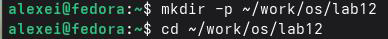


Шаг 2: Создайтескриптрезервногокопирования Содержимоескрипта: \#Скрипт: backup_script.sh \#Описание: Создаетрезервнуюкопиюсамогоскриптав~/backup/


\#Создайтекаталогрезервногокопирования, еслионнесуществует

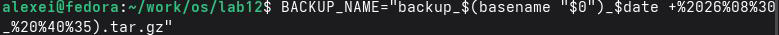

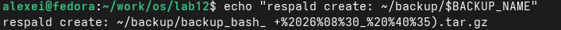

\#Назовитефайлрезервнойкопиисуказаниемдаты \#Создайтефайлtar.gzтекущегоскрипта tar \-czf~/backup/"$BACKUP_NAME""$0" \#Сообщениесподтверждением Шаг 3: Сделайтескриптисполняемым


### Шаг 4: Запуститескрипт

---

### Шаг 5: Убедитесь, чторезервнаякопиясоздана

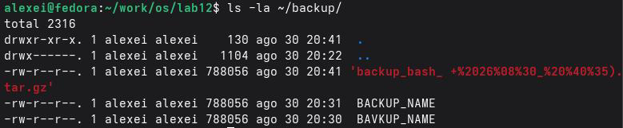


## 3.2.Скриптспроизвольнымколичествомаргументов

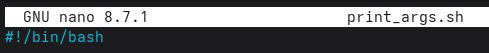

Задание: Напишите скрипт, который принимает любое количество аргументов

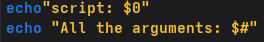

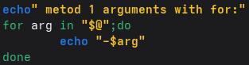

команднойстроки (дажебольше 10) ивыводитихпоследовательно.

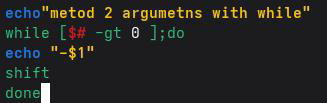

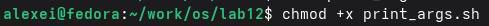

> Шаг 1: Создайтескрипт
> Содержимоескрипта:
> Шаг 2: Сделайтескриптисполняемым

---

Шаг 3: Запуститескриптсразнымколичествомаргументов

## 3.3.Скрипт, аналогичныйкомандеls

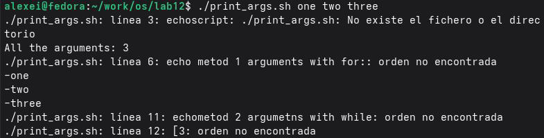

Инструкции: Напишите скрипт, работающий как `ls`(без использования команд `ls` или`dir`), отображающийинформациюобуказанномкаталогеиправахдоступакфайлам.

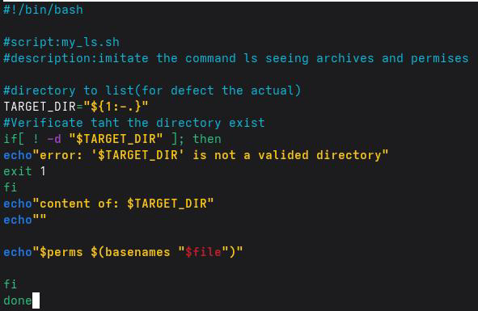

### Шаг 1: Создайтескрипт

> bash
> nanomy_ls.sh
> Содержимоескрипта:
> Шаг 2: Сделайтескриптисполняемым

---

### Шаг 3: Запуститескрипт


## 3.4.Скриптдляподсчетафайловпорасширению

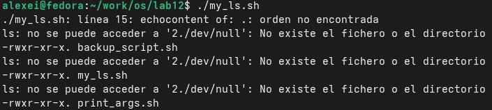

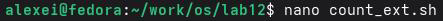

Скрипт `count_ext` принимает в качестве аргументов расширение файла (например,.txt,.doc,.jpg,.pdf) икаталог, иподсчитывает, сколько файлов сэтим расширениемнаходитсявкаталоге.

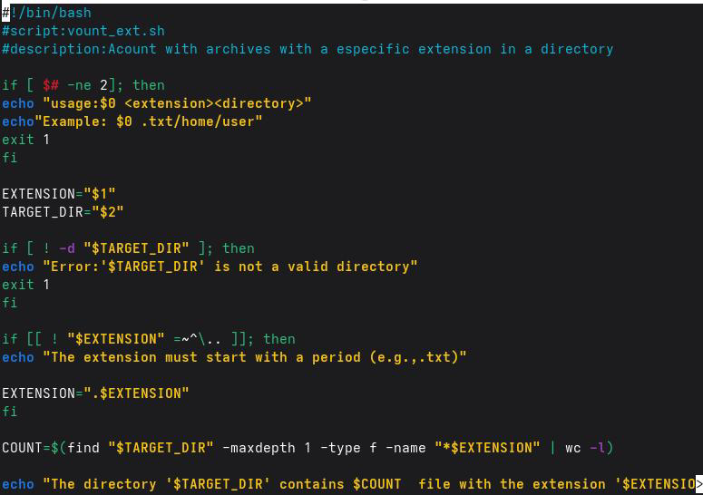

> Шаг 1: Созданиескрипта
> Содержимоескрипта:
> Шаг 2: Сделайтескриптисполняемым
> Шаг 3: Запуститескрипт

## Контрольныевопросы

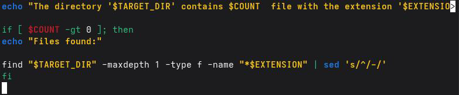

Вэтом разделе представлены ответы на контрольные вопросы по программированию на Bash, которые позволят вам проверить понимание основных концепций написания сценариевоболочкивсистемах Unix/Linux.

1.Объяснитепонятиекоманднойоболочки. Приведитепримерыкомандных


оболочек. Чемониотличаются?

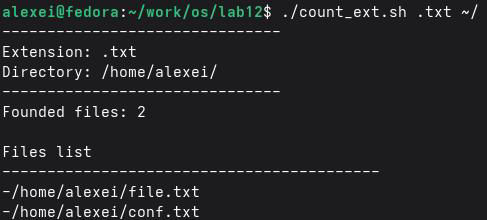

Команднаяоболочкаэтопрограмма, котораявыступаетвкачествеинтерфейса междупользователемиоперационнойсистемой, интерпретируяивыполняякоманды, введенныепользователем. Этосреда, вкоторойпользователимогутвзаимодействоватьс системойспомощьюкоманднойстрокиилискриптов.

### Примерыоболочекв Unix/Linux:

---

### Оболочка Особенности

Оболочка Борна (sh) Оригинальнаяоболочка UNIX, простаяибазовая. Она

являетсяосновойдлямногихдругихоболочек.

Оболочка C (csh) Используетсинтаксис, похожийнаязык C.Включает

историюкомандипсевдонимы.

Оболочка Корна (ksh) Сочетаетвсебевозможностиshиcsh. Соответствует

стандарту POSIX.

BASH (Bourne Again Shell) Самаяраспространеннаяоболочкав Linux. Сочетаетв

> себевозможностиsh, cshиksh. Являетсяоболочкойпо
> умолчаниювбольшинстведистрибутивов Linux.

### Основныеразличия:

```text
 Синтаксис: cshимеетсинтаксис, похожийна C (например, if (condition) then), втовремя
какsh/ksh/bashиспользуютif[condition]; then.
```

 Возможности: bashиkshобладаютбольшимколичествомфункций, чемsh (автозавершение, историякоманд, массивыит.д.).

 Совместимость: shболеебазовый; bashвключаетдополнительныевозможности.

2.Чтотакое POSIX?

POSIX (Portable Operating System Interface) этонабормеждународныхстандартов

(IEEE), определяющихинтерфейсмеждуоперационнойсистемойиприкладными программами. Егоосновнаяцельобеспечитьпереносимостьпрограммногообеспечения междуразличными UNIXсовместимымиоперационнымисистемами, позволяяпрограммам, написаннымдляоднойсистемы POSIX, работатьнадругойсминимальнымиизменениями.

3.Какопределяютсяпеременныеимассивывязыкепрограммированияbash?

### Переменные:

ВBash переменные определяются без объявления типа данных, ипо умолчанию они

### являютсястроками:

---

```text
bash
name="Alice"#Простаяпеременная
number=10#Числоваяпеременная (рассматривается какстрока)
Длядоступакеёзначениюиспользуйте$:
```

> bash
> echo$name#Выводит"Alice"
> Массивы:

### Ониопределяютсявскобках:

> bash
> fruits=("apple" "banana" "cherry")#Массив
> echo ${fruits[0]}#Выводит"apple"
> echo ${fruits[@]}#Выводитвсеэлементы
> 4.Каковоназначениеоператоровletиread?

`let`: Позволяет выполнять арифметические операции иприсваивать результат

переменной.

> bash
> leta=5+3
> echo$a#8

`read`: Считывает ввод пользователя склавиатуры (stdin) исохраняет его в

переменной.

> bash
> readname
> echo "Hello,$name"

5.Какиеарифметическиеоперацииможноприменятьвязыкепрограммированияbash?

---

Bash поддерживает следующие арифметические операции (сиспользованием $((...)) илиlet):

Оператор Описание Пример

+ Сложение $((3+5))→8 Вычитание $((104))→6 \* Умножение $((4*5))→20 /Целочисленноеделение $((10/3))→3% Остатокотделения $((10%3))→1 \** Возведениевстепень $((2**3))→8 ++ Инкремент ((i++)) \-Декремент ((i--)) += Присваиваниессложением ((x+=5)) 6.Чтоозначаетоперация(())?

Синтаксис ((...)) в Bash используется для вычисления арифметических выражений.

Он позволяет выполнять математические операции ичисловые присваивания всреде командной оболочки. Его можно использовать вциклах, условных операторах и присваиваниях.

> bash
> ((a=5+3))#Присваивание
> echo$a#8
> ((a++))#Увеличение
> if((a>10)); then#Условие
> echo"aбольше 10"
> fi

7.Какиестандартныеименаувасесть?

### Переменная Описание

HOME Домашнийкаталогпользователя. PATH Списоккаталогов, вкоторыхвыполняетсяпоисккоманд.

---

```text
USERили LOGNAME Текущееимяпользователя.
SHELL Текущаяоболочкапользователя.
PWD Текущийрабочийкаталог.
OLDPWD Предыдущийрабочийкаталог.
TERM Типтерминала.
HOSTNAME Имяхоста.
RANDOM Генерируетслучайныечисла.
PS1 Команднаястрока.
```

8.Чтотакоеметасимволы?

Метасимволы это специальные символы вкомандной оболочке, имеющие специфическое значение, выходящее за рамки их буквального значения. Они позволяют выполнятьтакие операции, как перенаправление, использование конвейера, подстановочных знаковит.д.

### Примеры:

 \*подстановочныйзнак (любаястрока). ? подстановочныйзнак (одинсимвол).  [] наборысимволов.  |конвейермеждукомандами.  \>перенаправлениевывода.  <перенаправлениеввода.  $переменная.  &фоновоевыполнение.

9.Какэкранироватьметасимволы?

Чтобы оболочка интерпретировала метасимвол как буквальный символ (то есть без

егоособогозначения), используетсяэкранирование. Методыэкранирования:

1.Спомощьюобратнойкосойчерты\\: экранируетодинсимвол.

### bash

---

```text
echo\*#Выводит'*'
echo\$HOME#Выводит'$HOME'
```

2.Спомощьюодинарныхкавычек'': экранируетвсеметасимволывнутриних. echo'Каталог$HOME'#Выводит'Каталог$HOME'

> bash
> bash

```text
3.Спомощьюдвойныхкавычек"": экранируетвсеметасимволы, кроме$,\и`.
echo"Каталог$HOME"#Выводит'Каталог/home/username'
10.Каксоздаватьизапускатькомандныефайлы?
```

### Созданиескрипта:

1. Создайтетекстовыйфайлсрасширением.sh (необязательно) инапишитевнёмкоманды.
2. Первая строка должна содержать shebang: \#!/bin/bash (или название используемой вами

оболочки).

3. Сохранитефайл.

### Сделайтеегоисполняемым:

bash chmod+xscript_name.sh

### Запуститеего:

> bash
> ./script_name.sh

11.Какопределяютсяфункциивпрограммированиина Bash?

Функциив Bashможноопределитьдвумяспособами:

---

### Способ 1 (наиболеераспространенный):

> bash
> functionfunction_name{
> \#команд
> }
> Способ 2:
> bash
> function_name(){
> \#команд
> }
> Пример:
> bash
> function greet{
> echo "Hello, $1!"
> }
> greet"World"#Выводит"Hello, World!"

12. Каким образом можно узнать, является ли файл каталогом или обычным

файлом?

```text
ВBashвыможетеиспользовать операторы проверки -f (обычныйфайл) и-d (каталог)
```

### внутриоператораif:

> бить
> если[-f"$файл"]; затем
> echo "$fileобычныйфайл."
> элиф[-d"$файл"]; затем
> echo«$fileэтокаталог».

### еще

> echo "$fileнесуществуетилиимеетдругойтип."
> Фи

13.Какназываютсякомандыset, typesetиunset?

 set: Позволяет настраивать или отображать параметры иопции оболочки. Также используетсядляприсвоениязначенийпозиционнымпеременным. bash set-arg 1 arg 2 arg 3#Присваиваетпозиционныеаргументы echo$1#arg 1

```text
 `typeset`: Объявляет переменныесопределенными атрибутами (аналогично `declare`).
Полезендляопределенияпеременныхилимассивовтолькодлячтения.
bash
typeset-r PI=3.14159#Переменнаятолькодлячтения
```

 unset: Удаляетпеременныеилифункции.

> bash
> unsetname#Удаляетимяпеременной
> unset-fgreet#Удаляетфункциюgreet

14.Какпередаютсяпараметрывкомандныхфайлах?

Параметрыпередаютсяскриптувкоманднойстрокепослеименискрипта:

---

> bash
> ./script.sh parameter 1 parameter 2 parameter 3

Внутрискриптадоступкнимосуществляетсяспомощьюпозиционныхпеременных:

```text
 $0имяскрипта.
 $1первыйпараметр.
 $2второйпараметрит.д.
 $#общееколичествопараметров.
 $@всепараметрыввидесписка.
 $*всепараметрыввидеоднойстроки.
```

15.Назовитеспециальныевариантыязыкаbashиихназвания.

```text
Переменная Описание
$0 Имятекущегоскриптаилиоболочки.
```

```text
$1до$9 Позиционныепараметры (аргументы).
$# Количествопереданныхаргументов.
$@ Всеаргументыввидеотдельногосписка.
$* Всеаргументыввидеоднойстроки.
$? Кодзавершенияпоследнейвыполненнойкоманды.
$$ PIDтекущейоболочки.
$! PIDпоследнегофоновогопроцесса.
$Текущиепараметрыоболочки.
```

## Выводы

Входе выполнения лабораторной работы яизучил основы программирования в командномпроцессоре ОСUNIXнапримереязыкаbash. Яосвоилосновныеэлементыязыка: переменные, арифметические операции, метасимволы иих экранирование, атакже управляющие конструкции (условные операторы, циклы for, while, untilиоператор выбора case). Янаучился создавать ивыполнять командные файлы (скрипты), передавать им параметрыиобрабатывать аргументы командной строки. Мной были разработаны четыре скрипта: для создания резервной копии самого себя, для обработки произвольного числа аргументов, аналог команды lsискрипт для подсчёта файлов по расширению. Все поставленные задачи выполнены, полученные навыки являются основой для автоматизации задачвоперационнойсистеме Linux.

---

## Списоклитературы

 danielnjama. (2025).Руководствопонаписаниюскриптов Bash. Git Hub.
https://github.com/danielnjama/bash-scripting#1

 Free Software Foundation. (2026).Справочноеруководствопо Bash: Массивы. GNU.org.
https://www.gnu.org/software/bash/manual/html_node/Arrays.html

 Linux Config. (2022).Скрипты Bash: Примерыиспользованияфлаговсаргументами.
https://linuxconfig.org/bash-script-flags-usage-with-arguments-examples
 Geeksfor Geeks. (2025).Позиционныепараметрывскриптахоболочки.
https://www.geeksforgeeks.org/linux-unix/how-to-use-positional-parameters-in-shell-scripting/
 Educational. (2026).Шпаргалкапо Bash: 25лучшихкомандисозданиепользовательских
команд.https://www.educative.io/blog/bash-shell-command-cheat-sheet

 Geeksfor Geeks. (2024).Скриптоболочкидлядемонстрацииспециальныхпараметров.
https://www.geeksforgeeks.org/linux-unix/shell-script-to-demonstrate-special-parameters-with-
example
