# РОССИЙСКИЙУНИВЕРСИТЕТДРУЖБЫНАРОДОВ

Факультетфизикоматематическихиестественныхнаук

Кафедраприкладнойинформатикиитеориивероятностей

ОТЧЕТ

ПОЛАБОРАТОРНОЙРАБОТЕNo 13 дисциплина: Архитектуракомпьютера

### Студент: Ромеро Гаспар Фернандо Алексей

### Группа: НКАбд-02-25

```text
МОСКВА
2026г.
```

---

## Оглавление

1. Цельработы
2. Заданиеипоследовательностьвыполненияработы

2.1.Скриптсиспользованиемgetopts (поискспараметрами)

2.2.Программанаязыке Cискриптдляанализавыходногокода 2.3.Скриптдлясоздания/удалениянумерованныхархивов 2.4.Скриптдляархивированияспомощьюtarифильтрацииподате

3. Контрольныевопросы
4. Выводы
5. Списоклитературы

---

## Цельработы

Целью данной лабораторной работы является изучение основ программированияв оболочке ОС UNIXиполучение навыков написания более сложных командных файловс использованиемлогическихуправляющихконструкцийициклов.

---

## Заданиеипоследовательностьвыполненияработы

Вэтом разделе описываются скрипты, которые необходимо разработать для данного

упражнения, атакжешагиикоманды, необходимыедляихреализации.

## 2.1.Скриптсиспользованиемgetopts (поискспараметрами)

Задача: Создайте скрипт, который анализирует командную строку со следующими

```text
параметрамиивыполняетпоисквфайленаосновеуказанногошаблона.
 -i (входнойфайл): чтениеданныхизуказанногофайла
 -o (выходнойфайл): записьвыводавуказанныйфайл
```


### Параметрыдляреализации:

```text
 -p (шаблон): поискпошаблону
 -C: регистрозависимый
 -n: отображениеномеровстрок
```

Как работает getopts: getoptsэто встроенная команда Bash, которая позволяет структурированно анализировать параметры командной строки. Параметры, которые ожидают аргумент, должны сопровождаться двоеточием (:) встроке параметров. Если параметримеетаргумент, getoptsсохраняетегозначениевпеременной OPTARG.

### Шаг 1: Созданиескрипта

### Кодскрипта:

---

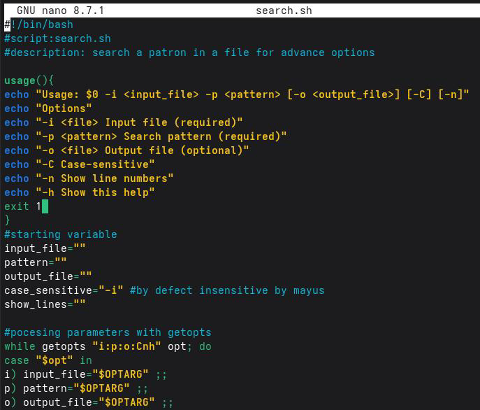

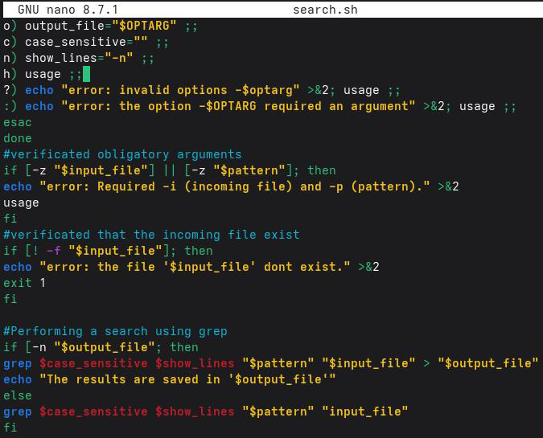

Шаг 2: Запускскрипта

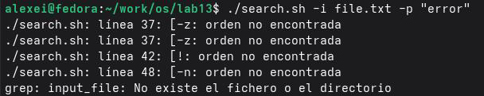

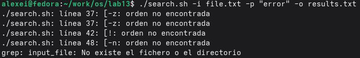

---

## 2.2.Программанаязыке Cискриптдляанализавыходногокода

Задача: Создайтепрограммунаязыке C, котораяопределяет, являетсяличисло положительным, отрицательнымилиравнымнулю, ивозвращаетопределенныйкод завершения. Затемскрипт Bashдолженвызватьэтупрограммуивывестисообщениев зависимостиоткодазавершения.

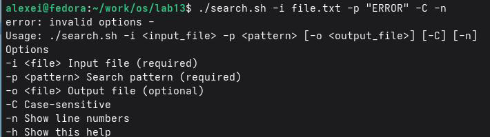

Кодзавершения: ВBashкодзавершениякомандыхранитсявпеременной$?.По


соглашению, код 0означаетуспех, акод, отличныйот 0, ошибку.

### Шаг 1: Создайтепрограммунаязыке C

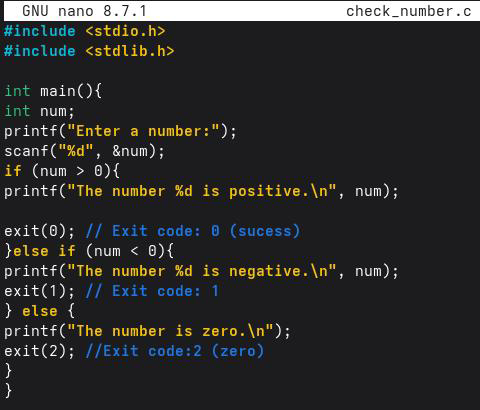

### Кодпрограммы:

---

### Шаг 2: Скомпилируйтепрограмму


Шаг 3: Создайтескрипт, которыйанализируеткодзавершения

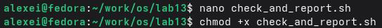

> Кодскрипта:
> Шаг 4: Запуститескрипт

## 2.3.Скриптдлясоздания/удалениянумерованныхфайлов

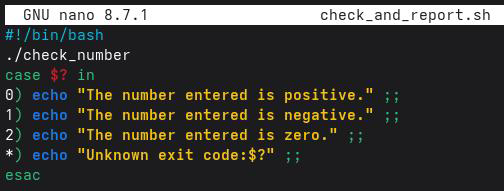

Задача: Создатьскрипт, которыйгенерирует Nпоследовательнопронумерованных

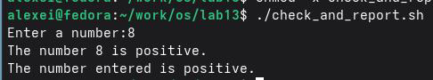

файлов (например, 1.tmp, 2.tmp,..., N.tmp) иможеттакжеудалятьих.

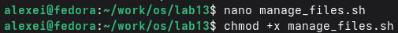

> Шаг 1: Созданиескрипта
> Кодскрипта:

---

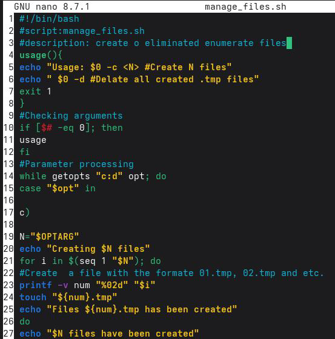

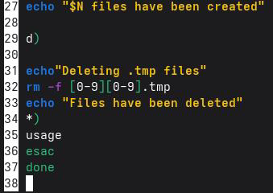

Шаг 2: Запускскрипта

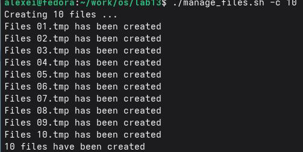

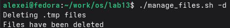

---

## 2.4.Скриптдляархивированияспомощьюtarифильтрацииподате

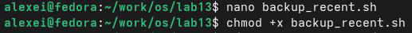

Задача: Создатьскрипт, которыйархивируетвсефайлывкаталогеспомощьюtar, но

толькоте, которыебылиизмененызапоследнююнеделю.

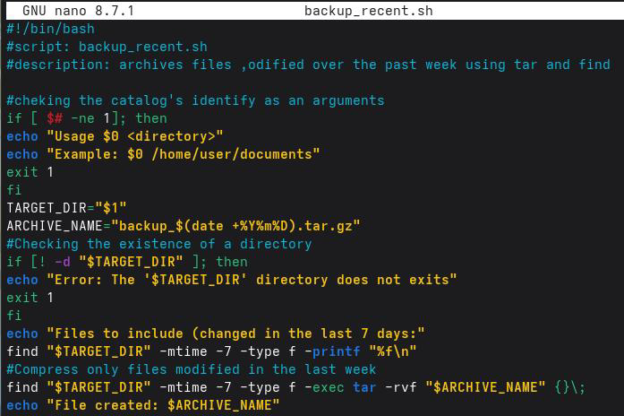

> Шаг 1: Созданиескрипта
> Кодскрипта:
> Шаг 2: Запуститескрипт

---

## Контрольныевопросы

Вэтомразделепредставленыответынаконтрольныевопросыпопродвинутому программированиюв Bash, которыепозволятвампроверитьпониманиеконцепцийgetopts, метасимволов, управляющихструктурициклов.

1.Чтотакоекомандаgetopts?

Командаgetoptsэтовстроенныйинструмент Bash, позволяющий

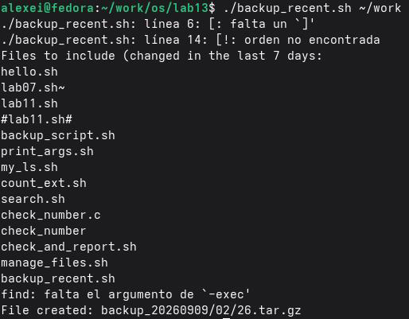

```text
структурированнымистандартнымспособоманализироватьиобрабатыватьпараметры
команднойстрокивскриптах. Еёцельупроститьреализациюпользовательских
интерфейсоввскриптах, позволяяскриптуполучатьаргументысфлагами (например,-i,-o,-
pит.д.) иихсоответствующиезначения.
```

### Основныевозможности:

 Обрабатываетоднобуквенныепараметрысдефисом(-).  Допускаетпараметрысаргументами (используядвоеточиевстрокепараметров).  Сохраняетзначениеаргументавпеременной OPTARG.  Сохраняетиндексследующегоаргументавпеременной OPTIND.  Поддерживаетстандартныепараметрыиобработкуошибок.

2.Какоеотношениеметасимволыимеюткгенерацииимёнфайлов?

---

Метасимволы (также называемые «подстановочными знаками») в Bash позволяют генерировать имена файловсиспользованием шаблонов (глоббинг).Это особенно полезно,

когданеобходимоссылатьсянанесколькофайловодновременно.

Метасимво Описание л

### Пример

- Соответствует любой строке (включая пустые \*.txt→всефайлы.txt

### строки)

```text
? Соответствуетодномусимволу file?.txt→file1.txt, file2.txt
[] Соответствуетнаборусимволов file[0-9].txt → file0.txt,
```

### file1.txt

```text
[^] Исключаетнаборсимволов file[^0-9].txt → исключает
```

файлы с числовыми значениями

### Связьсгенерациейименфайлов:

 Метасимволыпозволяютразворачиватьшаблонывспискахфайлов.

```text
 Этоупрощаетоперацииснесколькимифайлами (например,`cp *.pdf ~/documents/`).
```

 Оболочкавыполняетрасширениепередвыполнениемкоманды.

3.Какиеоператорывызнаете?

ВBashестьнесколькооператоровиуправляющихструктур:

```text
Структура Описание Пример
```

```text
if Простое условное если[условие]; тогда...fi
if-else Условное выражениес если [условие]; тогда...
```

### выражение

### альтернативой иначе...fi

```text
if-elif-else Несколькоусловий если [c1]; тогда... elif [c2];
```

### тогда...иначе...fi

case Множественныйвыбор case $var in pattern 1)...;;

---

### pattern 2)...;; esac

```text
for Циклпосписку foriinlist; do...done
while Условныйцикл while[условие]; do...done
until Циклдоусловия until[условие]; do...done
break Выходизцикла break
continue Переход кследующей continue
4.Какиеоператорыиспользуютсядлясозданияцикла?
```

### итерации

ВBashдляпрерыванияцикловиспользуютсяследующиеоператоры:

 break Завершаетвыполнениетекущегоцикла (полностьювыходитизнего).  continue Переходкследующейитерациицикла (незавершаетвесьцикл).

bash foriin{1..10}; do if[$i-eq5]; then break#Выходизциклаприi=5 fi echo$i done bash foriin{1..5}; do if[$i-eq3]; then continue#Пропускитерацииприi=3 fi echo$i done

5.Длячегонужныкоманды`false`и`true`?

Команды `true` и`false` это встроенные утилиты Bash, возвращающие

---

### определенныекодызавершения:

```text
 `true`Всегдавозвращаеткодзавершения 0 (успех/истина).
 `false`Всегдавозвращаеткодзавершения 1 (неудача/ложь).
```

### Распространенныевариантыиспользования:

### 1.Бесконечныециклы:

> `bash`
> `while true; do`
> `echo "Running..."`
> `sleep 1`
> `done`

### 2.Условныескрипты:

> `bash`
> `iftrue; then`
> `echo "Thisalways runs"`
> ``

### 3.Отладкаитестирование:

> `bash`
> `command&&echo "Success"||echo "Failure"`
> 6.Чтоозначает`iftest-fmans/s/i.\\$s`?

Эта строка проверяет, существует ли файлсдинамически генерируемым именем.

### Давайтепроанализируемкаждуючасть:

```text
Часть Значение
`iftest -f` Проверяет, существуетлифайлиявляетсялионобычным(-f).
`man` Фиксированныйпрефиксименифайла.
```

---

`$s` Переменная, содержащаязначениерасширенияилисуффикса. `\\\\$i` Экранирует знак доллара ($), чтобы он не интерпретировался как

переменная, отображая`$i`буквально.

`.` Буквальныйразделитель. `\\\\$s` Экранируетзнакдоллара($), чтобыотображать$sбуквально.

### Интерпретация:

Этастрокапроверяет, существуетлифайлсименемman<value_of_s>$i.<value_of_s>в

текущемкаталоге.

7.Объяснитеразличныеконструкцииwhileиuntil.

### Характеристика while until

Условие Выполняется, пока условие Выполняется до тех пор, пока условие

истинно (кодзавершения 0). истинно (кодзавершения 0).

Эквивалент while[condition]; do...done while[! condition]; do...done

Типичное Повторять, пока чтото Повторять, покачтотоистинно. использование истинно.

> Пример:
> bash
> \#while: выполняется, покаcounter<=5
> counter=1
> while[$counter \-le5]; do
> echo "while: $counter"
> ((counter++))
> done
> \#until: выполняется, покаcounter>5
> counter=1
> until[$counter \-gt5]; do
> echo "until: $counter"
> ((counter++))
> done

---

### Основноеразличие:

 whileвыполняетблок, покаусловиеистинно.  Функция `until` выполняет блок кода до тех пор, пока условие не станет истинным (т.е. покаоноложно).

## Выводы

Входе выполнения лабораторной работы яизучил основы программирования в оболочке ОСUNIXинаучился писать более сложные командные файлысиспользованием логических управляющих конструкцийициклов. Яосвоил использование команды getopts для анализакоманднойстрокисключами, создал программу наязыке Сиикомандныйфайл для анализа кода завершения, разработал скрипт для созданияиудаления пронумерованных файлов, атакжереализовалскриптдляархивациифайловсфильтрациейподатеизмененияс помощью команд tar иfind. Все поставленные задачи выполнены, полученные навыки являютсяосновойдляавтоматизациисложныхзадачвоперационнойсистеме Linux.

---

## Списоклитературы

 Baeldung. (2021).Анализаргументовкоманднойстрокив Bash.
https://www.baeldung.com/linux/bash-parse-command-line-arguments
 GNU.(2026).Справочноеруководствопо Bash: Кодзавершения.
https://www.gnu.org/software/bash/manual/html_node/Exit-Status.html

 Zero To Mastery. (2025).Руководстводляначинающихпоиспользованиюgetoptsв Bash.
https://zerotomastery.io/blog/bash-getopts
 Lab Ex.(2025).Какиспользоватькодзавершениявскриптах?
https://labex.io/questions/how-to-use-exit-status-in-scripts-927170

 Geeksfor Geeks. (2024).Скриптингв Bashциклwhile. Получено 15августа2026г.с
https://www.geeksforgeeks.org/bash-scripting-while-loop/

 \*Geeksfor Geeks. (2023).Скриптингв Bashциклuntil. Получено 15августа2026г.с
https://www.geeksforgeeks.org/bash-scripting-until-loop/