# РОССИЙСКИЙУНИВЕРСИТЕТДРУЖБЫНАРОДОВ

Факультетфизикоматематическихиестественныхнаук

Кафедраприкладнойинформатикиитеориивероятностей

ОТЧЕТ

ПОЛАБОРАТОРНОЙРАБОТЕNo 14 дисциплина: Архитектуракомпьютера

### Студент: Ромеро Гаспар Фернандо Алексей

### Группа: НКАбд-02-25

```text
МОСКВА
2026г.
```

---

## Оглавление

1. Цельработы 2. Заданиеипоследовательностьвыполненияработы 2.1.Скриптссемафоромисинхронизациейпроцессов 2.2.Скриптдляимитациикомандыman 2.3.Скриптдлягенерациислучайныхпоследовательностейбукв

3. Выводы
4. Списоклитературы

---

## Цельработы

Целью данной лабораторной работы является изучение основ программированияв оболочке ОС UNIXиполучение навыков написания более сложных командных файловс использованием логическихуправляющихконструкцийициклов, атакже освоениеработыс семафорами, генерациейслучайныхчиселисозданиеманалоговсистемныхкоманд.

---

## Заданиеипоследовательностьвыполненияработы

Вэтом разделе представлены задания, которые необходимо выполнить, иподробные инструкции по созданию скриптов на языке bash для реализации семафоров, имитации командыmanигенерациислучайныхпоследовательностейбукв.


## 2.1.Скриптссемафоромисинхронизациейпроцессов

Задание: Написатькомандныйфайл, реализующийупрощённыймеханизмсемафоров.

Командный файл должен втечение некоторого времени t1 дожидаться освобождения ресурса, выдавая об этом сообщение, адождавшись его освобождения, использовать егов течение некоторого времени t2<t1, также выдавая информацию отом, что ресурс используется. Запустить командный файл водном виртуальном терминале вфоновом режиме, перенаправив его вывод вдругой терминал. Доработать программу для взаимодействиятрёхиболеепроцессов.


Теоретическая справка: Семафор это механизм синхронизации, который контролирует доступкобщему ресурсувмногозадачных системах. ВBash семафор можно реализовать спомощью файловблокировок, где наличие файла указывает на занятость ресурса.

> Шаг 1: Созданиескриптасемафора
> Кодскрипта (длядвухпроцессов):

---

Шаг 2: Запуститескриптвдвухтерминалах Терминал 1 (основной):

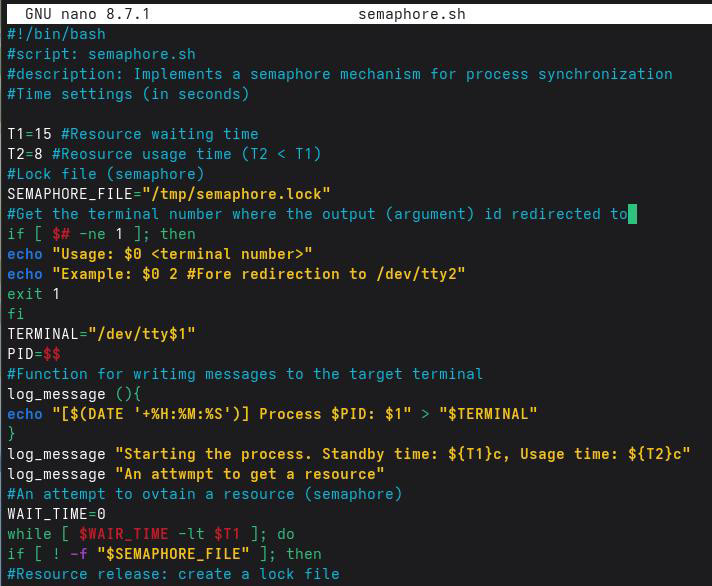

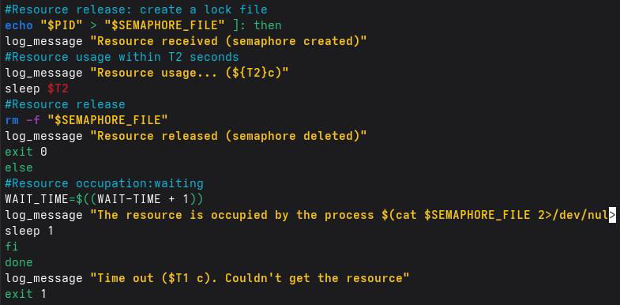

Шаг 3: Версиядлятрехпроцессов (semaphore_multiple.sh)


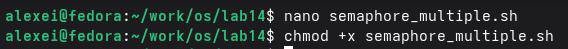

Кодскрипта (длянесколькихпроцессов): Шаг 4: Запускнесколькихпроцессов

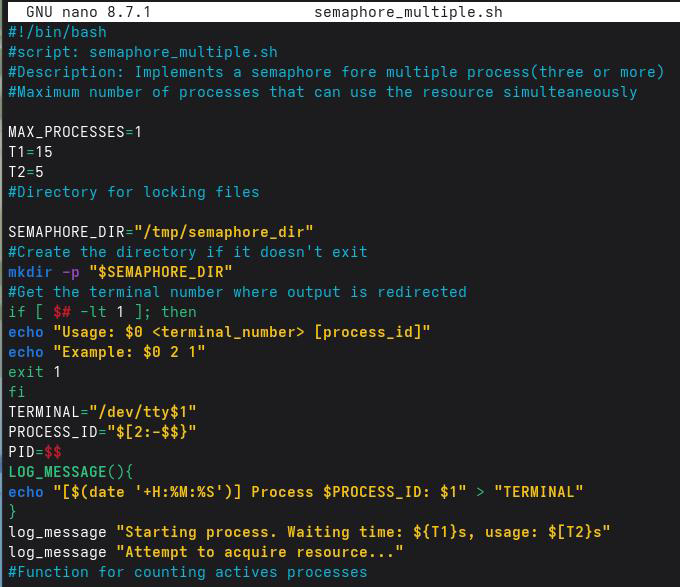

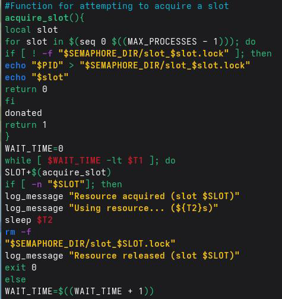

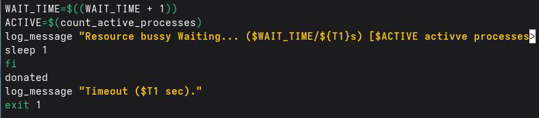

## 2.2.Скриптдляимитациикомандыman

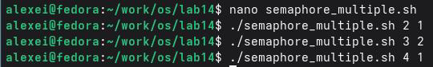

---

Задание: Реализоватькомндуmanспомощьюкомндногофайла. Командныйфайл долженполучатьимякомандывкачествеаргументаиотображатьегосправочнуюстраницу илисообщениеобошибке, еслиононесуществует.

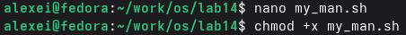

> Шаг 1: Созданиескрипта
> Кодскрипта:

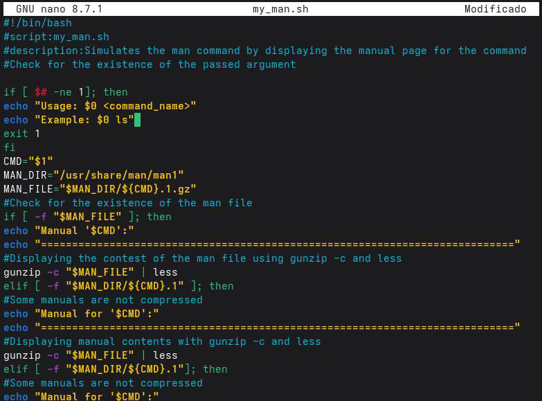

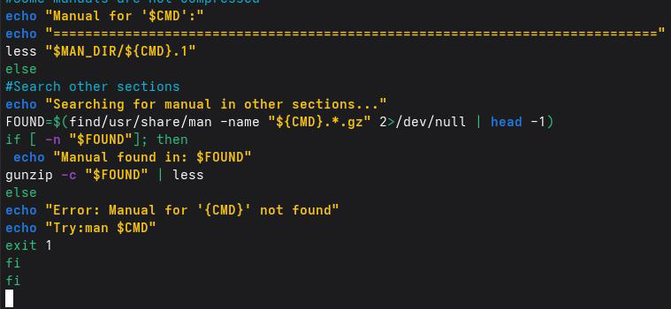

### Шаг 2: Просмотрсодержимогокаталогаman 1

---

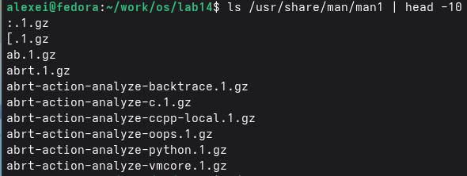


Шаг 3: Запускскрипта

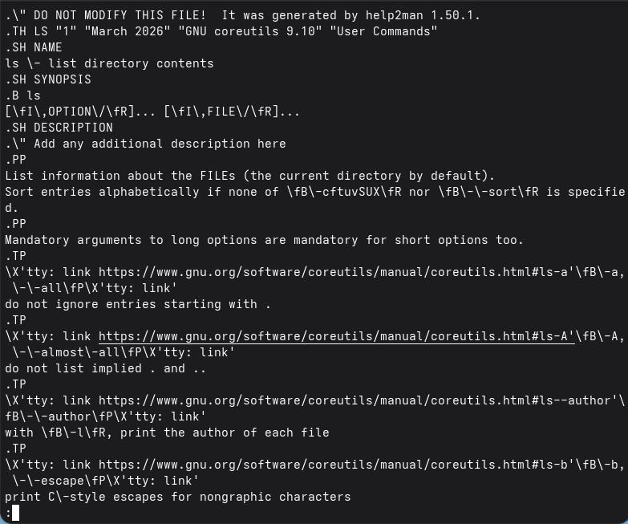


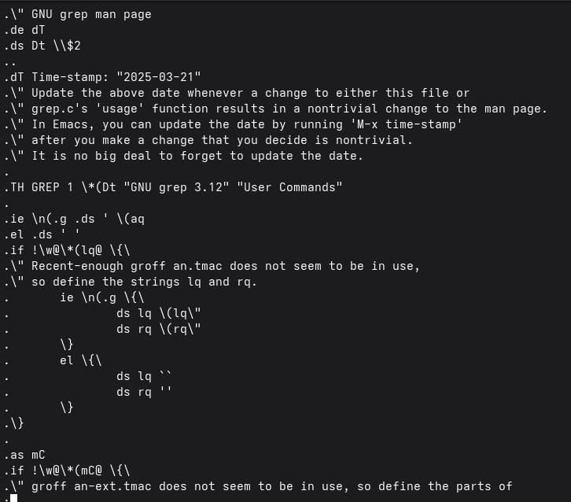

---

## 2.3.Скриптдлягенерациислучайныхпоследовательностейбукв


Задание: использование встроенной переменной $RANDOM, запись командного файла, генерация случайной последовательности букв лучайнуго `$RANDOM` генерирует псевдослучайныечиславдиапазонеот 0до32767.


Шаг1.Создайтесценарий.

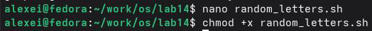

### Кодскрипта:

---

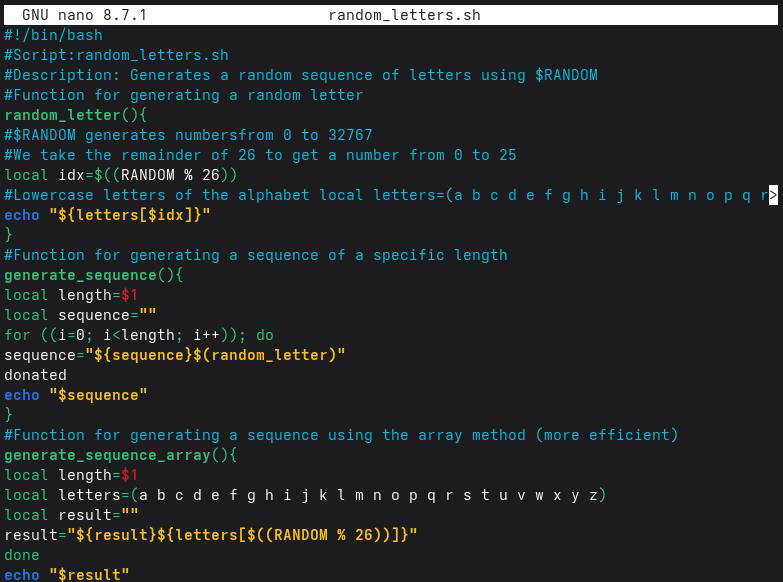

Шаг 2: Расширеннаяверсияспараметрамикоманднойстроки bash nanorandom_letters_cli.sh chmod+xrandom_letters_cli.sh Кодскрипта (саргументамикоманднойстроки): Шаг 3: Запускскриптов

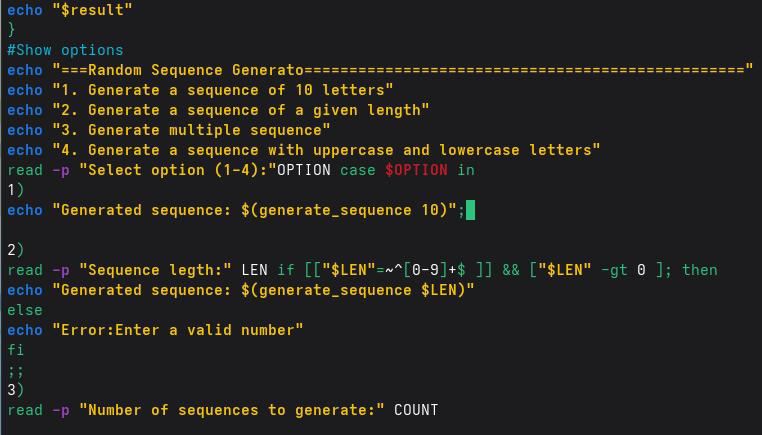

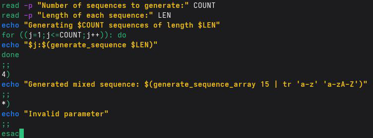

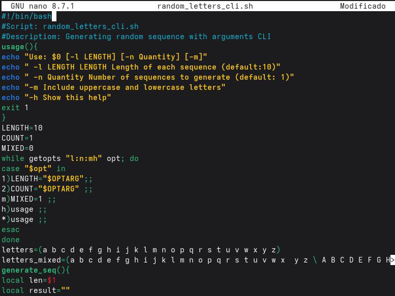

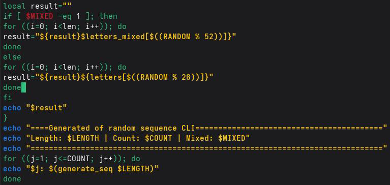

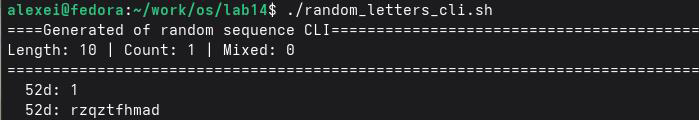

---

## Контрольныевопросы

Вэтомразделедаютсяответынаконтрольныевопросы, касающиесяпродвинутого

программированияв Bash.

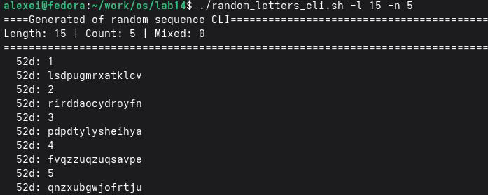

1.Найдитесинтаксическуюошибкувследующейстроке: while[$1!="exit"]

Основная ошибка заключаетсявотсутствии пробелов вокруг скобокиоператоров сравнения. ВBashправильныйсинтаксисдля`[(test)`требуетпробеловмеждуэлементами.

###  Неправильно (какввопросе):

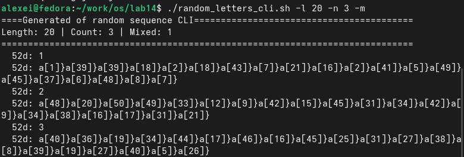

> bash
> while [$1!="exit"]

###  Правильно:

### bash

---

> while["$1"!="exit"]
> Пояснениеизменений:

 Пробелпосле`[`иперед`]`  Пробелывокруг оператора`!=`.  Переменные должны быть заключены вдвойные кавычки ("$1"), чтобы избежать проблем, еслиаргументсодержитпробелыилипуст.

2.Необходимолиподключатьдвижокксети?

ВBash конкатенация строк выполняется простым размещением переменных рядом

другсдругомводнойстроке.

> Простойпример:
> bash
> str 1="Hello"
> str 2="World"
> result="$str 1 $str 2"
> echo "$result"#Выводит: Hello World

### Другиеспособы:

###  Использование+=:

> bash
> text="Hello"
> text+="World"
> echo "$text"#Выводит: Hello World

 Использованиеprintf-v (болееэффективнаяверсиядлямножестваконкатенаций):

> bash
> printf-vresult '%s' "$str 1" "$str 2"

---

### echo "$result"#Выводит: Hello World

3.Найдитеинформациюотом, как использовать seq. Можноли релизоватьиее

функцииприпрограммированиивbash?

seqгенерируетпоследовательностичисел. Пример:`seq 15`выводит12345.

### Альтернативыв Bash:

1. С`for`и`{start..end}`(рекомендуетсядляфиксированныхдиапазонов):

> `bash`
> `foriin{1..10}; doecho $i; done`

2. С`while`(дляболеесложныхпоследовательностей):

> `bash`
> `i=1`
> `while[$i-le10]; doecho $i; ((i++)); done`

3. С`for ((...))`(синтаксис, похожийна C):

> `bash`
> `for ((i=1; i<=10; i++)); doecho$i; done`
> 4.Каковрезультатоперации$((10/3))?

Результатоперации$((10/3)) равен3.

```text
В Bash арифметические операции с$((...)) работают сцелыми числами
(целочисленное деление).Результат отбрасывает десятичную часть, поэтому 10/3=3, 333...
становится3.
```

5.Укажитекраткоосновныеотличиякоманднойоболочкиzshотbash.

---

 zsh (Z Shell) более современнаяипродвинутая оболочка, чем Bash, сулучшенными

функциямидляинтерактивногопользователя.

 Bashэто универсальная стандартная оболочка; она присутствует почтивкаждой

системе Linux, болеестабильнаиимеетлучшуюподдержкускриптов. Основныеотличия:

Функции Bash Zsh Автозавершение Базовое

### Интеллектуальное, сописаниямии

### параметрами

Совместимость Универсальная (стандартная Не всегда устанавливается по

### в Linux) умолчанию

Скрипты Более стабильная и Менее портативная (скрипты портативная могутдаватьсбоивдругихоболочках)

Настройка Ограниченная Высокая степень кастомизации

### (темы, плагиныс Oh My Zsh)

Исправление Неисправляетопечатки Предлагает исправления для

### ошибок

### неправильнонаписанныхкоманд

```text
6.Проверьтеправильностьследующегосинтаксиса: for ((a=1; a<=LIMIT; a++))
```

Да, синтаксисправильный (приусловии, что LIMITпредопределеннаяпеременная).

Этосинтаксисцикловforв Bashвстиле C.

### Полныйиправильныйпример:

```text
bash
LIMIT=5
for ((a=1; a<=LIMIT; a++)); do
echo "Iteration $a"
done
```

7.Экономия временииденег без программирования. Что вы думаетеотом,

чтобыпопробоватьэтосделать? Какиенедостатки?

---

### Преимущества Bash:

 Прямая интеграция соперационной системой: Вы можете выполнять команды, управлятьфайламиипроцессамибезвнешнихбиблиотек.

 Простая автоматизация: Идеально подходит для административных задач, резервного копированияирабочихпроцессовразработки (конвейеров).  Установленпоумолчанию: Практическивовсехсистемах Unix/Linux.

### Недостатки:

 Неинтуитивныйсинтаксис: Легкодопуститьошибки (например, забытьпробелыв[]).  Сложности со сложными операциями: Математикаирасширенная обработка данных ограничены; всеобрабатываетсякактекст.

 Менееструктурирован: Вотличие отязыков, таких как Python или C, структурыданных ограничены (встарыхверсияхнетсобственныхобъектовилиассоциативныхмассивов).  Ограниченная переносимость: Скрипты, использующие специфические для Bash функции, могутнеработатьвдругихоболочках (например, shилиdash).

## Выводы

Входе выполнения лабораторной работыя изучил основы программированияв оболочке ОСUNIXинаучился писать более сложные командные файлысиспользованием логических управляющих конструкций ициклов. Яреализовал упрощённый механизм семафоров для синхронизации процессов сиспользованием файловблокировок, создал командный файл для имитации работы команды man споиском справки вкаталоге /usr/share/man/man 1, а также разработал скрипт для генерации случайных последовательностей букв латинского алфавитасиспользованием встроенной переменной $RANDOM.Всепоставленныезадачивыполнены, полученныенавыкиявляютсяосновойдля автоматизациисложныхзадачисинхронизациипроцессоввоперационнойсистеме Linux.

---

## Списоклитературы

 Cylab. (2026).Избегайтеутечкиучетныхданныхспомощью Pass: стандартного
менеджерапаролейдля Unix. https://cylab.be/blog/503/avoid-credential-leakage-with-pass-
the-standard-unix-password-manager

 Chezmoi.(б.д.).Настройка.https://www.chezmoi.io/user-guide/setup/
 Chezmoi.(б.д.).Чтоделает chezmoi?.https://www.chezmoi.io/
 Руководствопо GNUEmacs.(б.д.).Хранилищепаролей Unix.
https://www.gnu.org/software/emacs/manual/html_node/auth/The-Unix-password-store.html
 Chezmoi.(б.д.).Справочнаяинформацияшаблоны.
https://www.chezmoi.io/reference/templates/

 Cylab. (2026).Избегайтеутечкиучетныхданныхспомощью Passстандартного
менеджерапаролейдля Unix. https://cylab.be/blog/503/avoid-credential-leakage-with-pass-
the-standard-unix-password-manager

 Go Pass.(2026). gopassчуть болеепродвинутыйстандартныйменеджерпаролейдля
Unixдлякоманд.https://www.gopass.pw/

 Password Store Google Play. (2026).Password Storeприложениедля Android.
https://play.google.com/store/apps/details? id=dev.msfjarvis.aps

 Хранилищепаролей.(2026).Хранилищепаролей: стандартныйменеджерпаролейдля
Unix. https://www.passwordstore.org/

 Проект Fedora. (2026).Руководствопосистемномуадминистрированию DNF.
https://docs.fedoraproject.org/en-US/fedora/latest/system-administrators-guide/package-
management/DNF/Command_Reference/

 Chezmoi.(б.д.).Краткоеруководство.https://www.chezmoi.io/quick-start/
 Интерфейскоманднойстроки Git Hub.(2026).Руководствопоинтерфейсукомандной
строки Git Hub.https://cli.github.com/manual/

```text
 *GPG.(2026).Документацияпо GNUPrivacy Guard. https://gnupg.org/documentation/
```

---

 How-To Geek. (2021).Каксоздатьсемафорв Bash.
https://www.howtogeek.com/devops/how-to-create-a-semaphore-in-bash/
 Baeldung. (2023).Используйте$RANDOMдлягенерациислучайнойстроки.
https://www.baeldung-cn.com/linux/generate-random-string-using-random
 Cloud Computing-Insider. (2022).Использованиеслучайныхстрокв Bash.
https://www.cloudcomputing-insider.de/zufallsquellen-in-der-bash-nutzen-a-
b7c25dcc121b0161f7501 eebb 98d45db/

 Unix&Linux Stack Exchange.(2020).Пользовательскаякомандаman.
https://unix.stackexchange.com/questions/

 Baeldung. (2023).Использование$RANDOMдлягенерациислучайнойстроки.
https://www.baeldung-cn.com/linux/generate-random-string-using-random
 GNUSavannah. (2022).Неожиданныйпробелвусловномоператоре.
https://savannah.gnu.org/support/index.php? 110745
 Refine. (2024).Zshи Bash. https://refine.dev/blog/zsh-vs-bash/