# РОССИЙСКИЙ УНИВЕРСИТЕТ ДРУЖБЫ НАРОДОВ

**Факултет физико-математических и естественных наук**
**Кафедра прикладной информатики и теории вероятностей**

## ОЧЕТ ПО ЛАБОРАТОРНОЙ Работе № 2

**Дисциплина:** Архитектура компьютера

**Студент:** Ромеро Гаспар Фернандо Алексей

**Группа:** НКАбд-02-25

**МОСКВА 2026 г.**

---

## Оглавление

1. [Цель работы](#цель-работы)
2. [Теоретические сведения](#теоретические-сведения)
   2.1. [Системы контроля версий. Общие понятия](#21-системы-контроля-версий-общие-понятия)
   2.2. [Примеры использования git](#22-примеры-использования-git)
   2.3. [Основные команды git](#23-основные-команды-git)
   2.4. [Стандартные процедуры работы при наличии центрального репозитория](#24-стандартные-процедуры-работи-при-наличии-центрального-репозитория)
3. [Базовая настройка git](#базовая-настройка-git)
   3.1. [Учёт переносов строк](#31-переносов-строк)
4. [Создание ключа SSH](#создание-ключа-ssh)
   4.1. [Общая информация](#41-общая-информация)
5. [Верификация коммитов с помощью PGP](#верификация-коммитов-с-помощью-pgp)
   5.1. [Обжая информация](#51-обжая-информация)
6. [Проверка коммитов в GIT](#проверка-коммитов-в-git)
   6.1. [Режим бдителности (vigilant mode)](#61-режим-бдительности-vigilant-mode)
7. [Задание и сопровождение работ](#задание-и-сопровождение-работ)
   7.1. [Установка программного обеспечения](#71-установка-программного-обеспечения)
        7.1.1 [Установка git](#711-установка-git)
        7.1.2 [Установка gh](#712-установка-gh)
   7.2. [Базовая установка git](#72-базовая-установка-git)
   7.3. [Создание ключа SSH](#73-создание-ssh)
   7.4. [Создание ключей PGP](#74-сщздание-ключей-pgp)
   7.5. [Установка GitHub](#75-установка-github)
   7.6. [Добавление PGP-ключа на Github](#76-добавление-pgp-ключа-на-github)
   7.7. [Настройка автоматической подписи коммитов в Git](#77-настройка-автоматической-подписи-коммитов-в-git)
   7.8. [Настройка gh](#78-натройка-gh)
   7.9. [Шаблон для рабочего пространства](#79-шаблон-для-рабочего-пространства)
	7.9.1. [Создание репозитория курса на основе шаблона](#791-создание-репозитория-курса-на-осноые-шаблона)
	7.9.2. [Настрой каталога курса](#792-настрой-каталога-курса)
8. [Контрольные вопросы](#контрольные-вопросы)
9. [Выводы](#выводы)
10. [Список литературы](#список-литературы)

---

##Цель работы

Целью данной лаборатоной работы является изучение идеологии и применения систем контроля версий,а также освоение базовых навыков работы с распределённой системой контроля версий Git. В ходе работы необходимо выполнить первоначальную настройку Git,создать SSH-и PGP-ключи для обеспечения безопасной работы с удалёнными рапозиториями,настроить автоматическую подпись коммитов,а также зарегистрироваться на платформе GitHub и создать локальный каталог для выполнения заданий по курсу.

---

##Теоретические сведения
В данном разделе представлены основные концепции систем контроля версий (VCS) и Git, необходимые для процесса разработки на практике.

###2.1. Системы контроля версий. Общие понятия

Система контроля версий (VCS)-это программное обеспечение,преднасченное для управления и упорядочивания различных правок и измений в файлах проекта,особенно в исходном коде. Ее ключева функция-ведение истории правок,что позволяет разработчикам восстанавливать предыдущие версии кода, эффективно сотрудничать в команде и поддерживать организованный рабочий процесс.

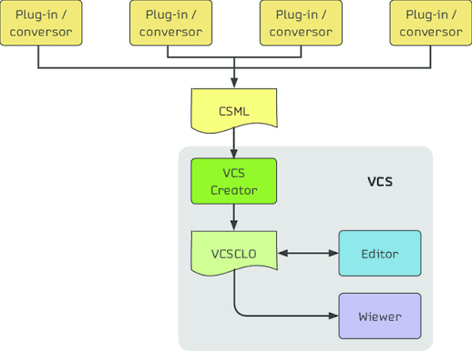

Ключевые преимущества венчурных капиталистов:

- Полная история: Позволяет просматривать и откатываться к любой предыдущей версии проекта.
- Совместная работа: Упрощает одновременную работу нескольких разработчиков над одним и тем же проектом без измений.
- Безпасность: Помогает предотвратить потерю кода и ведет учет того,кто вносил каждое изменение.

Венчурные капиталисты в основном делятся на два типа:

Централизванные системы(CVCS):
В этой модели существует единый центральный репозиторий,расположенный нв сервере,в котором хранятся все версии проекта. Разработчики загружают рабочую копию файдов с этого центрального сервера и после внессения изменений заружают их обратно в центральный репозиторий. Примерами систем такого явлаются CVS и Subversion(SVN)

Распределенные системы контроля версий(DVCS):
В DVCS каждый разработчик получает полную локальную копию рапосзитория,включающую весь журнал версий. Это позволяет отказаться от централизованного сервера,поскольку каждая локальная копия сама по себе служит рапозиторием. Эта система позволяет работать автономно, без подключения к интернету. Примерами могуть служить Git b Mercurial.

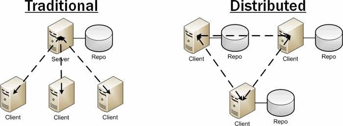

###2.2. Примеры использования git

Git-это распределенная система контроля версий, первоначально созданная Линусом Торвальдом для разработки ядра Linux. Его популярность заключается в его эффективности,гибкости и мощной системе ответлений.

Преимущества Git:

- Распределенная модель:У каждого разработчика есть полная копия рапозитория,что позволяет работать без постоянного подключения к Интернету.
- Гибкие ветви(branches):Посволяют легко создавать незавимые линии разработки, облегчая параллельное экспериментирование и работу.
- Производительность:Git работает чрезвычайно быстро и эффективно даже в больших проектах.
- Целостность: Каждое изменение идентифицируется с помощью криптографического хэша,который обеспечивает целостность истории.

###2.3. Основные команды git

Ниже перечислены наиболее часто используемые команды в Git:

- git init:Создает новый локальный репозиторий в текущем каталоге.
- git add:Добавляет файлы в промежуточную область (промежуточную область) для следующей фиксации.
- git commit:Сохраняет подготовленные изменения в локальном рапозитории с описательным сообщением.
- git status:Отображает состояние файлов в репозитории.
- git diff:Показывает различия между текущим состоянией и последней фиксацией.
- git pull:Извлекает измения из удаленного репозитория и объединяет их с локальным заданием.
- git push:Отправляет локальные измения в удаленный рапозиторий.
- git branch:Список,создание или удаление ветвей.
- git checkout:Переключение между ветвями или восстановление файлов.
- git merge:Объединяет изменения из одной ветки в другую.
- git clone:Создает локльную копию удаленного рапозитория.

##2.4. Стандартные процедуры работы при наличии центрального репозитория
 
При работе с центральным репозиторием типичный рабочий процесс включает следующие этапы:

1. Проверка и получение обновлений из центрального рапозитория:git checkout master,git pull,git chekout -b имя_ветки.
2. Внесение изменений в код:редактирование необходимых файлов.
3. Проверьте статус изменений:статус git.
4. Просмотрите различия:разница в git.
5. Добавьте изменения в промежуточную область:мерзавец добавить.
6. Сохраните изменения с помощью описательного сообщения:git commit-am "Сообщение о фиксации".
7. Отправьте изменения в центральный репозиторий:git push origin имя_файла_файла

Это процедура гарантирут,что изменения будут правильно интегрированы и сохранена чистая и организованная история.

##Базовая настройка git

##3.1. Учёт переносов строк

Операционные системы используют разные символы для обозначения конца строки в текстовых файлах:

- Windows:\\r\\n (CRLF)
- Unix/Linux/macOS:\\n (LF)

Git позволяет управлять этими различиями с помощью параметров конфигурации,которые нормализуют разрывы строк в репозитории,предотвращая конфликты при совместном использовании кода между различными системами:

Параметр core.autocrlf:

этот параметр определяет,как git обрабатывает окончания строк при выполнении коммитов и проверок:

- core. autocrlf true (Windows):Преобразует CRLF в LF при фиксации и LF в CRLF при оформлении заказа,адаптируя файлы к операционной системе.
- core. autocrlf (Linux/macOS):Преобразует CRLF в LF при фиксации,но не изменяет файлы при оформлении заказа.

Чтобы настроить его:

- Для систем Windows:git config --global core. autocrlf true
- Для систем Linux/macOs:git config  --глобальный ввод core. autocrlf

Параметр core. safe crlf:

Этот параметр позволяет проверить,является ли преобразование кщнца строки обратимым,предотвращая повреждение двоичных файлов:

- core. safecrlf true:Отлоняет коммиты с необратимыми преобразованиями.
- core. safecrlf warn:Показывает предупреждение,но разрешает фиксацию.

##Создание ключа SSH

###4.1. Общая информация

SSH (Secure Shell) — это сетевой протокол, обеспечивающий безопасное соединение между двумя системами через незащищенную сеть с помощью криптографической аутентификации. В контексте Git SSH-ключи применяются для авторизации пользователя на удаленных серверах, таких как GitHub, GitLab или Bitbucket, что позволяет выполнять операции вроде git push или git pull без необходимости вводить учетные данные при каждом действии.

Система аутентификации SSH основана на асимметричной паре ключей:

- Закрытый ключ-Остается на компьютере пользователя и никогда не должен передаваться другим лицам. Это ключ, который позволяет аутентифицировать личность пользователя.
- Открытый ключ-копируется на удаленный сервер (например, в учетную запись GitHub).
- Сервер использует его для проверки подлинности закрытого ключа.

Алгоритмы шифрования SSH:

SSH поддерживает несколько алгоритмов генерации ключей,наиболее рекомендуемых в настоящее время :

- Ed25519:Считается самым безопасным и эффективным.Он рекомендуется по умолчанию из-за его устойчивости к атакам и небольшого размера.
- RSA:широко применяемый алгоритм,однако для обеспечения безопасности рекомендуется использовать ключ длиной не менее 4096 бит.

Расположение ключей:

По умолчанию ключи SSH хранятся в каталоге~/. ssh/. Типичные имена:

- Закрытые ключи: id_rsa, id_ed25519
- Открытые ключи: id_rsa.pub, id_ed25519. pub

##Верификация коммитов с помощью PGP

###5.1. Общая информация

PGP (Pretty Good Privacy) — это криптографический инструмент, который позволяет подписывать коммиты цифровой подписью, гарантируя их подлинность и целостность. Когда коммит подписан, Git добавляет к нему цифровую подпись, созданную с использованием приватного ключа пользователя. Любой, у кого есть публичный ключ,может проверить, что коммит действительно был создан указанным автором и не был изменён.

Подписание коммитов с помощью PGP обеспечивает дополнительный уровень безопасности и доверия к программным проектам . Когда коммит подписан, Git прикрепляет цифровую подпись, используя закрытый ключ пользователя. Любой, у кого есть открытый ключ, может убедиться, что коммит является подлинным и не был изменен.

Преимущества подписания коммитов:

- Подлинность:Доказывает,что коммит был создан законным автором,предотвращая возможность того, чтобы кто-либо выдавал себя за разработчика.
- Целостность:Гарантирует,что код не был изменен с момента фиксации.
- Доверие:Для сопровождающих проектов подписанные коммиты обеспечивают уверенность в том,что код получен из надежного источника.

В GitHub коммиты, подписанные действительным PGP-ключом, помечаются зелёной
галочкой «Verified».

##Проверка коммитов в Git

В этом разделе рассказывается, как GitHub проверяет подлинность подписанных коммитов и как пользователи могут отслеживать состояние подписей в своих репозиториях,а также о дополнительных мерах безопасности, предоставляемых платформой.

###6.1. Режим бдительности (vigilant mode)

GitHub предлагает функцию безопасности под названием «Vigilant Mode» («Режим бдительности»), которая позволяет пользователям и организациям настраивать более строгий уровень проверки подписей.

Что же делает этот режим?

Давайте разберемся.· Все неподписанные коммиты помечаются как «Непроверенные»: при включённой этой опции любой неподписанный коммит или коммит с неподтверждённой подписью будет явно помечен как «Непроверенный» на GitHub.

Повышенная безопасность и прозрачность: эта настройка особенно ценна для проектов, где требуется высокий уровень защиты.

Она обязывает участников подписывать свои коммиты и позволяет легко выявлять тех, кто не соблюдает политику подписания.

Как включить режим Vigilant Mode:

1. Авторизуйтесь в GitHub.
2. Перейдите в Настройки (Настройки) → Ключи SSH и GPG.
3. В разделе "Ключи GPG" установите флажок "Отмечать неподписанные коммиты как непроверенные" (Flag unsigned commits as unverified).

Эффекты активации режима бдительности:

| Тип фиксации | Поведение без бдительного режима | Поведение с бдительным режимом |
|--------------|----------------------------------|--------------------------------|
| Подписанный коммит с действительным ключом | Проверено | Проверено |
| Подписанный коммит с несвязанным ключом | Непроверенный | Непроверенный |
| Зафиксировать без подписи | Без метки (ничего не отображается) | Непроверенный |

##Задание и сопровождение работ

В этоь разделе предстаилены задвчи,которые необходимо выполнить,и подробные инструкции по выполнению начальной настройки Git,генерации ключей SSH и PGP,связыванию с GitHub и созданию репозитория для курсовых работ.

###7.1. Установка программного обеспечения

Для работы с Git и GitHub из терминала необходимо установить два основных пакета:Git (система контроля версий) и GitHub CLI (интерфейс командной строки для взаимодействия с  GitHub).

###7.1.1. Установка git

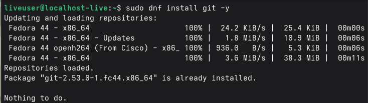

Опция -y автоматически подтверждает установку без необходимости ручного вмесшательства.

Проверка установки:

Для проверки правильности установки Git была выполнена следующая команда:

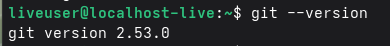

Ожидаемый результат должен отображать установленную версию.

###7.1.2. Установка gh

Для установки GitHub CLI была выполнена следующая команда:

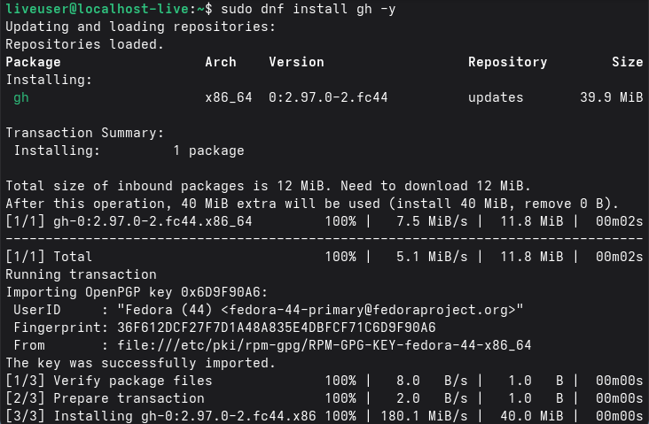

Проверка установки:

Для проверки правильности установки GitHub CLI была выполнена следующая команда:

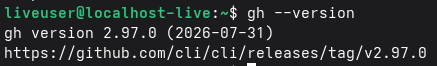

Ожидаемый результат должен отображать установленную версию.

###7.2. Выполнение базовой настройки git

Начальная настройка Git необходима для идентификации автора коммита и подготовки рабочей среды. Эта настройка выполняется глобально и применяется ко всем репозиториям пользователя.

Параметры для настройки:

- user.name:Определяет имя пользователя,которое будет отображаться в каждом коммите.
- user.mail:Определяет адрес электронной почты,связанный с коммитами. Он должен совпадать с адресом электронной почты,зарегистрированным в GitHub,для корректной проверки подписей PGP.
- core.quitepath:Настраивает кодировку UTF-8,чтобы избежать проблем со специальными символами в сообщениях коммитов.
- init.defaultBranch:Устанавливает имя ветки по умолчанию при создании нового репозитория (в данном случае,vaster).

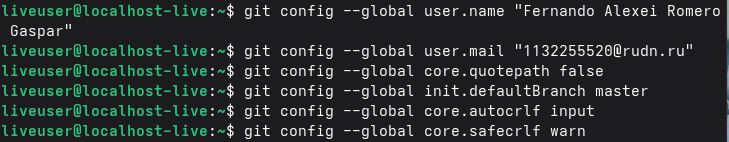

Для проверки правильности конфигурации была выполнена команда:

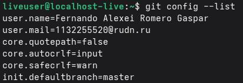

В результате настройка была применена успешно. Все параметры отображаются в выводе команды.

###7.3. Создание ключей SSH

Аутентификация SSH основана на паре асимметричных ключей:

- Приватный ключ:Чранится на локальной машине пользователя и никогда не должен передаваться третьим лицам.
- Публичный ключ:Загружается на удалённый сервер (например,в GitHub) и используется для проверки подлинности приватного ключа.

Для выполнения лавораторной работы были сгенерированы ключи по двум алгоритмам: Ed25519 (рекомендуемый) и RSA (как фльтернативный вариант для совместимости).

Былы выполнены следующие команды:

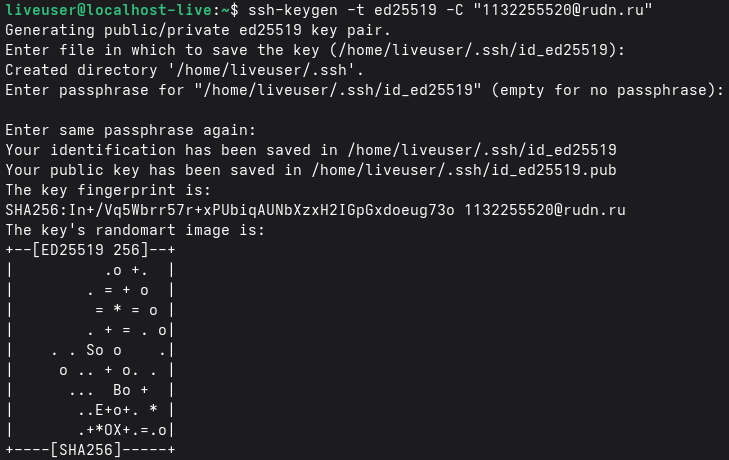
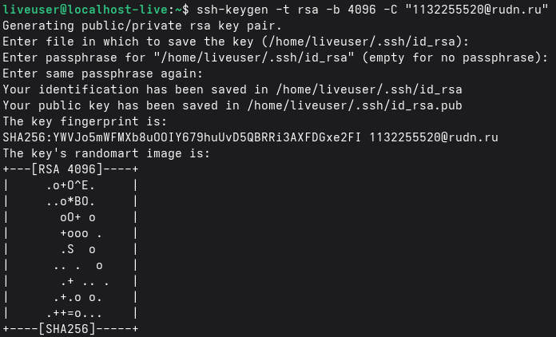

В процессе генерации было предложено указать имя файла для сохранения ключа (оставлено по умолчанию) и задать парольную фразу (passphrase) для дополнительной защиты приватного ключа.

Для проверки создания ключей была выполнена команда.

В резултате в каталоге ~/.ssh/ появились файлы:

- id_ed25519:Приватный ключ Ed25519
- id_ed25519.pub:Публичный ключ Ed25519
- id_rsa:Приватный ключ RSA
- id_rsa.pub:Публичный ключ RSA

###7.4. Создание ключей PGP

Для создания новой пары ключей была выполнена команда:

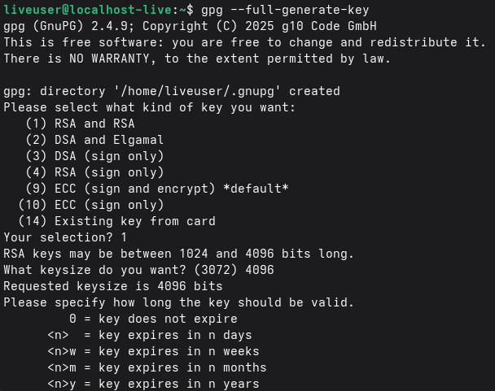
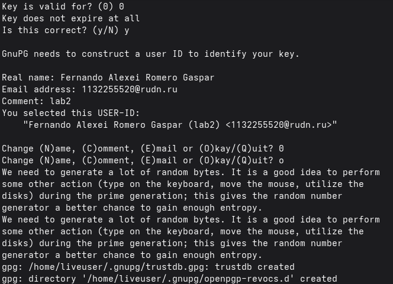
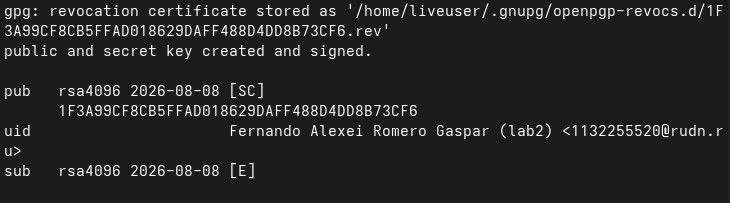

В процессе генерации были выбраны следующие параметры:

- Тип ключа:RSA and Rsa(рекомендуемый)
- Размер ключа:4096 бит
- Срок действия:0 (не истекает)
- Имя пользоваьеля:Fernando Alexei Romero Gaspar
- Электронная почта:1132255520@rudn.ru
- Комментарий:(остовлен пустым)

Проверка создания ключа и получение идентифмкатора:

Для просмотра созданных ключей и получения идентификатора (Key ID) была выполнена команда:

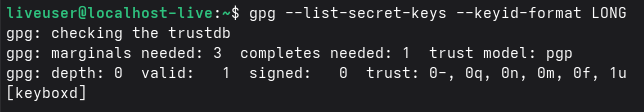

В выводе команды была получена следующая информация:

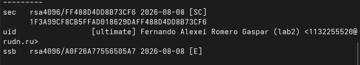

###7.5. Настройка GitHub

Для взаимодействия с GitHub из терминала и безопасного выполнения таких операций,как 'git push' и 'git pull',необходимо добавить открытый SSH-ключ, сгенерированный на предыдущем шаге,в вашу учетную запись GitHub. Это позволить GitHub распознать ваш компьютер как авторизованное устойство.

1. Скопируйте открытый ключ в буфер обмена:

Для получения содержимого открытого ключа и копирования его в буфер обмена использовалсь следующая команда:

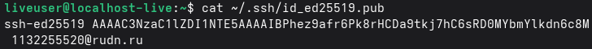

2. Добавление ключа в GitHub:

Затем были выполнены следующие шаги в веб-интерфейсу GitHub:

- Войдите в GitHub
- Перейдите в Настройки→Ключи SSH и GPG.
- Нажмите кнопку "Новый ключи SSH".
- В поле "Заголовок" введите описательное имя:Fedora Laptop.
- В поле "Ключ" вставьте ранее скопированный открытый ключ.
- Нажмите "Добавить ключ SSH",чтобы сохранить ключ.

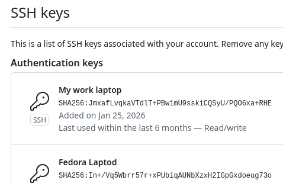

Проверка SSH-соединения:

Чтобы убедиться,что ключ добавлен правильно и соединеник с GitHub работает,выполните следующую команду:

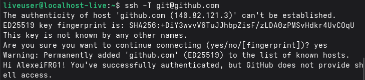

Это сообщеник подтверждает,что аутентификация SSHпрошла успешно и что машина авторизована для взаимодействия с удаленным рапозиторием.

###7.6. Добавление PGP-ключа в GitHub

Чтобы GitHub мог проверить подлинность коммитов,подписанных нашим PGP-ключом,необходимо добавить открытый ключ в учетную запичь GitHub. После добавления все коммиты,подписанные соответствующим закрытым ключом,будут отображать значок "Проверено" на GitHub.

Добавление PGP-ключа в GitHub:

Чтобы получить открытый ключ в формате, требуемом GitHub,ключ был экспортирован с использованием идентификатора (Key ID),полученного на предыдущем шаге:

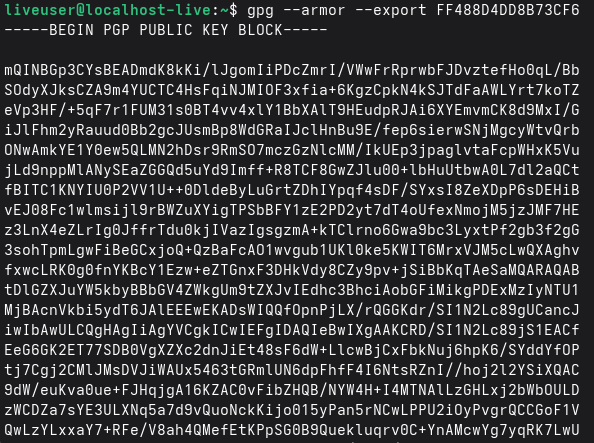

Затем ключ был добавлен в веб-интерфейс GitHub:

- Войдите в GutHub.
- Перейдите в Настройки Ключи SSH и GPG.
- В разделе "Ключи GPG" нажмите кнопку "Новый ключ GPG"
- В поле "Заголовок" введите описательное имя:Fedora GPG.
- Нажмите "Добавить ключ GPG".

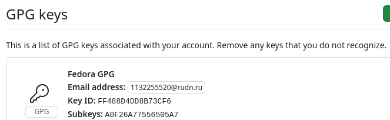

###7.7. Настройка автоматических подписей коммитов git

Чтовы гарантировать автоматическую подпись всех коммитов в репозитории,Git был настроен на использование ключа PGP,сгенерированного еа предыдущем шаге,без необходимости добавлять опцию '-S' к каждому коммиту. Это гарантирует,что ни один коммит не останется неподписанным им-за не недосмотра.

Преимущества автоматической подписи:

- Автоматизация:Нет неоюходимости помнить о добавлении '-S' к каждому коммиту.
- Безопасность:Все коммиты подписываются автоматически.
- Соответствие требованиям: Обеспечивает соответствие политикам безопасности проекта.

Для включения автоматической подписи были выполнены следующие команды:

1. Настройка идентификатора ключа подписи:


Эта команда указывает Git,какой ключ PGP использовать для подписи коммитов. Идентификатор (Key ID)-это тот,который получен на шаге 7.4 (Настройка ключей PGP).

2. Включите автоматическую подпись коммитов:

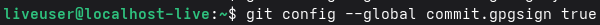

Сэтой конфигурацией все коммиты,созданные с этого момента,будут автоматически подписываться без необходимости использования опции -S.

3. Настройте переменную GPG_TTY для предотвращения ошибок:

На некоторых системах при подписании коммитов может появиться ошибка "пзп не удалось подписать данные". Для исправления этой проблемы была настроена переменная среды GPG_TTY:

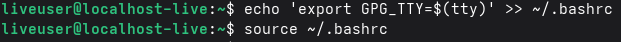

Проветка конфигурации:

Для проверки правильности примения конфигурации были выполнены следующие команды:

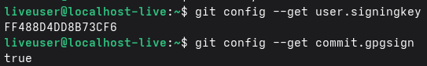

В резултате должны отобразиться идентификатор ключа и значение true сщщтветственно.

##7.8. Настройка gh

Аутентификация GitHub:

Для начала процесса аутентификации была выполнена следующая команда:

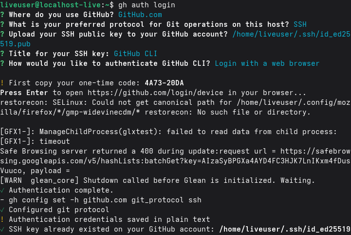

Прцесс проведет пользователя через ряд вопросов:

- В какую учетную запись вы хотите войти?:Был выбран GitHub.com.
- Какой протокол вы предпочитаете использловать для операций с Git?:Был выбран SHH (поскольку ключи SSH ьыли сгенерировары на шаге 7.3).
- Сгенерировать новый ключ SSH для добавления в ващу учетную запись GitHub?:Был выбран "Нет" (ключ SSH уже был сгенерирован).
- Как вы хотите пройти аутентификацию?:Был выбран вход через веб-браузер.

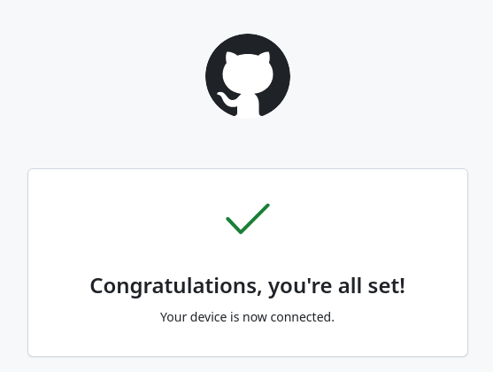

Затем браузер открылся автоматически для завершения процесса аутентификации. Были введены учетные данные GitHub,и авторизация была подтверждена.

Проверка аутентификации:

Для проверки успешности аутентификации была выполнена следующая команда:

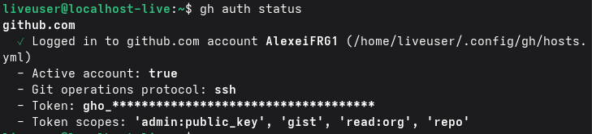

Ожидаемый результата должен отображать информацию об аутентифицированной учетной записи и используемом протоколе (HTTPS/SSH).

##7.9. Шаблон для рабочего пространства
###7.9.1. Создание репозитория курса на основе шаблона

для создания рапозитория курса были выполнены следующие шаги:

Шаг 1: Создание структуры каталогов

Иерархия каталогов для курса была создана в каталоге ~/work/study/:

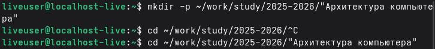

Шаг 2: Создание репозитория на основе шаблона

Для создания нового рапозитория на GitHub на основе предоставленного университетом шаблона использовалась команда gh repo create:

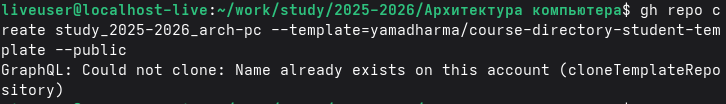

Эта команда:

- Создает общедоступный репозиторий на GitHub с именем study_2025-2026_arch-pc.
- В качестве основы используется шаблон yamadharma/course-directory-student-template.
- Опиция '--public' делает репозиторий видимым для всех.

Шаг 3:Клонируйте репозиторий на свой локальный компьютер

Для начала работы клонированный на локальный компьютер рапозиторий:

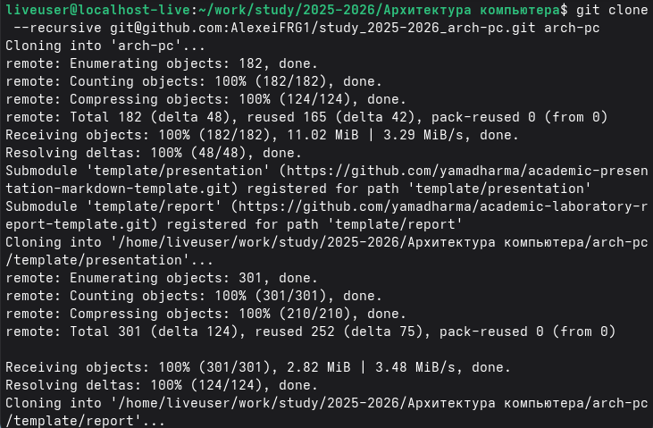
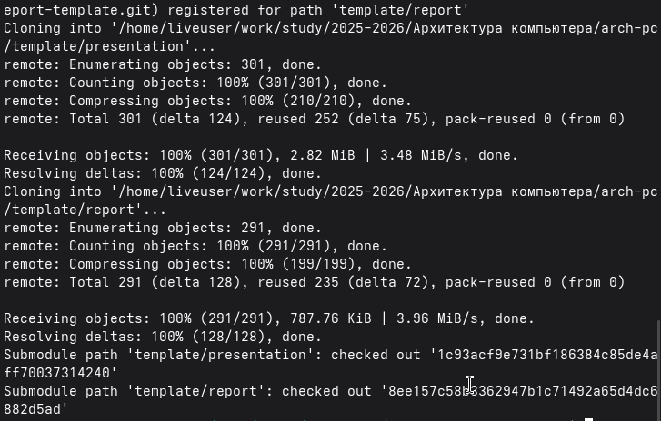

###Настройка каталога курса

Шаг 1:Перейдите в каталог курса

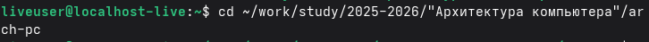

Шаг 2:Создайте файл COURSE

Для указания имении курса был создан файл с именем COURSE:

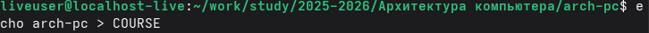

Шаг 3:Сгенерируйте структуру курса

Для генерации структуры каталогов и файлов,необходимых для курса,была выполнена команда make:

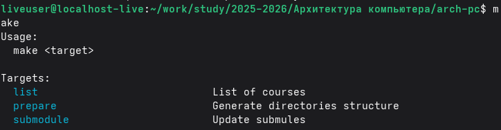

После генерации структуры изменения были сохранены и отправлены в удаленный рапозиторий:

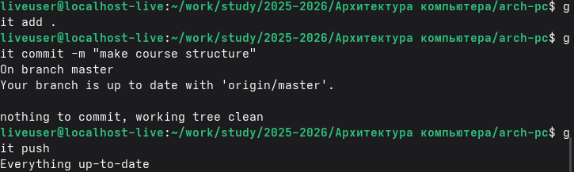

Проверка:

Чтобы убедиться в правильности создания структуры,вы можете вывести содержимое каталога:

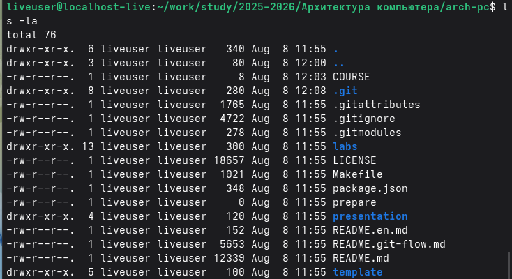

Каталог должен содержать структуру папок,соответствующую курсу (лабораторные работы,отчеты и т.д.)

##Контрольные вопросы

В этом разделе представлены ответы на контрольные вопросы,приверденные в конце лабораторной работы,которые позволяют понимание основных концепций систем контроля версий и Git/

**1. Что такое системы контроля версий (VCS) и для решения каких задач они предназначаются?**

Система контроля версий (VCS)-Это инструмент,который регистирует изменения в одном или несколких файлах с течением времени,позволяя восстанавливать предыдущие версии проекта. Они предназначены в первую очередь для:

- Управления историей изменений:Ведение полного журнала всех изменений,внесенных в исходный код.
- Облегчения совместной работы:Позволяет нескольким разработчикам одновременно работать над одним проектом,не перезаписывая работу друг друга.
- Отката изменений:Возможность возврата к предыдущим версиям кода в случае ошибок или проблем.
- Управления ветками (branches):Сщздание независимых линий разработки для экспериментов без влияния на стабильную версию проекта.
 
Разрешения конфликтов:Помощ в разрешении разлияий,когда два или болле разработчика изменяют одни и те же части кода.

**2. Объясните следующие понятия VCS и их отношения:хранилище,commit,история,рабочая копия.**

Хранилище(репозиторий):Это место,где хранятся все файлы проекта вместе с их историей изменений. Репозиторий может быть локальным (на компьютере разработчика) или удаленным (на сервере,например,GitHub).

Commit (Фиксация изменений):Это снимок (snapshot) состояния репозитория в определенный момент времени. Каждый commit содержит набор изменений,описательное сообщение,дату и время,а также информацию об авторе. Commit представляет собой атомарную единицу изменения в истории проекта.

История:Это хронологическая последовательность всех commit-ов,сделанных в репозитории. Она позволяет просматривать прошлое проекта,видеть,кто,когда и какие изменения вносил,а также при необходимости возвращаться к более ранним версиям.

Рабочая копия:Это текущая версия файлов проекта,которая находится на локальном компьютере разработчика. Именно над этой копией выполняется работа:редактируются файлы,добавляются новые,удаляются старые. Рабочая копия связана с репозиторием,и изменения,внесенные в нее,могут быть зафиксированы (committed) для обновления репозитория.

Связь между понятиями:Разработчик работает со своей рабочей копией,внося изменения. Когда он считает,что изменения готовы,он группирует их в commit,который добавляется в историю репозитория. Таким образом,репозиторий всегда содержит последнюю версию кода и всю историю изменений.

**3. То представляют собой и чем отличаются централизованные и децентрализованные VCS?Приведите примеры VCS каждого вида.**

Централизованные VCS (CVCS):

В этой модели существует единый центральный репозиторий,расположенный на сервере,который хранит все версии проекта. Разработчики загружают рабочую копию файлов с этого центрального сервера и после внесения изменений отправляют их обратно в центральный репозиторий.

Преимущества:

- Простота администрирования (единая точка контроля).
- Централизованное управление доступом и првами.

Недостатки:

- Зависмость от центрального сервера:если сервер выходит из строя,работа останавливается.
- Невозможность работать без подключения к интернету для обмена изменениями.

Примеры:CVS,Subversion(SVN).

Распределенные VCS (DVCS):

В DVCS каждый разработчик имеет полную копию репозитория на своем локальном компьютере,включая всю историю версий. Это устраняет зависимость от единственного централбного сервера,поскольку каждая локальная копия функционирует как полноценный репозиторий.

Преимущества:

- Возможность работы без подключения к интернету.
- Повышенная устойчивость (лобая копия может восстановить проект).
- Ветки (branches) более легкие и простые в управлении.

Недостатки:

- Более высокая начальная сложность.
- Большее использование дискового пространства (каждая копия содержит всю историю)

Примеры:Git,Mercurial,Bazaar.

**4. Опишите действия с VCS при единоличной работе с хранилищем.**

При индивидуальной работе с репозиторием типичный рабочий процесс выглядит следующим образом:

- Инициализация репозитория:
```bash
mkdir проект
cd проект
git init
```
- Создание или изменение файлов:Работа над кодом или файлами проекта.
- Проверка состояния:
```bash
git status
```
- Добавление изменений в область подготовки (staging area):
```bash
git add. #Добавляет все изменения
 #или
git add имя_файла #Добавляет конкретный файл
```
- Фиксация изменений (commit):
```bash
git commit -m "Описательное сооьщение об изменении"
```
- Просмотр истории:
```bash
git log
```
- Откат изменений при необходимости:
Для отмены неподтвержденных изменений:git checkout --Файл
Для возврата к предыдущему commit:git revert <хэш_commit>

**5. Опишите порядок работы с общим хранилищем VCS.**

При работе с общим (коллаборативным) репозиторием,имеющим центральный репозиторий,типичный рабочий процесс выглядит следующим образом:

- Получение последних изменений из удаленного репозитория:
```bash
git pull
```
- Создание ветки для работы над новой функциональностью (рекомендуется)
```bash
git checkout -b имя_ветки
```
- Внесение изменений в код
- Проверка состояния изменений:
```bash
git status
```
- Добавление изменений в область подготовки:
```bash
git add.
```
- Фикчация изменений с описательным сооьщением:
```bash
git commit -m "Описание изменения"
```
- Отправка изменений в удаленный репозиторий:
```bash
git push origin имя_ветки
```
- Если работа ведется в ветке,сляние с основной веткой:
```bash
git checkout master
git merge имя_ветки
git push origin master
```
- Разрешение конфликтов при их возникновении (когда два  человека  изменяют одни и те же строки файла).

**6. Каковы основные задачи,решаемые инструментальным средством git?**

Git решает несколько фундаментальных задач в разработке программного обеспечения:

- Распределенное управление версиями:Позволяет каждому разработчику иметь полную копию репозитория,что облегчает работу без подключения к сети и совместную работу.
- Управление ветками (branches):Предоставляет очень эффективную и легкую систему ветвления,позволяющую работать одновременно над несколькими линиями разработки.
- Целостность данных:Использует хэши SHA-1 для идентификации каждого commit,гарантируя,что данные не будут повреждены.
- Эффективность производительности:Быстрый даже для проектов большого размера.
- Полная история:Ведет детальный журнал всех изменений,позволяя проводить аудит и откаты.
- Совместная работа:Облегчает работу в команде благодаря интеграции с платформами таким как GitHub,GitLab или Bitbucket.

**7. Назовите и дайте краткую характеристику командам git.**

- git init:Инициализирует новый репозиторий Git в текущем каталоге.
- git add:Добавляет файлы в область подготовки (staging area) для следующего commit.
- git commit:Сохраняет изменения из области подготовки в локальном репозитории с сообщением.
- git status:Показывает текущее состояне репозитория (измененные,добавленные файлы и т.д.)
- git diff:Показывает различия между текущим состоянием и последним commit.
- git log:Показывает историю commit-ов репозитория.
- git branch:Выводит список,создает или удаляет ветки.
- git checkout:Переключается между ветками или восстанавливает файлы.
- git merge:Сливает изменения из одной ветки в другую.
- git clone:Создает локальную копию удаленного репозитория.
- git pull:Получает изменения из удаленного репозитория  и сливает их с локальной работой.
- git push:Отправляет локальные изменения в удаленный репозиторий.
- git remote:Управляет удаленными репозиториями,связанными с локальным репозиторием.

**8. Приведите примеры использования при работе с локальным и удалённым репозиториямию**

С локальным репозиторием:

1. Инициализация локального репозитория:
```bash
mkdir мой_проект
cd мой_проект
git init
```
2. Создание файла и добавление его репозиторий:
```bash
echo "Привет мир" > файл.txt
git add файл.txt
git commit -m "Первый commit"
```
3. Посмотр истории:
```bash
git log
```

С удаленным репозиторием:

1. Клонирование удаленного репозиторя:
```bash
git clone https://github.com/пользователь/репозиторий.git
```
2. Добавление уданного репозитория к существующему локльному:
```bash
git remote add origin https://github.com/пользователь/репозиторий.git
```
3. Отправка изменений в удаленного репозиторий:
```bash
git push -u origin master
```
4. Получение изменений из удаленного репозитория:
```bash
git pull
```

**9. Что такое и зачем могут быть нужны ветви (branches)?**

Ветки (branches)-Это независмые линии разработки,которые позволяют работат над различными функциональными возможностями или экспериментами,не затрагивая основную (стабильную) версию проекта.

Зачем они нужны:

- Параллельная разработка:Позволяют нескольким разработчикам одновременно работать над различными функциональностями.
- Эксеперименты:Позволяют тестировать новые идеи без риска сломать стабильный код.
- Организация работы:Помагают структурировать разработку вокруг версий,функциональностей или исправлений ошибок.
- Слияние (Merge):После завершения работы в ветке ее можно слить с основной веткой,интегрируя изменения контролируемым образом.

**10. Как и зачем можно игнорировать некоторые файлы при commit?**

Файлы игнорируются путем создания файла .gitignort в корне репозитория,в котором указываются шаблоны имен файлов или каталогов,которы Git должен игнорировать.

Зачем игнорировать файлы:

- Избежание ненужных файлов: Временые файлы,логи,файлы сборкм м бинарные файлы не должны включаться в репозиторий.
- Уменьшение размера репозитория: Поддержание репозитория легким и эффективным.
- Безопасность:Предотвращение загрузки файлов с конфиденциальной информацией (пароли,ключи API).
- Поддержание чистоты: Предотврщение зарянения истории репозитория автоматически генерирумыми файлами.

##выводы

В ходе выполнения лавораторной работы я освоил базовые навыки работы с Git: установил и настроил систему,создал SSH-ключи и PGP-ключи для безопасного подключения и подписи коммитов,а также настроил автоматическую подпись. я зарегистрировался на GitHub,созлад репозиторий на основе шаблона и настроил рабочее пространство для дальнейших работ. Все поставленные задачи выполнены,полученные навыки являются основой для дальнейшего использования систем контроля версий.

##Список литературы

- [Защищенныйю(s.f.).Системы контроля версий из](htp://www.ecured.cu/index.php?title=Sistemas_de_control_de_versiones)
- [Мастер приложений. (2020).Контроль версий из](https://appmaster.io/es/glossary/control-de-versiones-1)
- [Университет Вальядолида. (2018). Менеджеры контроля версий. В TFG-I-1266 из](https://uvadoc.uva.es/bitstream/handle/10324/37777/TFG-I-1266/pdf)
- [Arsys. (2024). Что такое системы контроля версий? из](https://www.arsys.es/blog/control-versiones-git)
- [Microsoft Learn. (2024). Совместная работа над кодом-репозитории Azure из](htpps://learn.microsoft.com/es-es/azure/devops/repos/get-started/what-is-repos)
- [Чакон,С.,и Штрауб,Б.(2014). Pro Git (2-у изд.). Нажмите. из](https://git-scm.com/book/es/v2)
- [Атлассиан. (2014). Руководство по GitHub по SSH. из](https://www.atlassian.com/es/git/tutorials)
- [Документы GitHub.(s.f.). Подключениу к GitHub по SSH. из](https://docs.github.com/es/authentication/connecting-to-github-sith-ssh)
- [Red Hat. (2023). Руководство по администрированию SSH из](https://www.redhat.com/sysadmin/ssh-key-management)
- [OptnSSH. (2024). Инструкция по удалению ssh-кейгена из](https://man.openbsd.org/ssh-keygen.1)
- [Чакон,С.,и Штрауб.Б.(2014). Руководство (2-у изд.).Приложение из](https://git-scm.com/book/es/v2)
- [Цифоровой окен.(2024).Как настроить SSH-ключи в Linux из](https://www.digitalocean/com/community/tutorial/how-to-set-up-ssh-keys-on-linux)
- [Документы на GitHub.(С.Ф.)Acerca de la verificacion firma из](https://docs.github.com/es/authentication/managing-commit-signature-verification)
- [Докуметы на GitHub. (С.ф.).Генерировать и читать паревода УНА Нуэва Клаве ГОБю из](https://docs.github.com/es/authentification/managing-commit-signature-verification/generating-a-new-gpg-key)
- [Документы на Гитхабе. (s.f.).Я открыл доступ к ПЗП как источнику информации на Гитхабе из](https://docs.github.com/es/authentication/managing-commit-signature-verification/adding-a-gpg-key-to-your-github-account)
- [Башня мерзавцев. (2025). Как (и зачем) подписывать коммиты с помощью GPG из](https://www.git-tower.com/learn/git/faq/sign-commits-with-gpg)
- [Документы GitHub/ (s.f.). Проверке подписи коммитов из](https://docs.github/es/authentication/managing-commit-signature-verification/about-commit-signature-verification)

