> **РОССИЙСКИЙ** **УНИВЕРСИТЕТ** **ДРУЖБЫ** **НАРОДОВ** **Факультет**
> **физико-математических** **и** **естественных** **наук**
>
> **Кафедра** **прикладной** **информатики** **и** **теории**
> **вероятностей**
>
> **ОТЧЕТ**
>
> **ПО** **ЛАБОРАТОРНОЙ** **РАБОТЕ** **№** **3**
>
> *<u>дисциплина:</u>* *<u>Архитектура компьютера</u>*
>
> <u>Студент: Ромеро Гаспар Фернандо Алексей</u>
>
> Группа: <u>НКАбд-02-25</u>
>
> **МОСКВА**
>
> 2026 г.

**Оглавление**

1\. Цель работы

2\. Предварительные сведения

> 2.1. Базовые сведения о Markdown 2.1.1. Заголовки
>
> 2.1.2. Выделение текста 2.1.3. Списки
>
> 2.1.4. Ссылки 2.1.5. Блоки кода
>
> 2.1.6. Математические формулы
>
> 2.2. Оформление отчета по лабораторной работе 2.2.1. Структура отчёта

2.2.2. Содержание основных элементов отчета 3. Задание и
последовательность выполнения работы

> 3.1. Установка Pandoc
>
> 3.2. Создание отчета в формате Markdown
>
> 3.3. Компиляция отчета в форматы PDF, DOCX y MD 3.4. Создание архива с
> файлами отчета

4\. Выводы

5\. Список литературы

> **Цель** **работы**
>
> Целью данной лабораторной работы является освоение процедуры
> оформления

отчетов с помощью легковесного языка разметки Markdown. В ходе работы
необходимо изучить базовый синтаксис Markdown для форматирования текста,
создания списков, вставки изображений и оформления математических
формул, а также получить практический опыт работы с утилитой Pandoc для
компиляции документов в форматы PDF и DOCX. Кроме того, требуется
закрепить навыки использования системы контроля версий Git для
сохранения и фиксации результатов работы в удаленном репозитории.

> **Предварительные**
> **сведения**
>
> В этом разделе представлены основные принципы работы с языком разметки

Markdown, конвертером Pandoc и структурой академических отчётов,
необходимые для понимания и выполнения задания.

> **2.1** **Базовые** **сведения** **о** **Markdown**
>
> Markdown — это легкий язык разметки, созданный в 2004 году Джоном
> Грубером и

Аароном Шварцем. Его ключевая идея заключается в том, что текст,
набранный в Markdown, должен оставаться читаемым в исходном формате, без
необходимости преобразования в HTML, при этом предоставляя простую
синтаксическую структуру для добавления базовых элементов
форматирования, таких как курсив, подчеркивание, заголовки и списки.

> **2.1.1** **Заголовки**

В Markdown заголовки создаются с помощью символа решетки (#) в начале
строки.

Количество таких символов определяет уровень заголовка — от первого (#
Заголовок 1) до шестого (###### Заголовок 6). Важно оставлять пробел
между символом \# и текстом заголовка, чтобы форматирование применялось
корректно. Для заголовков уровней 1 и 2 также существует альтернативный
синтаксис, где текст подчёркивается символами = или -, однако наиболее
распространённой и рекомендуемой формой является использование символа
\#.

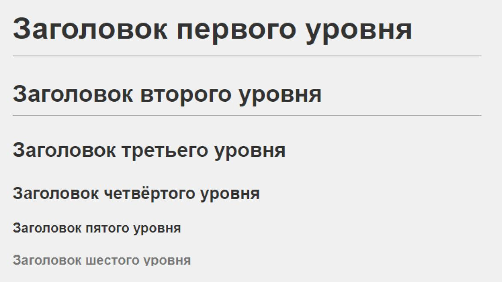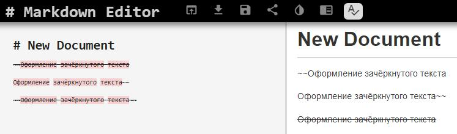

> **2.1.2** **Выделение** **текста**

В Markdown для выделения текста можно использовать звездочки (\*) или
нижние подчеркивания (\_). Для полужирного шрифта применяются два
символа — звездочка или нижнее подчеркивание (\*\*текст\*\* или
\_\_текст\_\_). Для курсива — один символ — звездочка или нижнее
подчеркивание (\*текст\* или \_текст\_). Для полужирного и курсива — три
символа — звездочка или три нижних подчеркивания (\*\*\*текст\*\*\* или
\_\_\_текст\_\_\_). Хотя оба символа допустимы, рекомендуется
использовать звездочки, так как они более распространены и помогают
избежать путаницы в некоторых редакторах. Кроме того, в некоторых
версиях Markdown допускается выделение текста с помощью тильды
(\~~текст\~~) и выделение кода в строке (код).

> **2.1.3.** **Списки**

Markdown позволяет легко создавать списки. Для формирования
неупорядоченных списков используйте символы «-», «\*» или «+» в начале
строки, за которыми следует пробел. Отсортированные списки создаются с
использованием чисел, за которыми следует точка (1., 2., 3.). Чтобы
создать вложенные списки, просто добавьте отступ (два или четыре
пробела) к элементам, принадлежащим подуровню . Важно поддерживать
последовательность в

использовании символов в одном и том же списке, чтобы избежать ошибок
форматирования.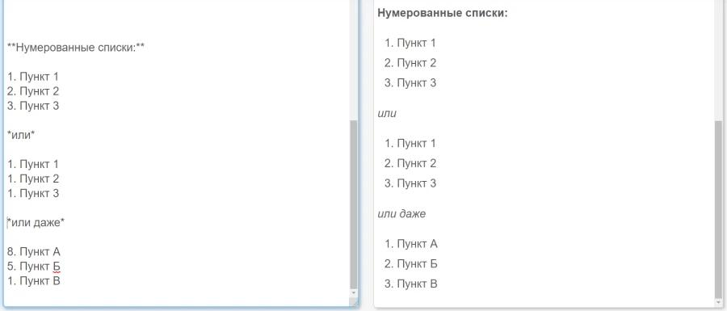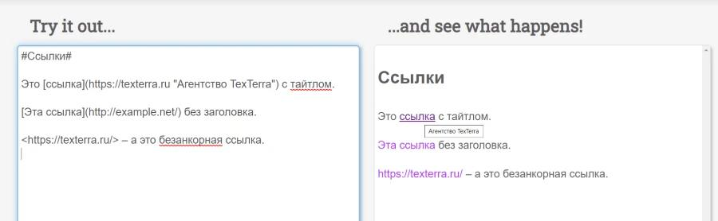

> **2.1.4.** **Ссылки**

Ссылки в Markdown создаются с помощью синтаксиса \[видимый текст\](URL).
Видимый текст — это то, что будет отображаться в документе, а URL — это
адрес, на который ведет ссылка. Кроме того, можно добавлять заголовки к
ссылкам, добавляя текст в кавычках после URL: \[текст\](URL
"заголовок"). Для внутренних ссылок внутри одного документа можно
использовать конструкцию \[text\](#id-из-заголовка), где ID
автоматически формируется из текста заголовка, заменяя пробелы кавычками
и удаляя специальные символы. Также существует синтаксис для внешних
ссылок, позволяющий задать URL в другом месте документа и тем самым
очистить текст от лишних элементов.

> **2.1.5.** **Блоки** **кода**
>
> Markdown поддерживает два способа вставки блоков кода. Первый — это
> выделение

текста с помощью четырех пробелов или табуляции, что указывает на
наличие форматированного кода. Второй, более современный и
предпочтительный метод — использование трех обратных кавычек (\`) в
начале и конце блока кода. Эта синтаксическая конструкция также
позволяет указать язык программирования после первых обратных кавычек,
чтобы выделить синтаксис (например, \`bash\` для Bash-кода). Для
inline-кода внутри абзаца используются обычные обратные кавычки
(например,
\`код\`).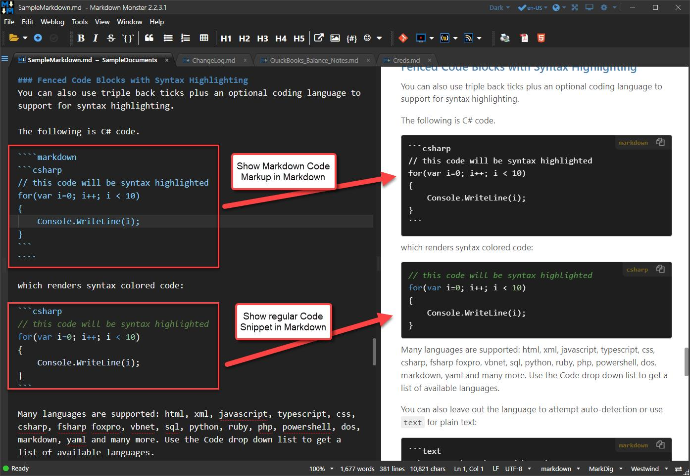

> **2.1.6.** **Математические** **формулы**
>
> Markdown позволяет включать математические формулы с использованием
> LaTeX-

синтаксиса, особенно при работе с процессорами, поддерживающими MathJax
или KaTeX. Для отображения формул в тексте их нужно заключить в двойные
долларовые символы (\$формула\$). Формулы в блоках, отображаемые
отдельной строкой и по центру, записываются между двумя парами символов
доллара (\$\$формула\$\$). Это позволяет корректно оформлять сложные
математические выражения, включая дроби (\frac{}{}), интегралы (\int),
квадратные корни (\sqrt{}) и греческие буквы (\alpha, \beta).
Совместимость с формулами зависит от используемого Markdown-процессора,
однако эта функция особенно полезна для академических и научных отчётов.

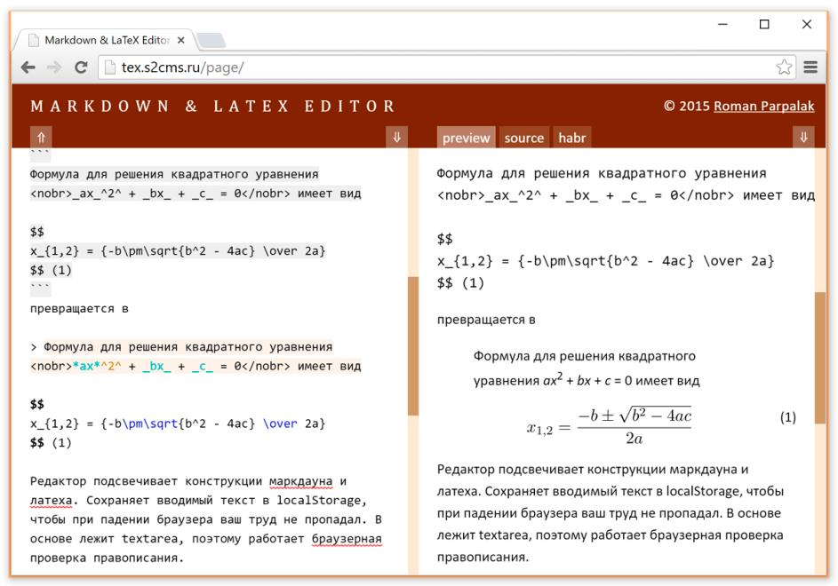

> **2.2.** **Оформление** **отчета** **по** **лабораторной** **работе**

Структура лабораторного отчета должна соответствовать определенным
стандартам, чтобы обеспечить его ясность и полноту. Согласно ГОСТ
7.32-2001, отчет о проведении исследований должен включать ряд
обязательных структурных элементов.

> **2.2.1.** **Структура** **отчёта**
>
> Рекомендуемая базовая структура лабораторного отчета включает
> следующие

элементы :

 Титульный лист (Обложка)

 Содержание (Индекс)

 Введение (Введение)

 Основная часть (Основная часть, где описана методология и результаты)

 Закрытие (Выводы)

 Список используемых источников (Библиографические ссылки)

> **2.2.2.** **Содержание** **основных** **элементов** **отчета**

Титульный список: Он должен содержать название учебного заведения,
факультет, название должности, дисциплину, данные студента (название и
группа) и год выпуска .

 Введение: Представляет цели работы и контекст
исследования.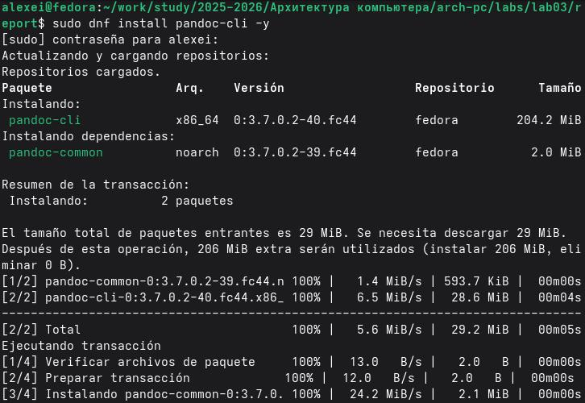

 Основная часть: Описывает развитие практики, включая выполненные
команды и

> скриншоты полученных результатов.

 Закрытие: Обобщает полученные результаты и оценивает, были ли
достигнуты поставленные цели, выделяя приобретенные компетенции.

 библиографические ссылки: Перечисляет библиографические ссылки, к
которым обращались, в стандартном формате.

> **Задание** **и** **последовательность** **выполнения** **работы**

В этом разделе описаны практические шаги, необходимые для выполнения
лабораторной работы — от установки инструментов до создания сжатого
архива с итоговым отчетом.

> **3.1.** **Установка** **Pandoc**

Для преобразования документов Markdown в другие форматы, такие как PDF,
DOCX или

HTML, используется инструмент Pandoc. В системах Fedora установка
выполняется с помощью следующей команды:

Проверка установки:

Чтобы убедиться, что Pandoc установлен правильно, выполняется следующая
команда:

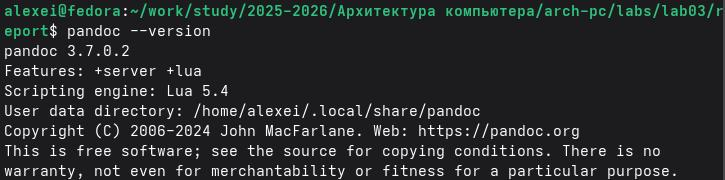

На выходе должна отображаться установленная версия.

> **3.2.** **Создание** **отчета** **в** **формате** **Markdown**
>
> Первым практическим шагом является создание файла отчета в формате
> Markdown (.

md). Этот файл должен содержать всю информацию из предыдущей лаборатории
(Лаборатория № 2), переписанную с использованием синтаксиса Markdown.

> Структура файла Markdown:
>
> Файл должен включать следующие разделы:

 Титульный лист (Титульный лист): Информация об университете,
факультете, степени,

> 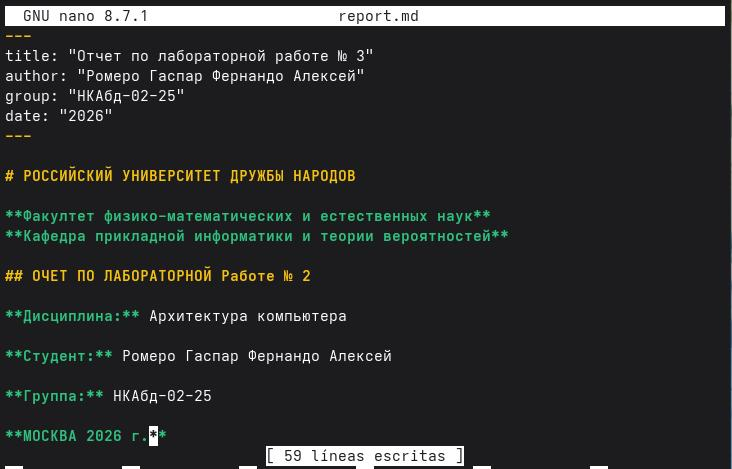данные
> студента.

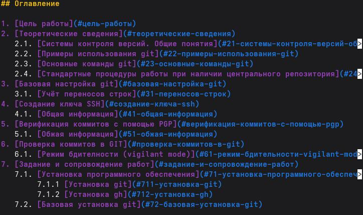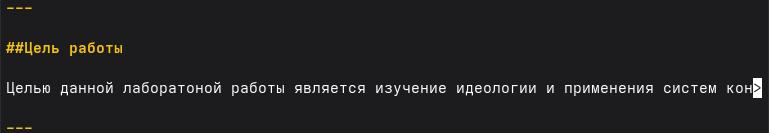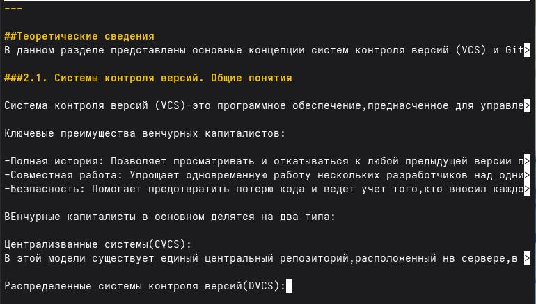

 Цели работы (Цель).

 Теоретические сведения (Теория) с соответствующими подразделами.

 Забота и сопровождение работ (Практическое развитие).

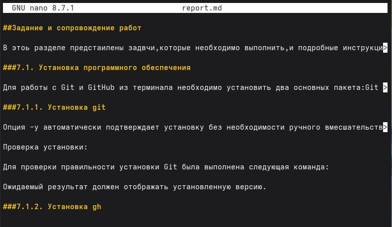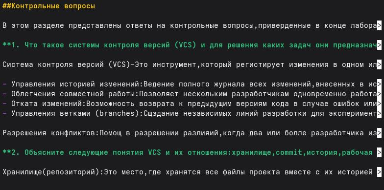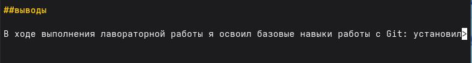

 Контрольные вопросы (Контрольные вопросы).

 Выводы (Выводы).

 Список литературы (Ссылки).

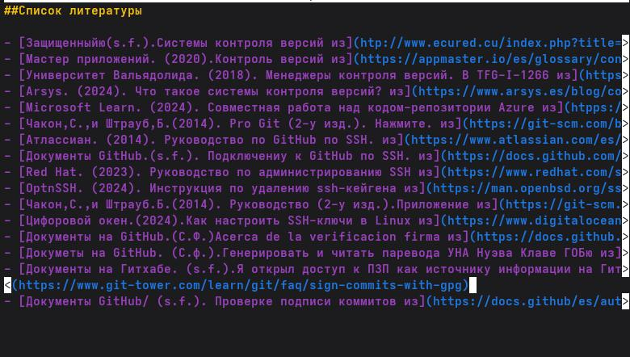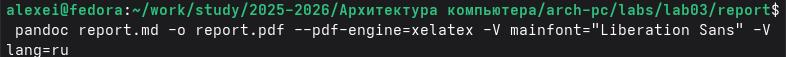

Снимки экрана должны быть включены в отчет с использованием синтаксиса
Markdown для изображений:

> \`"уценка
>
> \ \`\`
>
> Рекомендация: Создайте папку assets/img / в каталоге лаборатории,
> чтобы

упорядочить все изображения. .

> **3.3.** **Компиляция** **отчета** **в** **форматы** **PDF,** **DOCX**
> **y** **MD**
>
> Когда файл Markdown готов, нужно собрать его в нужные форматы.
>
> Сборка в PDF:
>
> Сборка в DOCX:
>
> \`

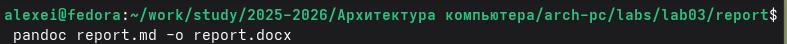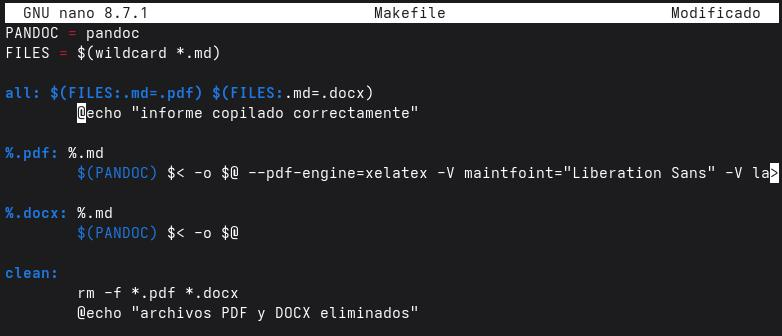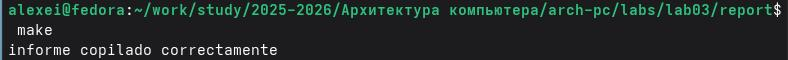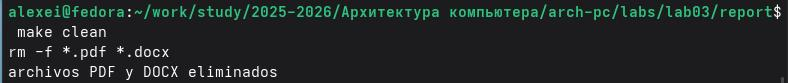

> Использование Makefile для автоматизации сборки:

Чтобы было проще и не вводить команды каждый раз, можно создать файл
Makefile в папке с лабораторной работой. Вот что в нём написать:

> Теперь, чтобы собрать все форматы сразу:
>
> А чтобы удалить все созданные файлы:

\`

> **3.4.** **Создание** **архива** **с** **файлами** **отчета**
>
> После создания всех необходимых файлов их нужно упаковать в сжатый
> архив .zip

для отправки.

> В ZIP-архив следует включить следующие файлы:

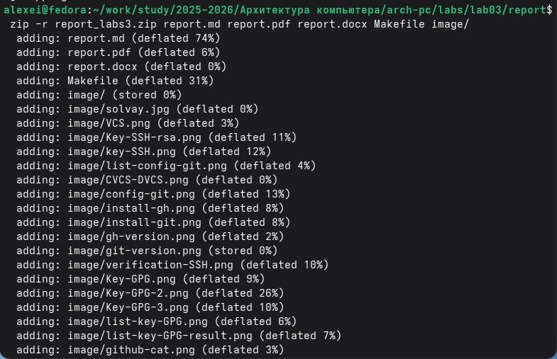

> 1\. reporte.md (исходный текст в формате Markdown)
>
> 2\. reporte.pdf (отчет в формате PDF)
>
> 3\. reporte.docx (отчет в формате DOCX) 4. Makefile (для компиляции)
>
> 5\. Папка assets/ (содержит изображения)
>
> Команда для создания ZIP-архива:
>
> Проверка содержимого ZIP-архива:
>
> 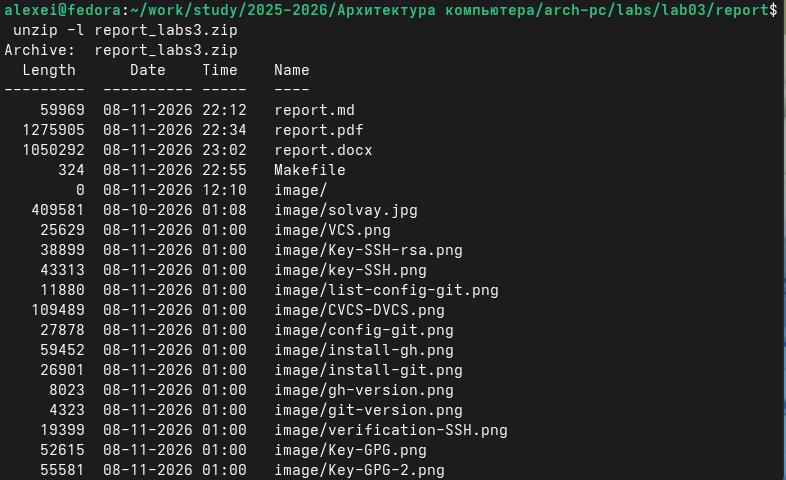Чтобы
> убедиться, что ZIP-файл содержит все необходимые элементы:
>
> **Выводы**

В ходе выполнения лабораторной работы я освоил базовые навыки оформления
отчетов с использованием языка разметки Markdown. Я изучил основные
элементы синтаксиса: заголовки, выделение текста, списки, ссылки,
вставку изображений и математических формул. Также я научился
использовать утилиту Pandoc для компиляции отчетов в форматы PDF и DOCX,
и автоматизировал процесс с помощью Makefile. Все поставленные задачи
выполнены, полученные навыки будут полезны для дальнейшего оформления
учебных и научных работ

> **Список** **литературы**

 Грубер, Дж. (2004). Уценка. Дерзкий огненный шар.

> [<u>https://daringfireball.net/projects/markdown/</u>](https://daringfireball.net/projects/markdown/)

 Потрясающая академия. (2024). Читшит-лист для уценки.

> [<u>https://fabacademy.org/2024/labs/waag/students/leo-kuipers/other/Markdown-cheatsheet/</u>](https://fabacademy.org/2024/labs/waag/students/leo-kuipers/other/Markdown-cheatsheet/)

 Pandoc. (2026). Руководство пользователя Pandoc.
[<u>https://pandoc.org/demo/example3.html</u>](https://pandoc.org/demo/example3.html)

 Libnorm. (2018). ГОСТ 7.32-2001.
[<u>http://libnorm.ru/</u>](http://libnorm.ru/)

 Документы на GitHub. (s.f.). Базовый синтаксис написания и
форматирования.

> [<u>https://docs.github.com/en/get-started/writing-on-github/getting-started-with-writing-and-formatting-on-github/basic-writing-and-formatting-syntax</u>](https://docs.github.com/en/get-started/writing-on-github/getting-started-with-writing-and-formatting-on-github/basic-writing-and-formatting-syntax)

 Катекс. (2026). Документация по Катекс.
[<u>https://katex.org/docs/supported.html</u>](https://katex.org/docs/supported.html)

 Pandoc. (2026). Руководство пользователя Pandoc.
[<u>https://pandoc.org/demo/example3.html</u>](https://pandoc.org/demo/example3.html)

 Проект Fedora. (2026). Руководство по системному администрированию
DNF.

> [<u>https://docs.fedoraproject.org/en-US/fedora/latest/system-administrators-guide/package-</u>](https://docs.fedoraproject.org/en-US/fedora/latest/system-administrators-guide/package-management/DNF/Command_Reference/)
>
> [<u>management/DNF/Command_Reference/</u>](https://docs.fedoraproject.org/en-US/fedora/latest/system-administrators-guide/package-management/DNF/Command_Reference/)

 Грубер, Дж. (2004). Markdown. Daring Fireball.
[<u>https://daringfireball.net/projects/markdown/</u>](https://daringfireball.net/projects/markdown/)
