> **РОССИЙСКИЙ** **УНИВЕРСИТЕТ** **ДРУЖБЫ** **НАРОДОВ** **Факультет**
> **физико-математических** **и** **естественных** **наук**
>
> **Кафедра** **прикладной** **информатики** **и** **теории**
> **вероятностей**
>
> **ОТЧЕТ**
>
> **ПО** **ЛАБОРАТОРНОЙ** **РАБОТЕ** **№** **4**
>
> *<u>дисциплина:</u>* *<u>Архитектура компьютера</u>*
>
> <u>Студент: Ромеро Гаспар Фернандо Алексей</u>
>
> Группа: <u>НКАбд-02-25</u>
>
> **МОСКВА**
>
> 2026 г.

**Оглавление**

1\. Цель работы

2\. Теоретические сведения

> 2.1. Рабочий процесс Gitflow 2.1.1. Общая информация
>
> 2.1.2. Процесс работы con Gitflow 2.2. Семантическое версионирование
>
> 2.2.1. Краткое описание семантического версионирования 2.2.2.
> Программное обеспечение
>
> 2.3. Общепринятые коммиты 2.3.1. Описание
>
> 2.3.2. Типы коммитов

3\. Задание и последовательность выполнения работы 3.1. Установка
программного обеспечения

> 3.1.1. Установка git-flow 3.1.2. Установка Node.js 3.1.3. Настройка
> Node.js
>
> 3.2. Общепринятые коммиты 3.2.1. Установка commitizen
>
> 3.2.2. Установка standard-changelog
>
> 3.3. Практический сценарий использования git 3.3.1. Создание
> репозитория git

3.3.2. Работа репозитория git 4. Выводы

5\. Список литературы

> **Цель** **работы**
>
> Целью данной лабораторной работы является получение навыков правильной
> работы

с репозиториями git, освоение рабочего процесса Gitflow, изучение
семантического версионирования и правил оформления коммитов в
соответствии со спецификацией Conventional Commits. В ходе работы
необходимо установить и настроить программное обеспечение для работы с
Gitflow, изучить структуру ветвления, освоить создание функциональных
веток, веток релиза и исправлений, а также научиться автоматизировать
процесс ведения журнала изменений с помощью стандартных инструментов.

> **Теоретические**
> **сведения**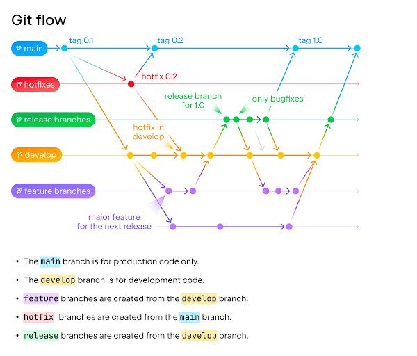
>
> В этом разделе представлены основные концепции Gitflow, семантического

управления версиями и соглашений по оформлению сообщений коммитов,
необходимые для понимания принципов разработки.

> **2.1** **Рабочий** **процесс** **Gitflow** **2.1.1** **Общая**
> **информация**
>
> Gitflow — это модель ветвления для Git, предназначенная для
> организации процесса

разработки ПО вокруг запланированных релизов. Разработанная Винсентом
Дриссеном в 2010 году, она стала отраслевым стандартом для проектов,
требующих структурированного цикла публикаций. Эта модель определяет
стратегию ветвления, которая позволяет упорядочено управлять разработкой
новых функций, подготовкой версий и срочными исправлениями.

Структура Gitflow основана на двух основных ветвях неопределённой
продолжительности :

 Основной или основной: содержит готовый к производству код, стабильную
версию

> проекта. Все официальные релизы помечены в этой ветке.

 develop-служит ветвью интеграции для новых функций. В нем объединяются
изменения функциональных ветвей, и он является основой для подготовки
релизов.

> В дополнение к этим основным ветвям Gitflow использует несколько типов

вспомогательных ветвей, которые являются временными :

 Функциональные ветки (feature/\*): создаются на основе ветки develop
для разработки

> новых функций. После завершения работы они снова объединяются с веткой
> develop.

 Веточки релизов (release/\*): формируются на основе ветки develop,
когда в системе накапливается достаточно функционала для нового релиза.
На этом этапе допускаются только исправления ошибок и подготовка
метаданных. По завершении они объединяются в основную ветку (с
соответствующей меткой версии) и в ветку разработки.

 Ветви срочных исправлений (hotfix/\*): создаются на основе основной
ветки для устранения критических ошибок в производственной среде. После
завершения работы они также объединяются в основную ветку и в ветку
разработки.

> **2.1.2** **Процесс** **работы** **con** **Gitflow**
>
> Рабочий цикл с Gitflow можно резюмировать в следующих шагах :

1\. Инициализация: структура настраивается путём запуска git flow init.
Это устанавливает ветви main и develop и определяет префиксы для
вспомогательных ветвей (feature/, release/, hotfix/).

2\. Разработка функциональности: новая ветка функциональности
запускается с помощью git flow feature start имя-функциональность. Над
ней ведётся работа, и по завершении она интегрируется в ветку develop с
помощью команды git flow feature finish имя-функциональности.

3\. Подготовка к релизу: при планировании выпуска новой версии создаётся
специальная ветка релиза с помощью команды git flow release start 1.0.0.
В этой ветке проводятся финальные настройки и обновляется документация.
По завершении выполняется команда git flow release finish 1.0.0, которая
объединяет изменения в ветках main и develop и создаёт тег с номером
версии.

4\. Устранение критических ошибок: при обнаружении серьёзной проблемы в
продакшене создаётся ветка hotfix на основе main с помощью команды git
flow hotfix start fix-urgent. После внедрения исправления выполняется
финальная команда git flow hotfix finish fix-urgent, которая объединяет
эту ветку с main и develop.

Этот рабочий процесс обеспечивает чёткую структуру, упрощающую командную
работу и управление версиями.

> **2.2.** **Семантическое** **версионирование**
>
> **2.2.1.** **Краткое** **описание** **семантического**
> **версионирования**

Семантическое управление версиями (SemVer) - это набор правил, которые
определяют, как номера версий назначаются и увеличиваются в программном
обеспечении, с целью информирования о типе внесённых изменений . В их
спецификации указано, что версия должна быть отформатирована как САМАЯ
БОЛЬШАЯ.МЛАДШИЙ.ПАТЧ (X. Y. Z), где:

 МАЙОР (X): увеличивается при внесении несовместимых с предыдущими
версиями

> изменений в публичный API.

 МИНОР (Y): увеличивается при добавлении новой функциональности,
совместимой с предыдущими версиями.

 ПАЧЧЕ (Z): увеличивается при исправлении ошибок, сохраняющих
совместимость с предыдущими версиями.

> Эта конвенция позволяет разработчикам и инструментам управления
> зависимостями

оценивать влияние новой версии без необходимости детального анализа
кода. Благодаря использованию SemVer можно избежать «кошмара
зависимостей», задавая диапазоны версий, которые гарантированно
совместимы.

> **2.2.2.** **Программное** **обеспечение**

Существует множество инструментов для внедрения семантического
управления версиями. Один из самых популярных — это standard-version или
пакет standard-changelog, которые автоматизируют создание файла
CHANGELOG.md на основе сообщений коммитов и помогают соблюдать принцип
SemVer при увеличении версий. Другие инструменты, такие как
semantic-release, также автоматизируют процесс публикации, опираясь на
принципы Conventional Commits.

> **2.3.** **Общепринятые** **коммиты** **2.3.1.** **Описание**

Спецификация Conventional Commits - это упрощённое соглашение для
сообщений о фиксации. Он предоставляет набор правил для создания явной
истории коммитов, что упрощает написание автоматизированных
инструментов. Это соглашение тесно связано с SemVer, поскольку оно
описывает в сообщении фиксации тип внесённого изменения (новая
функциональность, исправление ошибок или несовместимое изменение).

> Формат обычного сообщения о фиксации следующий:
>
> \`\`\`
>
> \<тип\>(\<необязательный объем\>): \<описание\>
>
> \[ дополнительный корпус \]
>
> \[ дополнительная ножка \] \`\`\`
>
> Основными элементами являются :

 исправить:: фиксация типа fix исправляет ошибку в коде. Это
соответствует приращению

> патча в SemVer.

 feat:: фиксация типа feat добавляет новую функциональность. Это
соответствует МЕНЬШЕМУ приращению в Севере.

 BREAKING CHANGE:: фиксация, содержащая текст BREAKING CHANGE: в начале
или нижней части сообщения, указывает на изменение, несовместимое с
предыдущими версиями. Это соответствует большему приращению в Севере .

> Помимо этих основных типов, для классификации других видов изменений

рекомендуется использовать такие категории, как docs:, style:,
refactor:, perf: и test:.

> **2.3.2.** **Типы** **коммитов**
>
> Основными типами коммитов в соответствии с обычной спецификацией
> являются:

 Тип Описание Корреляция SemVer

 feat Добавляет в код новую функциональность . НЕЗНАЧИТЕЛЬНЫЙ

 исправление Исправляет ошибку в коде . ЗАПЛАТКА

 BREAKING CHANGE Вносит изменение, нарушающее совместимость API . Он
может

> быть частью любого типа коммита. МАЙОР
>
> В дополнение к основным типам для поддержания чистой и семантической
> истории

коммитов обычно используются следующие типы:

 документы:: Изменения в документации.

 стиль:: Изменения, которые не влияют на смысл кода (форматирование,
пробелы и т. Д.).

 рефакторинг:: Изменения в коде, которые не исправляют ошибку и не
добавляют

> функциональности.

 perf:: Улучшения производительности.

 тест:: Добавление или исправление тестов.

 работа по дому:: Изменения в процессе строительства или
вспомогательные инструменты.

> **Задание** **и** **последовательность** **выполнения** **работы**
>
> В этом разделе описаны практические шаги, необходимые для выполнения

лабораторной работы — от установки инструментов до создания релизов и
публикации на GitHub.

> **3.1.** **Установка** **программного** **обеспечения**
>
> **3.1.1.** **Установка** **git-flow**

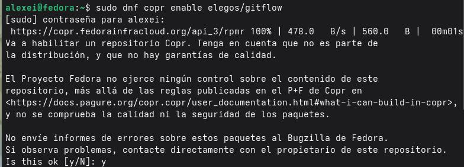Git-flow -
это набор расширений для Git, который упрощает реализацию модели
ветвления Gitflow. Чтобы установить его в Fedora, сначала необходимо
включить репозиторий CopR, содержащий пакет :

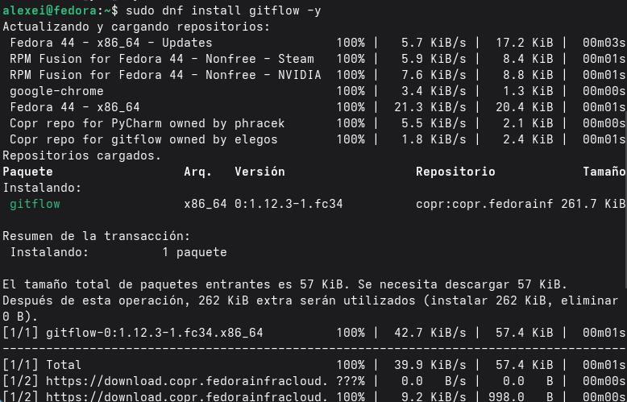

> Проверка установки:
>
> Чтобы убедиться в корректной установке git-flow, выполните команду:
>
> 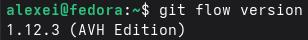 style="width:3.20833in;height:0.41667in" />\|
>
> **3.1.2.** **Установка** **Node.js**
>
> Node.js это среда выполнения JavaScript, используемая для запуска
> инструментов

обычных коммитов и генерации журналов изменений. В Fedora он
устанавливается вместе с менеджером пакетов pnpm:

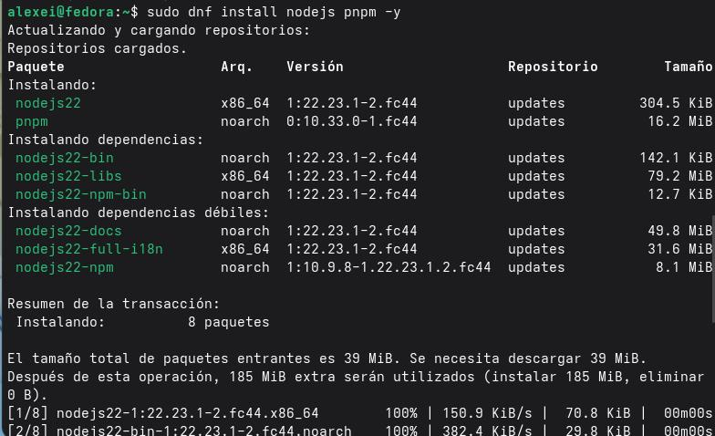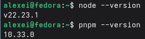

> Проверка установки:
>
> **3.1.3.** **Настройка** **Node.js**

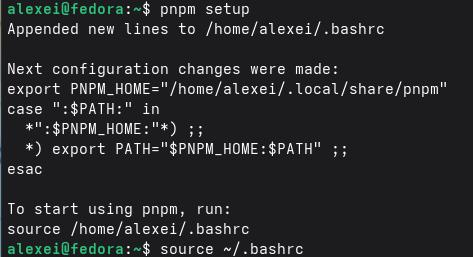Чтобы
глобально установленные пакеты с помощью pnpm были доступны в терминале,
необходимо настроить переменную окружения PATH:

> **3.2.** **Общепринятые** **коммиты** **3.2.1.** **Установка**
> **commitizen**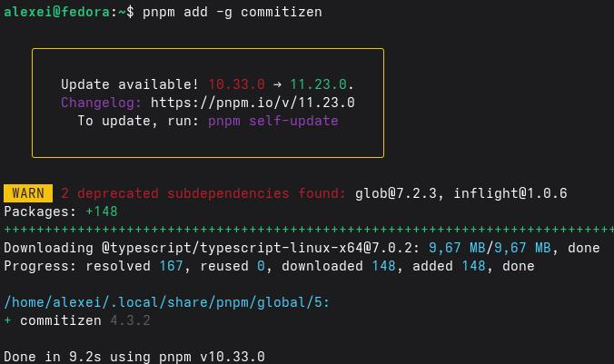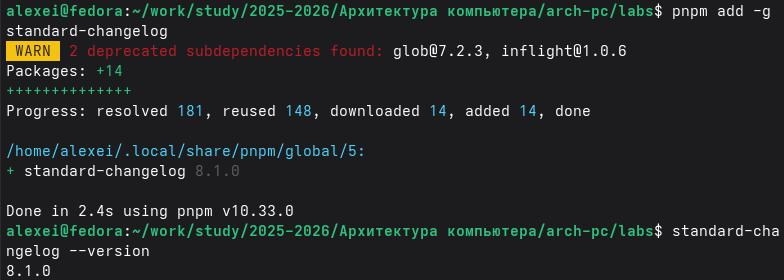

Commitizen - это инструмент, который помогает создавать коммиты в
формате обычных коммитов в интерактивном режиме. Устанавливается
глобально с помощью pnpm:

> **3.2.2.** **Установка** **standard-changelog**
>
> Standard-changelog genera automáticamente un archivo CHANGELOG.md
> basado en los

mensajes de commit. Se instala globalmente:

> **3.3.** **Практический** **сценарий** **использования** **git**
> **3.3.1.** **Создание** **репозитория** **git**
>
> Шаг 1: Создание репозитория на
> GitHub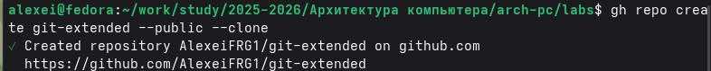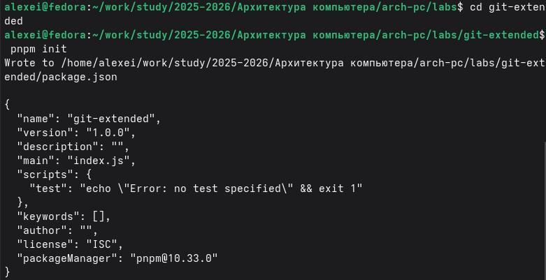
>
> Шаг 2: Инициализация файла package.json
>
> Шаг 3: Настройка файла package.json
>
> 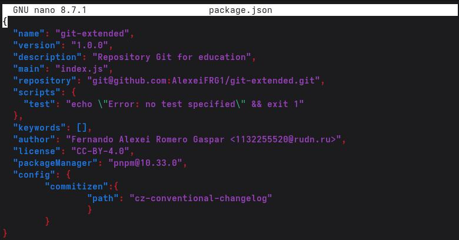Отредактируйте
> файл package. json, чтобы он содержал следующее содержимое:
>
> Шаг 4. Выполните первую фиксацию с помощью
> commitizen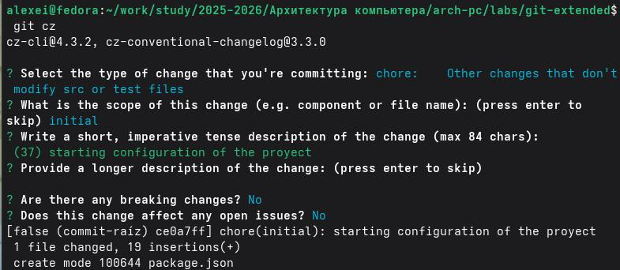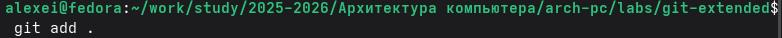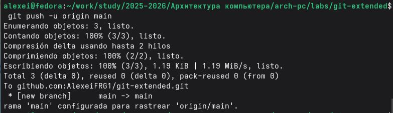
>
> **3.3.2.** **Работа** **con** **el** **repositorio** **git**
>
> Шаг 1. Инициализируйте Gitflow

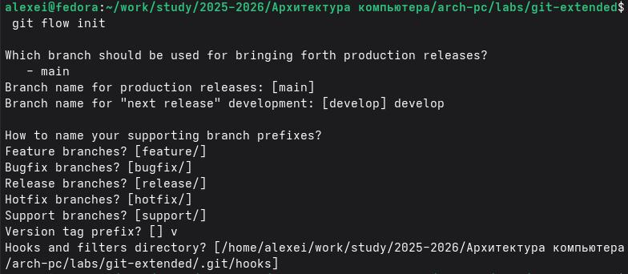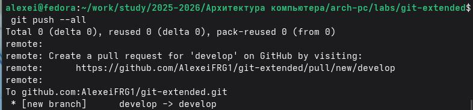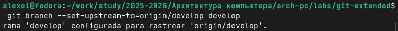

> Загрузить все ветки в удаленный репозиторий:
>
> Установить отслеживание ветки разработки:
>
> 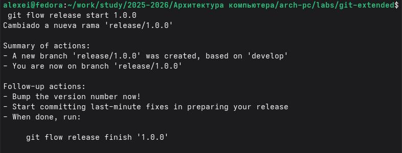Шаг
> 2. Создайте первый релиз (версия 1.0.0)

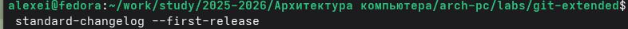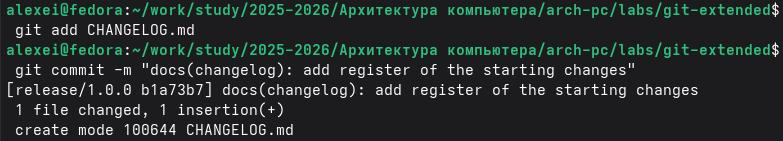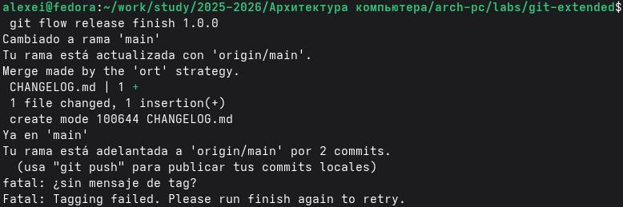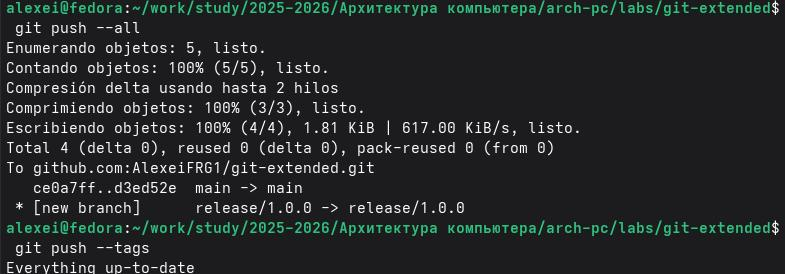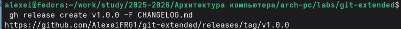

> 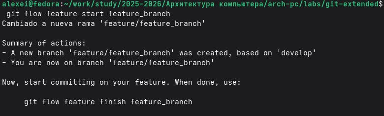Шаг
> 3: Разработка новой функциональности

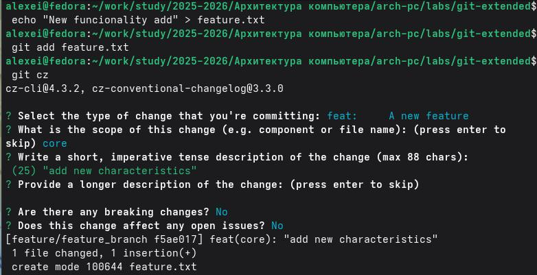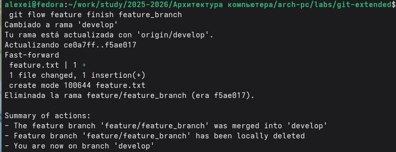

> 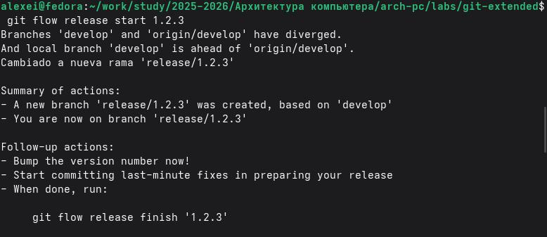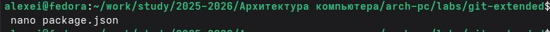 style="width:6.68667in;height:0.395in" />Шаг 4: Создайте второй релиз
> (версия 1.2.3)

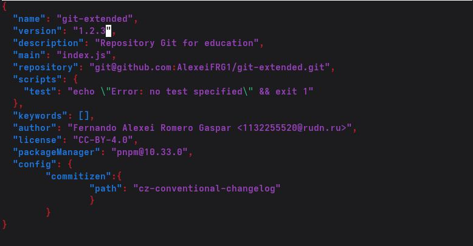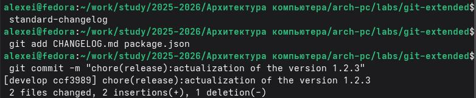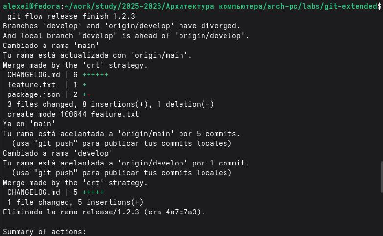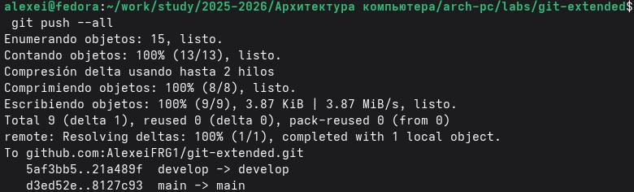

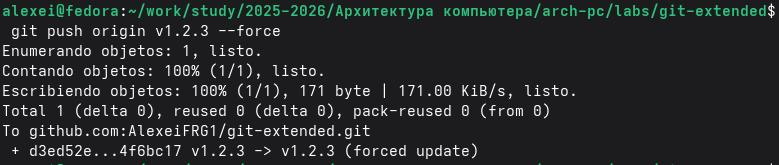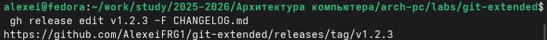

> **Выводы**

В ходе выполнения лабораторной работы я освоил продвинутые методы работы
с Git: изучил модель ветвления Gitflow, научился использовать
семантическое версионирование и применять спецификацию Conventional
Commits. Я установил и настроил необходимые инструменты (git-flow,
Node.js, commitizen, standard-changelog), создал тестовый репозиторий,
реализовал два релиза с автоматической генерацией changelog-файлов и
опубликовал их на GitHub. Все поставленные задачи выполнены, полученные
навыки будут полезны для профессиональной разработки в команде.

> **Список** **литературы**

 Дриссен, В. (2010). Успешная модель ветвления в Git. nvie.com.
[<u>https://nvie.com/posts/a-</u>](https://nvie.com/posts/a-successful-git-branching-model/)

> [<u>successful-git-branching-model/</u>](https://nvie.com/posts/a-successful-git-branching-model/)

 GitHub. (2026). CJ-Systems/gitflow-cjs: CJS-версия расширений для Git.
GitHub.

> [<u>https://github.com/CJ-Systems/gitflow-cjs/</u>](https://github.com/CJ-Systems/gitflow-cjs/)

 Традиционные коммиты. (2020). Традиционные коммиты 1.0.0-beta.3.

> [<u>https://www.conventionalcommits.org/</u>](https://www.conventionalcommits.org/)

 \*Семантическое управление версиями. (2013). Семантическое управление
версиями 2.0.0.

> [<u>https://semver.org/</u>](https://semver.org/)
