# РОССИЙСКИЙУНИВЕРСИТЕТДРУЖБЫНАРОДОВ

Факультетфизикоматематическихиестественныхнаук

Кафедраприкладнойинформатикиитеориивероятностей

ОТЧЕТ

ПОЛАБОРАТОРНОЙРАБОТЕNo 5 дисциплина: Архитектуракомпьютера

### Студент: Ромеро Гаспар Фернандо Алексей

### Группа: НКАбд-02-25

```text
МОСКВА
2026г.
```

---

## Оглавление

> 1. Цельработы
> 2. Теоретическиесведения
> 2.1.Менеджерпаролейpass
> 2.1.1. Основныесвойства
> 2.1.2. Структурабазыпаролей}
> 2.1.3. Реализации
> 2.2.Управлениефайламиконфигурациисchezmoi
> 2.2.1. Общаяинформация
> 2.2.2. Конфигурацияchezmoi
> 2.2.3. Шаблоны
> 2.3. Общепринятыекоммиты
> 2.3.1. Описание
> 2.3.2. Типыкоммитов

```text
3. Заданиеипоследовательностьвыполненияработы
3.1.Менеджерпаролейpass
3.1.1. Установка
3.1.2. Настройка
3.1.3. Настройкаинтерфейсасбраузером
3.1.4. Сохранениепароля
3.2.Управлениефайламиконфигурациисchezmoi
3.2.1. Установкадополнительногопрограммногообеспечения
3.2.2. Созданиесобственногорепозитория
3.2.3. Подключениерепозиторияксвоейсистеме
```

4. Выводы
5. Списоклитературы

---

## Цельработы

Целью данной лабораторной работы является освоение навыков настройки рабочей среды разработчика. Входе работы необходимо изучить менеджер паролей `pass` для безопасного храненияиуправления паролями, атакже освоить инструмент `chezmoi` для управления конфигурационными файлами (dotfiles) вдомашнем каталоге пользователя. Работа направлена на автоматизацию процесса развертывания рабочей среды на новых машинахиобеспечениебезопасногохраненияконфиденциальнойинформации.

---

## Теоретическиесведения

Вданномразделепредставленытеоретическиеосновыдвухключевыхинструментов дляуправлениясистемами: менеджерапаролейpassименеджераконфигурационныхфайлов chezmoi. Этипонятияиграютважнейшуюрольвпониманиипринциповбезопасностии автоматизациив Unix/Linuxсредах.

## 2.1 Менеджерпаролейpass

pass это менеджер паролей, созданный всоответствии сфилософией Unix и известный как «стандартный менеджер паролей для Unix».Вотличие отоблачныхрешений, pass хранит данные локальновфайловой системе, структурируя ихввиде иерархической иерархии каталоговифайлов, ииспользуетключи GPGдляшифрованияинформации. Такая архитектура обеспечивает пользователю полный контроль над своими конфиденциальными данными.

## 2.1.1 Основныесвойства

### Основныефункцииpassвключаютвсебя:

 Локальное хранилищевфайловой системе: База данных паролей организованаввиде структуры каталоговифайлов, что упрощает её пониманиеиуправлениеспомощью стандартныхинструментов Unix.

 Шифрование спомощью GPG: Каждый файл, содержащий пароль, шифруется индивидуальносиспользованиемпарыключей GPGпользователя. Этогарантирует, что тольковладелецзакрытогоключасможетрасшифроватьипрочитатьпароли.  Встроенная интеграция с Git: pass поддерживает интеграцию с Git, что позволяет создаватьверсии, синхронизироватьисоздаватьрезервныекопиибазыданныхпаролейв удалённыхрепозиториях.

 Простота: будучи набором shellскриптов, pass представляет собой лёгкоеипрозрачное решение, удобное для аудитаирасширения. Его работа основана на интеграции уже существующихсистемныхинструментов, такихкакgpg, gitиtree.

## 2.1.2 Структурабазыпаролей

---

Хотя структура базы данных может быть свободно определена пользователем,

сообществопринялостандартнуюсемантикудляорганизациизаписей:

 example.com.gpg: Сохраняет пароль для хоста example.com без указания пользователя илипорта.

 example.com/user.gpg: Сохраняет пароль для определённого пользователя на хосте example.com.

 user@example.com.gpg: Имя пользователя выражаетсяввиде префикса, отделённого от хостасимволом@.

 example.com: 22.gpg: Порт (или служба) указывается после хоста, разделённый двоеточием(:).

 example.com: 22/user.gpg: Объединяетспецификациюпользователяипорта.

## 2.1.3.Реализации

passимеетнесколькореализацийирасширенийдляразныхплатформ:

 Утилиты командной строки: Существует две основные реализации: классическая pass (сценарии оболочки) иgopass (написанная на Go), которая предлагает дополнительные функции, такиекакподдержка OTP.

 Графические интерфейсы: qtpassэто кроссплатформенный графический клиент, gopass-пользовательскийинтерфейсдляgopassиwebpassвкачествевебинтерфейса.  Приложение для Android: Password Store позволяет управлять базой данныхс Android, а Open Keychain: Easy PGPнеобходимдляуправленияключами GPG.

```text
 Пакеты для Emacs: pass (основнойрежим), helm-passиivy-pass интегрируют управление
паролямив Emacs.
```

## 2.2.Управлениефайламиконфигурациисchezmoi

chezmoiэто инструмент для безопасногоиэффективного управления личными конфигурационными файлами (известными как dotfiles) на множестве компьютеров. Его задачаобеспечить единообразие рабочего окружения пользователя вне зависимости от используемойсистемы.

---

## 2.2.1.Общаяинформация

chezmoi предлагает надёжный подход куправлению точечными файлами, отличающийсяотболее простыхметодов, таких как символическиессылки. Егоосновными характеристикамиявляются:

 Управление несколькими машинами: Позволяет обрабатывать тонкие различия между различными системами (например, персональным ноутбукомирабочим сервером) с помощьюшаблоновипеременных.

 Безопасность: Предлагает встроенную поддержку менеджеров паролей (включая pass), чтопозволяетбезопаснохранитьсекреты, нераскрываяихвхранилищенастроек.  Без зависимостей: Распространяется как единый статический двоичный файл без внешних зависимостей, что упрощает его установку влюбую систему без необходимостиправадминистратора.

## 2.2.2.Конфигурацияchezmoi

Рабочийпроцессchezmoiоснованнатрёхосновныхконцепциях:

 Исходный каталог (source directory): По умолчанию он находится в ~/.локальный/общий/личный. Это клон репозитория Git, который содержит основные файлыконфигурации. Этоткаталогявляетсяобщимдлявсехкомпьютеров.  Целевой каталог (target directory) Это каталог $HOME пользователя. Здесь chezmoi применяетфайлыконфигурации.

```text
 Локальныйфайлконфигурации: Обычнонаходитсяв~/. config/chezmoi/chezmoi. toml. Он
содержит настройки, специфичные для локального компьютера, такие как переменные,
используемыевшаблонах.
```

Процессchezmoiapply сравнивает заданноевисходномкаталогесостояниестекущим вцелевом каталогеиприменяетнеобходимыеизменениядляихсинхронизации. Крометого, chezmoiможетавтоматическисоздатьлокальныйконфигурационныйфайлнановоймашине, есливрепозиторииприсутствуетшаблонсименем.chezmoi.$FORMAT.tmpl.

## 2.2.3.Шаблоны

---

chezmoi использует систему шаблонов Goдля обработки различий междумашинами.

Файл считается шаблоном, если его имя заканчивается на.tmpl или он находится в специальном каталоге.chezmoitemplates. Это позволяет адаптировать содержимое конфигурационного файла под системные переменные, такие как имя хоста (chezmoi.хостнейм), операционная система (chezmoi.os) или архитектуравсё это делает dotfilesмаксимальнопереносимымиинастраиваемыми.

## Заданиеипоследовательностьвыполненияработы

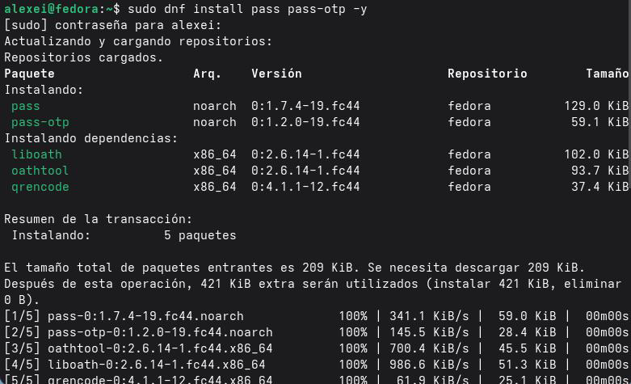

Вэтом разделе описаны практические шаги, необходимые для выполнения лабораторной работы: от установкиинастройки менеджера паролей Pass до управления конфигурационнымифайламиспомощьюchezmoi.

## 3.1.Менеджерпаролейpass 3.1.1.Установка

> Установкаpassиpass-otpв Fedora:
> Проверкакорректностиустановки:

---

## 3.1.2.Настройка

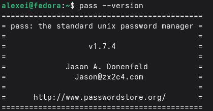

### Шаг1.Проверьтеилисоздайтеключ GPG

Чтобыиспользоватьpass, вамнеобходимоиметьключ GPG.Вопервых, проверяется,

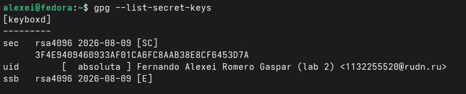

### существуетлиуже:

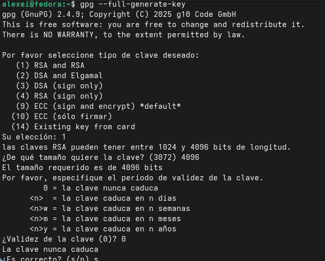

### Еслиключанет, необходимосоздатьновый:

---

```text
Шаг 2: Инициализацияхранилищапаролей
Шаг3.Настройтесинхронизациюс Git
```

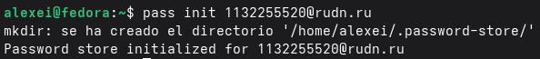

Дляссылкинаудаленныйрепозиторий (ранеесозданныйна Git Hub): Длясинхронизации:

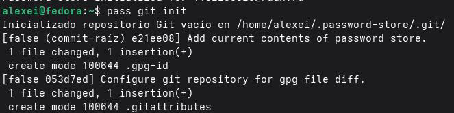

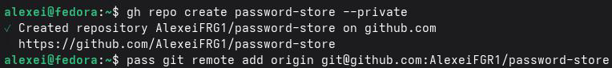

## 3.1.3.Настройкаинтерфейсасбраузером

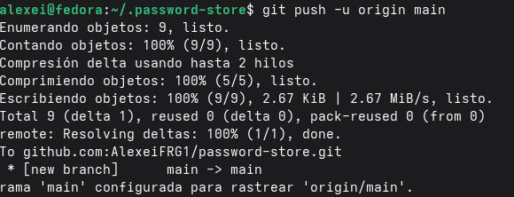

Чтобыиспользоватьpassсбраузером, необходимоустановитьплагинbrowserpass.

---

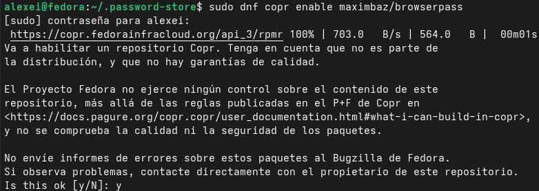

```text
Шаг1.Установитеbrowserpass (собственныйинтерфейсобменасообщениями)
Шаг2.Установитерасширениевбраузере
*Firefox: Установитьизнадстроек Firefox.
·Chrome/Chromium: Установитеиз Chrome Web Store.
```

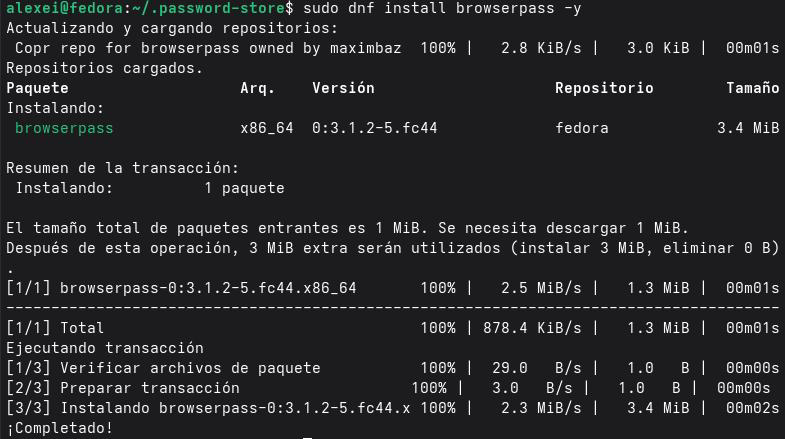

---

## 3.1.4.Сохранениепароля

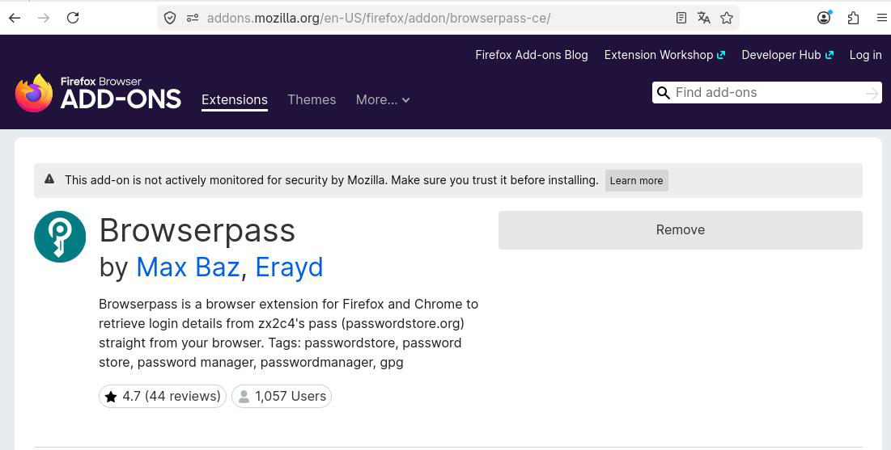

Добавитьновыйпароль: Автоматическигенерироватьпароль: Заменитьсуществующийпароль:

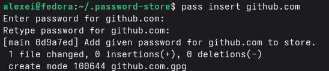

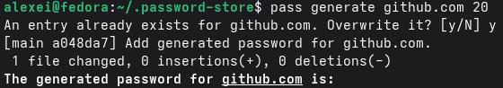

## 3.2.Управлениефайламиконфигурациисchezmoi

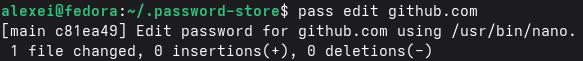

3.2.1.Установкадополнительногопрограммногообеспечения Установитедополнительныепакеты:

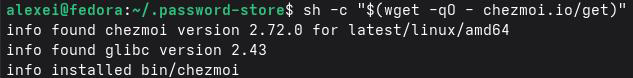

## 3.2.2.Созданиесобственногорепозитория

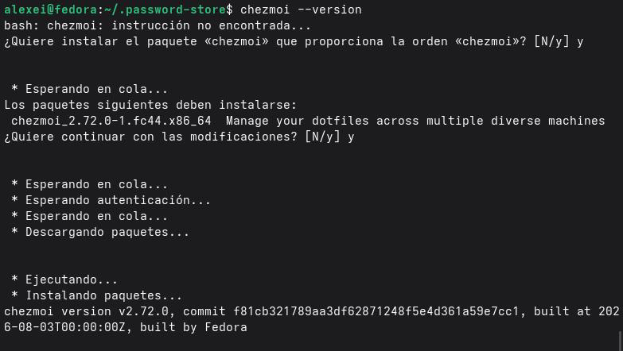

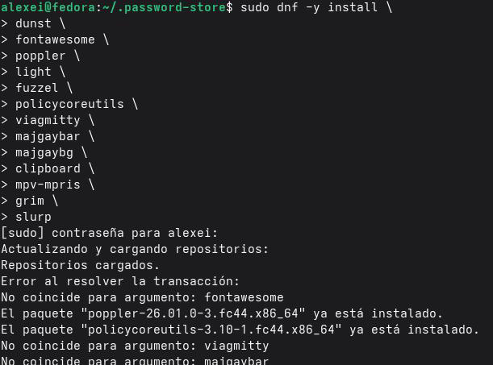

Шаг1.Создайтерепозиторийна Git Hubнаосновешаблона

---

## 3.2.3.Подключениерепозиторияксвоейсистеме

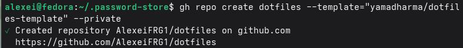

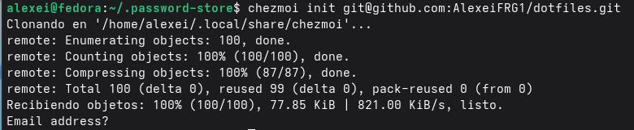

Шаг1.Инициализируйтеchezmoiспомощьюрепозитория Шаг3.Проверьтеналичиеизменений Шаг4.Применитеизменения

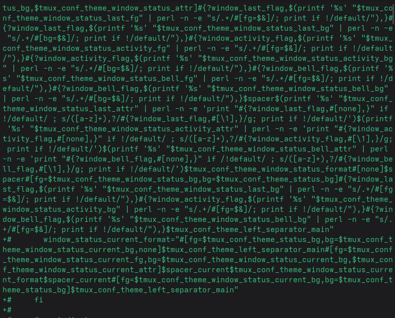

---

### `

## Выводы

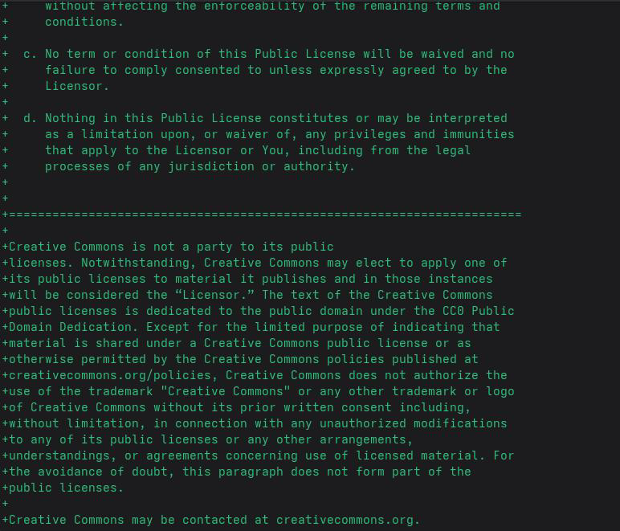

Входе выполнения лабораторной работы яосвоил инструменты для настройки безопаснойиэффективной рабочей среды. Яустановилинастроил менеджер паролей pass, научился инициализировать хранилище, синхронизировать егос Gitиуправлять паролями через командную строку. Также яизучил работу сchezmoi для управления конфигурационными файлами, создал репозиторий dotfilesинастроил его применение на системе. Все задачи выполнены, полученные навыки повышают безопасность работыи упрощаютпереносконфигурациймеждумашинами.

---

## Списоклитературы

 Cylab. (2026).Избегайтеутечкиучетныхданныхспомощью Pass: стандартного
менеджерапаролейдля Unix. https://cylab.be/blog/503/avoid-credential-leakage-with-pass-
the-standard-unix-password-manager

 Chezmoi.(б.д.).Настройка.https://www.chezmoi.io/user-guide/setup/
 Chezmoi.(б.д.).Чтоделает chezmoi?.https://www.chezmoi.io/
 Руководствопо GNUEmacs.(б.д.).Хранилищепаролей Unix.
https://www.gnu.org/software/emacs/manual/html_node/auth/The-Unix-password-store.html
 Chezmoi.(б.д.).Справочнаяинформацияшаблоны.
https://www.chezmoi.io/reference/templates/

 Cylab. (2026).Избегайтеутечкиучетныхданныхспомощью Passстандартного
менеджерапаролейдля Unix. https://cylab.be/blog/503/avoid-credential-leakage-with-pass-
the-standard-unix-password-manager

 Go Pass.(2026). gopassчуть болеепродвинутыйстандартныйменеджерпаролейдля
Unixдлякоманд.https://www.gopass.pw/

 Password Store Google Play. (2026).Password Storeприложениедля Android.
https://play.google.com/store/apps/details? id=dev.msfjarvis.aps

 Хранилищепаролей.(2026).Хранилищепаролей: стандартныйменеджерпаролейдля
Unix. https://www.passwordstore.org/

 Проект Fedora. (2026).Руководствопосистемномуадминистрированию DNF.
https://docs.fedoraproject.org/en-US/fedora/latest/system-administrators-guide/package-
management/DNF/Command_Reference/

 Chezmoi.(б.д.).Краткоеруководство.https://www.chezmoi.io/quick-start/
 Интерфейскоманднойстроки Git Hub.(2026).Руководствопоинтерфейсукомандной
строки Git Hub.https://cli.github.com/manual/

```text
 *GPG.(2026).Документацияпо GNUPrivacy Guard. https://gnupg.org/documentation/
```