# РОССИЙСКИЙУНИВЕРСИТЕТДРУЖБЫНАРОДОВ

Факультетфизикоматематическихиестественныхнаук

Кафедраприкладнойинформатикиитеориивероятностей

ОТЧЕТ

ПОЛАБОРАТОРНОЙРАБОТЕNo 6 дисциплина: Архитектуракомпьютера

### Студент: Ромеро Гаспар Фернандо Алексей

### Группа: НКАбд-02-25

```text
МОСКВА
2026г.
```

---

## Оглавление

> 1. Цельработы
> 2. Теоретическиесведения
> 2.1.Форматкоманды
> 2.2.Командаman
> 2.3.Командаcd
> 2.4.Командаls
> 2.5.Командаmkdir
> 2.6.Командаrm
> 2.7.Командаhistory

3. Заданиеипоследовательностьвыполненияработы 3.1.Определениеполногоименидомашнегокаталога 3.2. Работаскаталогом/tmp 3.3. Проверканаличияподкаталогаcron 3.4. Работасдомашнимкаталогом 3.5. Созданиеиудалениекаталогов 3.6. Использованиекомандыman 3.7. Использованиекомандыhistory

4. Контрольныевопросы
5. Выводы
6. Списоклитературы

---

## Цельработы

Целью данной лабораторной работы является приобретение практических навыков взаимодействия пользователясоперационной системой типа Linux посредством командной строки. Входе работы необходимо изучить основные команды для навигации по файловой системе, управления каталогамиифайлами, атакже освоить использование справочной системыmanиисториикоманддляэффективнойработывтерминале.

---

## Теоретическиесведения

Вэтомразделепредставленытеоретическиеосновыинтерфейсакоманднойстрокив системах Unix/Linuxиосновныекоманды, необходимыедлявзаимодействиясоперационной системой.

## 2.1.Форматкоманды

Командная строка это текстовый интерфейс, позволяющий пользователю взаимодействоватьсоперационной системой, вводя инструкции. Общийформат командыв Linuxвыглядитследующимобразом:

> текст
> <имякоманды>[параметры][аргументы]

Имя команды указывает на выполняемое действие, параметры (также называемые флагами) изменяют её поведение, ааргументы указывают объекты, над которыми она работает (файлы, каталогиит.д.).

## 2.2.Командаman

Команда `man`(сокращение от manual) это встроенный инструмент для работыс документацией всистемах Unix/Linux. Она позволяет получить доступ кстраницам руководства, содержащим подробную информациюобольшинстве команд, доступныхв системе, включаяихсинтаксис, параметрыипримерыиспользования.

### Чтобыиспользоватькоманду`man`, введите:

> `bash`
> `man<имя_команды>`
> `Например, чтобыпросмотретьруководстводлякоманды`ls`:`

> `bash`
> `manls`

---

Внутри страницы руководства вы можете перемещаться спомощью клавиш со стрелками, переходить между страницами спомощью пробела ивыходить, нажимая клавишу`q`.

## 2.3.Командаcd

Команда `cd` (переход вдругой каталог) используется для навигации между

### каталогамивфайловойсистеме. Еёбазовыйформат:

> bash
> cd[каталог_файла]
> Некоторыераспространённыевариантывключают:

 `cd..`перемещаетсянаодинуровеньвверхпоиерархиикаталогов.  `cd~`илипросто`cd`переводитвасвдомашнийкаталогпользователя.  `cd/`переводитвасвкорневойкаталогсистемы.

## 2.4.Командаls

Команда`ls`(список) отображаетсодержимоекаталога. Еёбазовыйформат: bash `ls[параметры][put]`

Некоторыеизнаиболеечастоиспользуемыхпараметров:

```text
 `-a`отображаетвсефайлы, включаяскрытые (те, чьиименаначинаютсясточки).
 `-l`отображаетподробнуюинформацию (правадоступа, количествоссылок, владелец,
размер, датаизменения).
```

```text
 `-F` добавляет символ вконец имени файла, чтобы указать тип файла (`/` для
каталогов,`*`дляисполняемыхфайлов,`@`длясимволическихссылок).
 `-t`сортируетфайлыподатеизменения.
 `-R`рекурсивновыводитсодержимоеподкаталогов.
```

Можнокомбинироватьнесколькопараметров, например:`ls \-la`дляотображениявсех

файловсподробнойинформацией.

---

## 2.5.Командаmkdir

Команда`mkdir`(создатькаталог) создаетновыекаталоги. Ееформат: bash mkdir[параметры] каталог_каталог Параметр `-p` позволяет создать полную иерархию каталогов, создавая любые

### промежуточныекаталоги, которыхещенет:

> bash
> mkdir-p~/dir 1/dir 2/dir 3

## 2.6.Командаrm

Команда`rm`(удалить) удаляетфайлыиликаталоги. Еёбазовыйформат: bash rm[параметры][файлы] Некоторыеважныепараметры:

```text
 -rудаляеткаталогииихсодержимоерекурсивно.
 -fпринудительноудаляетбеззапросаподтверждения.
```

Для удаления пустого каталога можно также использовать специальную команду `rmdir`.

## 2.7.Командаhistory

Команда `history` отображает список команд, ранее выполненныхвтекущей сессии

терминала. Каждаякомандаобозначаетсяномером, чтопозволяет:  Просмотретьвсюисторию:`history`.  Повторновыполнитькомандупоеёномеру:`!<number>`.

---

 Выполнитьпоисквистории, нажав Ctrl+R.

Эта функция очень полезна для экономии времени при повторении сложных команд

илидлязапоминаниятого, какбылавыполненапредыдущаязадача.

## Заданиеипоследовательностьвыполненияработы

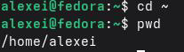

Вэтом разделе представлены задания, которые необходимо выполнить, иподробные

инструкциипоработескоманднойстрокойвоперационнойсистеме Linux.

## 3.1.Определениеполногоименидомашнегокаталога

Шаг 1: Определитеполныйпутькдомашнемукаталогу

Чтобы найти абсолютный путь кдомашнему каталогу пользователя, используйте команду `pwd`(вывести рабочий каталог).Сначала перейдитевдомашний каталог, азатем выполнитеследующуюкоманду:

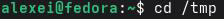

```text
Ввыводебудетпоказанполныйпуть, например:/home/alexei
```

## 3.2.Работаскаталогом/tmp

### Шаг 1: Перейдитевкаталог/tmp

Шаг 2: Отобразитесодержимоекаталога/tmpспомощьюразличныхопций

---

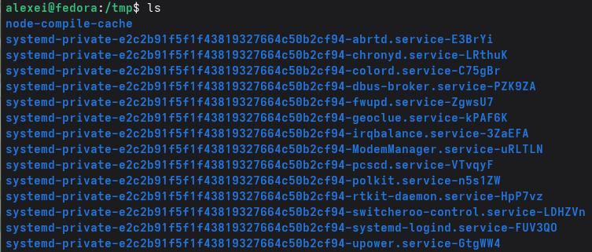

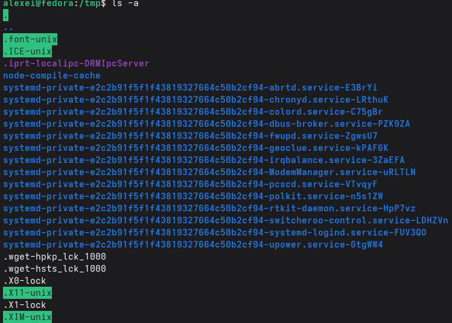

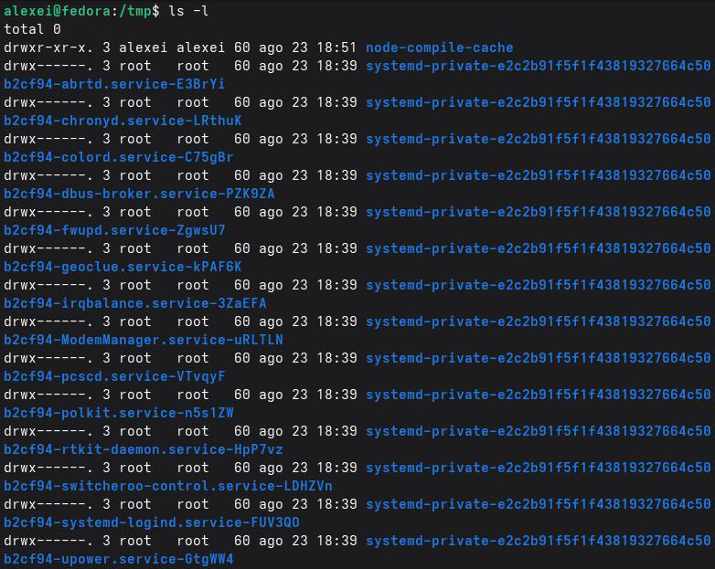

---

### Пояснениеразличий:

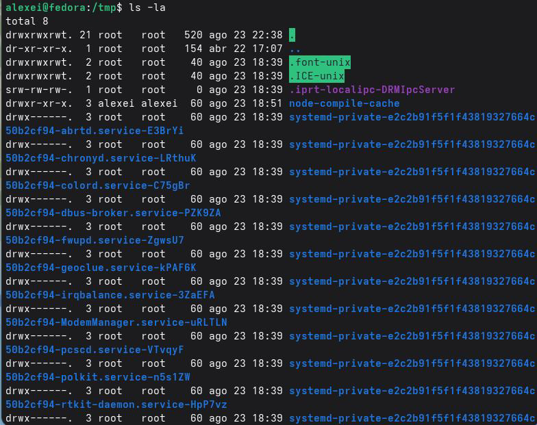

```text
 lsпоказываеттолькоименавидимыхфайловикаталогов.
 ls-aтакжепоказываетскрытыефайлы (те, которыеначинаютсясточки).
 ls-lпоказываетподробнуюинформацию: права доступа, количествоссылок, владелец,
группа, размер, датаиимя.
```

```text
 ls-laобъединяетобеопции: показываетвсефайлысподробнойинформацией.
 ls-la Fдобавляетсимволвконецимени, чтобыуказатьтипфайла(/длякаталогов,*
дляисполняемыхфайлов,@длясимволическихссылок).
```

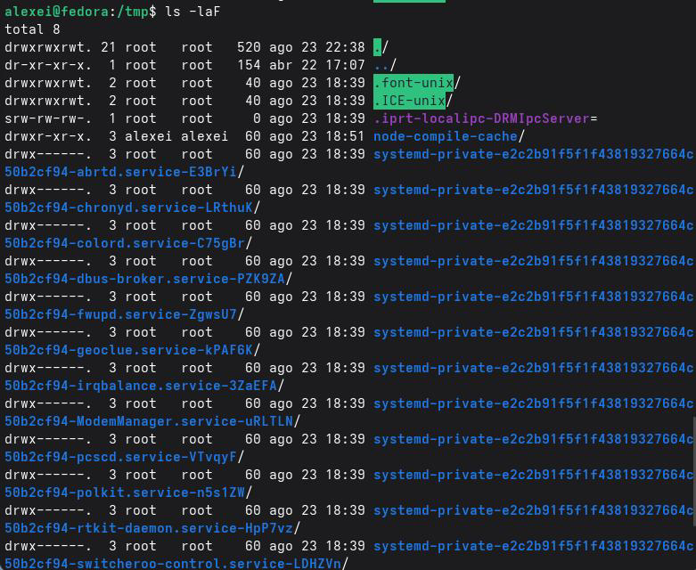

## 3.3.Проверканаличияподкаталогаcron

---

```text
Шаг 1: Проверьте, существуетлиподкаталогcronв/var/spool
Чтобывыполнитьпоискименнокаталогаcron:
```

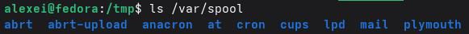

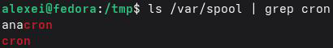

### Илинапрямую:

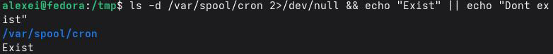

```text
3.4.Работасдомашнимкаталогом
Шаг 1: Перейдитевсвойдомашнийкаталог
```


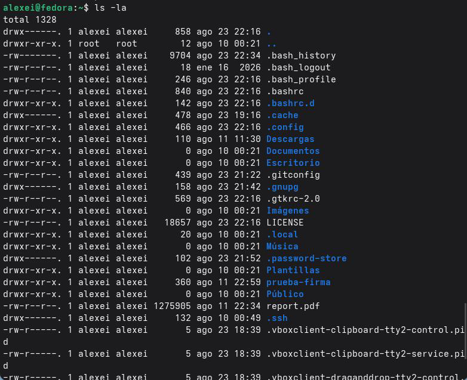

Шаг 2: Отобразитесодержимоесвоегодомашнегокаталогасподробнойинформацией

---

### Шаг 3: Определитевладельцафайловикаталогов

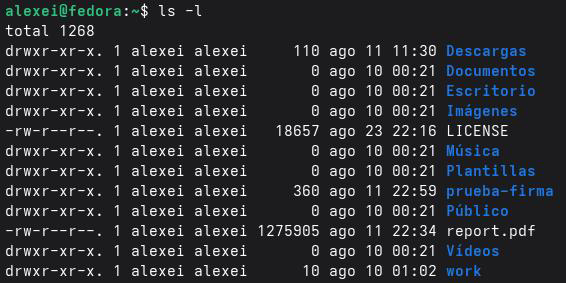

Ввыводе команды ls-lтретий столбец указывает владельца каждого файла или

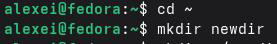

каталога.


## 3.5.Созданиеиудалениекаталогов

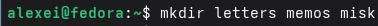

Шаг 1: Создайтеновуюдиректориювсвоейдомашнейдиректории

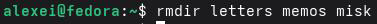

> Шаг 2: Создайтеподкаталогвнутриnewdir
> Шаг 3: Создайтетридиректорииоднойкомандой
> Шаг 4: Удалитетридиректорииоднойкомандой

---

Шаг 5: Попробуйтеудалитьдиректориюnewdirспомощьюкомандыrm

Командавыведетошибку, указывающуюнато, чтоnewdir являетсядиректорией.

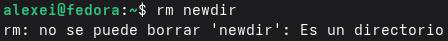

Чтобыудалитьеё, необходимоиспользоватьопцию-r:

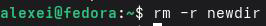

### Шаг 6: Убедитесь, чтодиректориябылаудалена

## 3.6.Использованиекомандыman

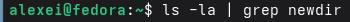

Шаг 1: Определитепараметр`ls`длярекурсивногоперечисленияподкаталогов


```text
Вруководственайдитепараметр`-R`или`--recursive`, которыйпозволяетрекурсивно
```

перечислятьсодержимоеподкаталогов.

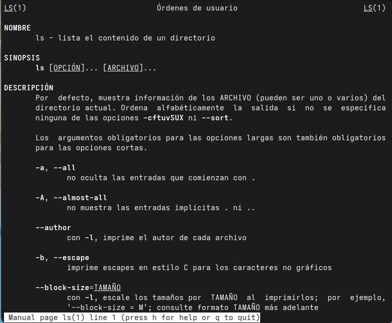

Шаг 2: См.руководствопокомандам`cd`, `pwd`, `mkdir`, `rmdir`и`rm`

---

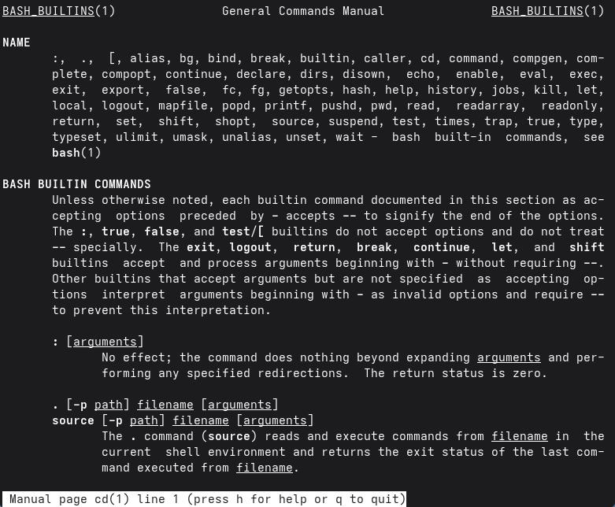

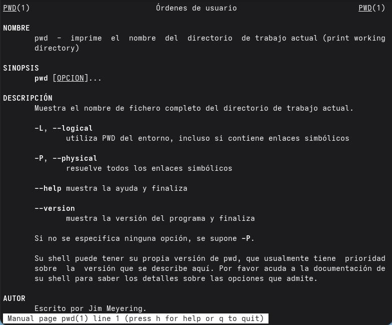

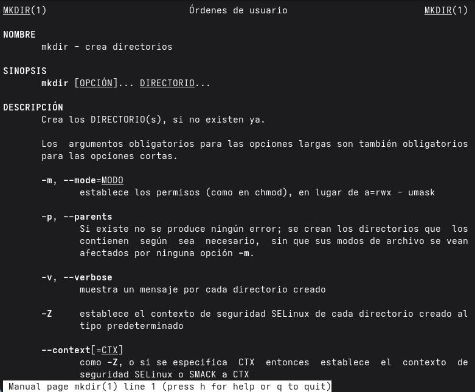

---

### Пояснениеосновныхпараметров:

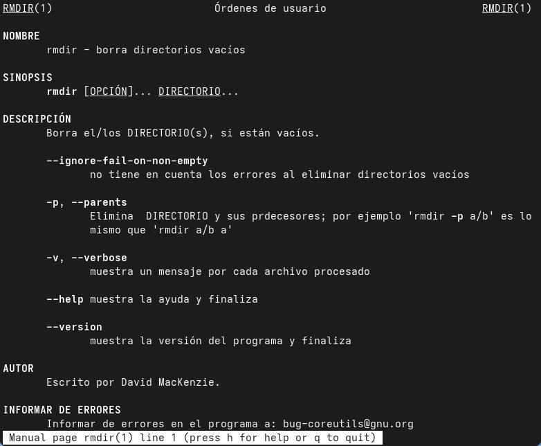

```text
 `cd`неимеетсущественныхпараметров; онтолькоменяеткаталог.
 `pwd`с`-P`отображаетфизическийпутьбезсимволическихссылок.
 `mkdir``-p`создаетпромежуточныекаталоги;`-m`устанавливает правадоступа.
 `rmdir`удаляеттолькопустыекаталоги.
 `rm``-r`удаляетрекурсивно;`-f`принудительноудаляет;`-i`запрашивает
подтверждение.
```

## 3.7.Использованиекомандыhistory

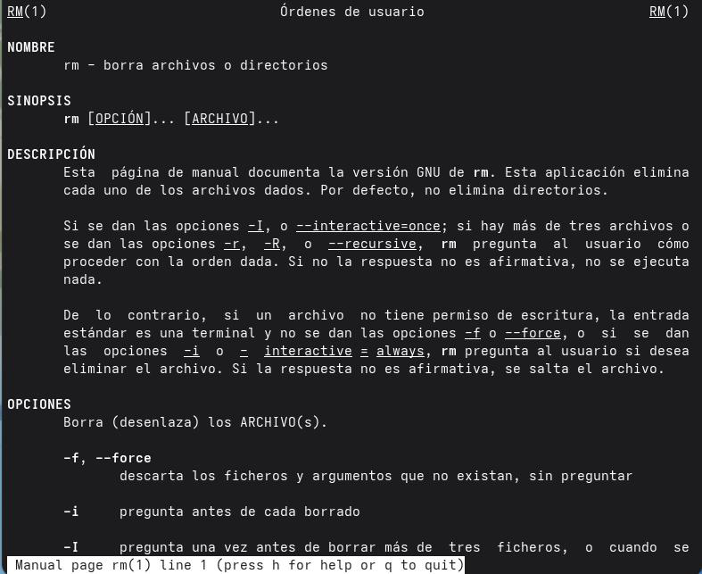

### Шаг 1: Отобразитьисториюкоманд

---

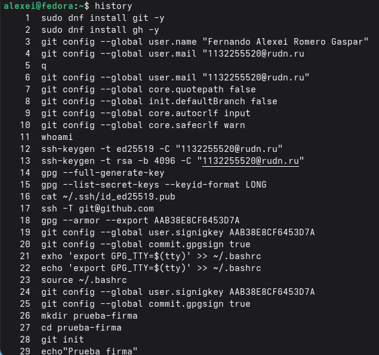

Шаг 2: Повторновыполнитькомандуизисториипоеёномеру

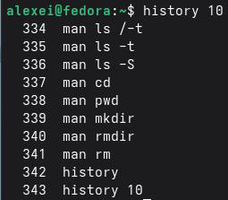

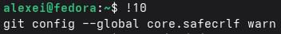

```text
Шаг 3: Изменитьивыполнитькомандуизистории
Например, есликоманда 20ls-la, еёможноизменитьнаls-l:
Шаг 4: Найтивисторииспомощью Ctrl+R
```

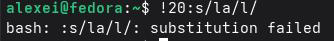

---

Нажмите Ctrl+Rивведитечастьискомойкоманды.

### Шаг 5: Выполнитьпоследнююкоманду

## Контрольныевопросы

1.Чтотакоекоманднаястрока?

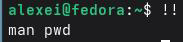

Интерфейс командной строки (CLI) это текстовый интерфейс, позволяющий пользователювзаимодействоватьсоперационнойсистемой, вводяинструкцииввидекоманд. Вотличие от графических пользовательских интерфейсов (GUI), командная строка требует от пользователя ввода конкретных команд для выполнения таких задач, как навигация по файловой системе, запуск программ или управление файлами. Этомощныйиэффективный инструмент, особенно для административных задачизадач автоматизации, поскольку он обеспечивает точный контроль над системой ивозможность объединять команды для выполнениясложныхзадач.

2.Передкомандаминеследуетвключатьабсолютныеслова. Существуеткаталог?

Пожалуйста, проверьтесначала.

Абсолютный путьэто полный адрес, указывающий местоположение файла или каталога от корня файловой системы (обозначается символом /). Абсолютный путь не зависитоттекущегокаталогаивсегданачинаетсяскорня.

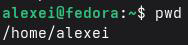

Команда для определения абсолютного путиктекущему каталогу`pwd`(вывести

рабочийкаталог).

### Пример:

```text
Еслипользовательнаходитсявкаталоге`/home/alexei`, выводбудетследующим.
```

---

3. Вот некоторые из команд ипараметров, которые могут быть вам

предоставлены. Какие имена естьвкаталоге? Пожалуйста, сначала ознакомьтесьс информацией.

Чтобы определить типы файловиотобразить только их именавтекущем каталоге, используйте команду `ls`сопцией `-F`. Эта опция добавляетвконец имени файла символ, указывающийнаеготип.

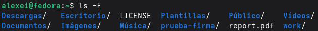

```text
Символ Типфайла
/Каталог
```

\* Исполняемыйфайл

### @ Символическаяссылка

### (безсимволов) Обычныйфайл

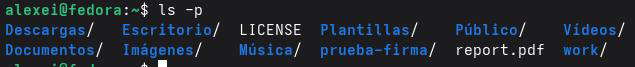

### Примеры:

```text
Вытакжеможетекомбинироватьэтос-p (аналогично-F, нотолькодлякаталогов):
4.Какизобразитьинформациюоскрытыхфайлах? Приведитепример.
```

Скрытые файлыв Linuxэто файлы, имена которых начинаютсясточки (.).Эти файлыобычно содержат настройки приложенийили системыине отображаютсявобычных списках во избежание путаницы. Чтобы отобразить эту информацию, используйте команду `ls`сопцией`-a`(все):

---

### Пример:

Это отобразит все файлы, включая скрытые, сподробной информацией (права

доступа, владелец, размер, датаит.д.).

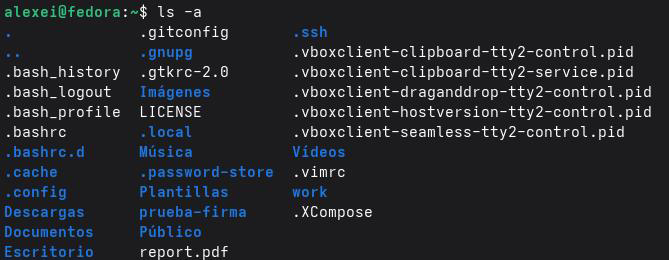

5.Как узнать, как проверить каталог? Чем это похоже на вашу команду?

Пожалуйста, сначалапосмотрите.

Да, выможетеудалять какфайлы, такикаталогиспомощьюоднойитойжекоманды

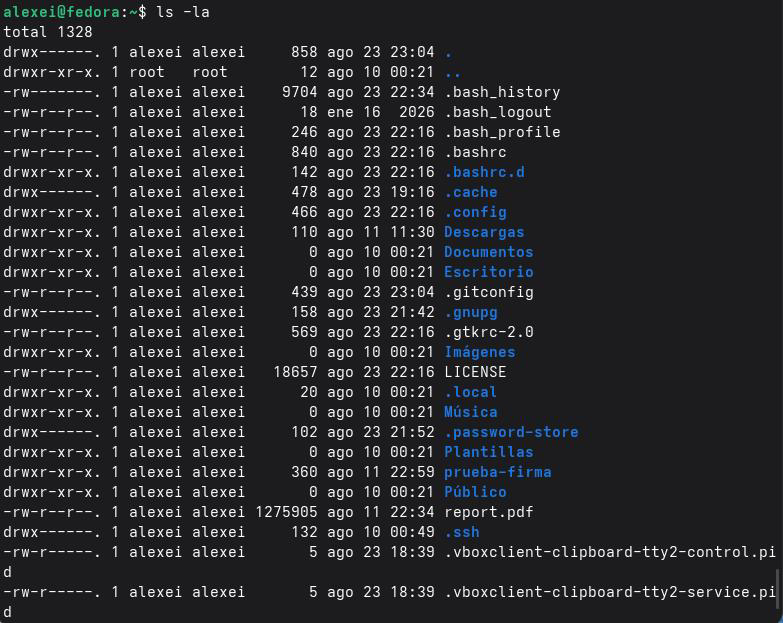

`rm`(удалить).Разницазаключаетсявиспользуемыхпараметрах.

Для удаления файлов используйте команду `rm` без какихлибо специальных

### параметров:

---

Дляудалениякаталоговиихсодержимогоиспользуйтепараметр`-r`(рекурсивный):

Такжесуществуетспециальнаякоманда`rmdir`дляудаленияпустыхкаталогов: Примеры:

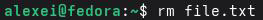

> Команда Действие
> rmfile.txt Удаляетфайлfile.txt

```text
rm-rfolder/Удаляетпапкуивсееесодержимое
rmdir empty_folder/Удаляетпапкутольковтомслучае, еслионапуста
6.Намненужнопредоставлятьинформациюилиинформациюовыполненных
```

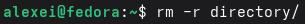

пользовательскихкомандах?

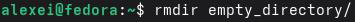

Дляпросмотраисториипоследнихвыполненныхкомандиспользуетсякомандаhistory.

Поумолчаниюонаотображаетвсекомандывтекущейсессии.

---

Чтобыотобразитьтолькопоследние Nкоманд, можноуказатьчисло: Этоотобразиттолькопоследние 10выполненныхкоманд.

7.Какиспользовать историю команд для изменения уже выполненныхкоманд?

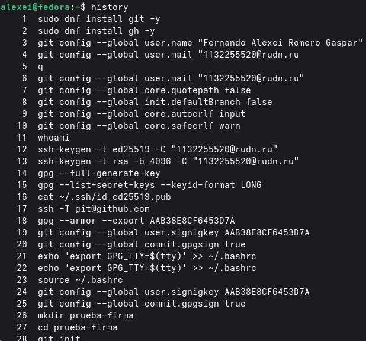

Дляначала, добропожаловать.

История команд позволяет повторно использоватьиизменять предыдущие команды,

используясимвол!, закоторымследуетчислоилитекстовая строка.

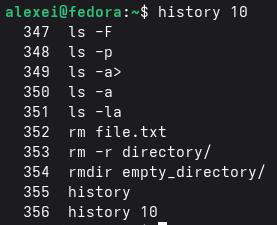

### Базовыйсинтаксис:

!<число>выполняеткомандусномером, указаннымвистории. !! выполняетпоследнююкоманду. !<текст>выполняетпоследнююкоманду, начинающуюсяс<текст>.

---

```text
!<число>: s/<старый>/<новый>/выполняет команду<число>, заменяя<старый>на
```

<новый>.

### Примеры:

> bash
> \#Историякоманд
> history
> 1cd/tmp
> 2ls-la
> 3 pwd

\#Повторноевыполнениекоманды 2! 2#Выполняет: ls-la

\#Повторноевыполнениепоследнейкоманды!!#Выполняетпоследнююкоманду

```text
#Повторновыполняетизмененнуюкоманду 2 (замените-laна-l)
```

### ! 2: s/la/l/#Выполняет: ls-l

8.Первыекомандынажимайтеодновременно.

ВLinux можно выполнять несколько команд водной строке, используя разные

операторы, которыеопределяют, каконибудутобъединенывцепочку.

### Оператор Функция

; Выполняеткомандыпоследовательно, независимо отуспехаили

неудачипредыдущих.

&& Выполняет следующую команду только втом случае, если

предыдущаябылавыполненауспешно (кодзавершения 0).

### ||

Выполняет следующую команду только втом случае, если

предыдущаязавершиласьнеудачей (кодзавершения, отличныйот 0).

### Примеры:

---

bash \#Выполнитьтрикомандыпоследовательно cd/tmp; ls; pwd \#Создатькаталоги, еслиуспешно, перейтивнего mkdirnew_dir&&cdnew_dir \#Попытатьсяперейтивкаталог; еслинеудастся, создать его cd/tmp/nonexistent_dir||mkdir/tmp/nonexistent_dir

9.Экранирующиесимволы.

Экранирующие символыэто специальные символы, которые позволяют оболочке интерпретировать символ буквально, то есть рассматривать специальный символ как обычный, не пытаясь выполнить его специальную функцию. Наиболее распространенным

экранирующимсимволомв Linuxявляетсяобратнаякосаячерта (\\).

Примерыспециальныхсимволов, которыенеобходимоэкранировать:

Символ Специальнаяфункция \\ "" '' $ \*? [] | \>< Примеры: bash \#Создатьфайлсименем, содержащимпробелы (безэкранирования) touchmyfile.txt#❌Ошибка: создаетдвафайла"my"и"file.txt"

Началосимволаэкранирования Кавычки (групповойтекст) Одинарные кавычки (групповой

### литеральныйтекст)

Переменнаясреды Подстановочныйзнак (любаястрока) Подстановочныйзнак (одинсимвол) Наборысимволов Вертикальныйсимвол Перенаправлениеввода/вывода

---

\#Используйтеэкранирование, чтобысделатьпробелбуквальным touchmy\\file.txt#✅Создает"myfile.txt" \#Используйтекавычкидлятойжецели touch"myfile.txt"#✅Создает"myfile.txt"

10. Охарактеризуйтевыводинформациинаэкран послевыполнениякомандыls

сопциейl.

Опция \-lкоманды ls отображает подробный список файлов икаталогов, также известный как «длинный формат».Каждая строка содержит информацию офайле или каталоге, организованнуювстолбцы. Выводимеетследующийформат:

```text
текст
drwxr-xr-x2группапользователей409613августа 10: 00 Документы/
-rw-r--r-1группапользователей102413августа 09: 30file.txt
```

### Столбец Значение

```text
1 Тип файла (d=каталог,=файл, l=символическая ссылка) и
```

### правадоступа (rwxr-xr-x)

> 2 Количествожесткихссылокнафайл
> 3 Владелецфайла (имяпользователя)
> 4 Группа, ккоторойпринадлежитфайл
> 5 Размерфайлавбайтах
> 6 Датаивремяпоследнегоизменения
> 7 Имяфайлаиликаталога

11. Вчём смысл игры? Приоритет отдаётся первому отношительному и

абсолютномупутипривыполнениикакойлибокоманды.

```text
Абсолютный путьэто полный адрес, указывающий местоположение файла или
каталога от корня файловой системы (обозначается символом /). Например:
/home/alexei/documentos/informe.txt.
```

Относительный путь указывает местоположение файла или каталога относительно текущегокаталога. Онненачинаетсяс/ииспользует такиесимволы, как.(текущийкаталог)

---

и..(родительскийкаталог).

### Примеры:

Тип Путь Значение Абсолютный

```text
/home/alexei/documents/report.txt каталога(/) дофайла
```

### От корневого

Относительный documents/report.txt От текущего каталога

Относительный../report.txt На один уровень

### вышетекущегокаталога

### Примериспользования`cd`:

```text
bash
#Использованиеабсолютногопути
`cd /home/alexei/documents`
#Использованиеотносительногопути (есливынаходитесьв`/home/alexei`)
`cddocuments`
#Использованиеотносительногопути (наодинуровеньвыше)
`cd..`
```

12.Какполучитьинформациюокоманде?

Для получения подробной информации окоманде используйте команду `man`

(справочник), котораяотображаетсправочнуюстраницудляуказаннойкоманды:

> bash
> man<имя_команды>
> Примеры:
> bash
> manls#Отображаетруководстводля'ls'
> mancd#Отображаетруководстводля'cd'

---

### manman#Отображаетруководстводля'man'

Внутри справочной страницы вы можете перемещаться спомощью клавиш со

стрелками, двигатьсявпередспомощьюпробелаивыходитьспомощьюклавиши`q`.

13. Какая клавиша или комбинация клавиш служит для автоматического

дополненияпривводекоманд?

Клавиша Tab используется для автозаполнения команд, имен файловикаталоговв терминале. Принажатии клавиши Tab во время ввода команды или пути оболочка пытается автоматическидополнитьтекстнаосновесуществующихфайловикаталогов.

> Пример:
> bash
> \#Введитечастькомандыинажмите Tab
> cd/home[TAB]#Дополняетсядо: cd/home/

Если есть несколько возможных вариантов, двойное нажатие клавиши Tab отобразит

вседоступныеварианты.

## Выводы

Входе выполнения лабораторной работы яприобрёл практические навыки взаимодействия соперационной системой Linux через командную строку. Яизучил основные команды для навигации по файловой системе (cd, pwd), просмотра содержимого каталогов (lsсразличными опциями), созданияиудаления каталогов (mkdir, rm, rmdir). Также яосвоил использование справочной системы man для получения информации о командах иработу систорией команд (history) для их повторного выполнения и модификации. Все поставленные задачи выполнены, полученные навыки являются основой дляэффективнойработывтерминале Linux.

---

## Списоклитературы

 GNU.org.(2025).Руководствопоcoreutils: Списоккаталогов.
https://www.gnu.org/software/coreutils/manual/coreutils.pdf

 USDA.(2024).Интерфейскоманднойстроки Linux. https://scinet.usda.gov/guides/use/cli
 Система Университета Иллинойса.(2026).Краткийсправочникпокомандам Linux.
https://answers.uillinois.edu/hipaa/104977

 Национальнаялаборатория Ок Ридж.(s.f.).Базоваякоманднаястрока Linux.
https://single-crystal.ornl.gov/guide/linux/index.html

 Документация Ubuntu.(2026).Команднаястрока Linuxдляначинающих.
https://documentation.ubuntu.com/desktop/en/latest/tutorial/the-linux-command-line-for-
beginners/

 Страницыруководства Debian. (2025).man (1) man-db Debiantrixie.
https://manpages.debian.org/trixie/man-db/man.1.de.html

 Страницыруководства Debian. (2026). ls (1) coreutils Debianunstable.
https://manpages.debian.org/unstable/coreutils/ls.1.en.html
 phoenix NAP.(2025).Командаистории Linuxспримерами.
https://www.phoenixnap.de/kb/Linux-Verlaufsbefehl

 Научныевычисления USDA.(2024).Интерфейскоманднойстроки Linux.
https://scinet.usda.gov/guides/use/cli

 Стэнфордскийуниверситет.(2026).Команднаястрокавашдруг.
https://ccrma.stanford.edu/docs/common/command-line.html