# РОССИЙСКИЙУНИВЕРСИТЕТДРУЖБЫНАРОДОВ

Факультетфизикоматематическихиестественныхнаук

Кафедраприкладнойинформатикиитеориивероятностей

ОТЧЕТ

ПОЛАБОРАТОРНОЙРАБОТЕNo 7 дисциплина: Архитектуракомпьютера

### Студент: Ромеро Гаспар Фернандо Алексей

### Группа: НКАбд-02-25

```text
МОСКВА
2026г.
```

---

## Оглавление

1. Цельработы
2. Теоретическиесведения

```text
2.1.Командыдляработысфайламиикаталогами
2.1.1. Командаtouch
2.1.2. Командаcat
2.1.3. Командаless
2.1.4. Командаhead
2.1.5. Командаtail
2.2.Копированиефайловикаталогов (cp)
2.3. Перемещениеипереименованиефайловикаталогов (mv)
2.4. Правадоступа
```

2.4.1. Изменениеправдоступа (chmod)

> 2.5. Анализфайловойсистемы
> 2.5.1. Командаmount
> 2.5.2. Командаdf
> 2.5.3. Командаfsck

3. Заданиеипоследовательностьвыполненияработы 3.1. Работасфайламиикаталогами 3.2.Копированиефайловикаталогов 3.3.Перемещениеипереименованиефайловикаталог 3.4.Изменениеправдоступакфайламикаталогам 3.5.Анализфайловойсистемы

4. Контрольныевопросы
5. Выводы
6. Списоклитературы

---

## Цельработы

Целью данной лабораторной работы является ознакомлениесфайловой системой

Linux, её структурой, именами исодержимым каталогов. Входе работы необходимо приобрести практические навыки по применению команд для работы сфайлами и каталогами, по управлению процессами (иработами), по проверке использования дискаи обслуживаниюфайловойсистемы.

---

## Теоретическиесведения

Вэтомразделепредставленытеоретическиеосновынаиболееважныхкоманддля работысфайламиикаталогамивсистемах Linux, атакжеинструментыдляанализаи обслуживанияфайловойсистемы.

## 2.1.Командыдляработысфайламиикаталогами 2.1.1.Командаtouch

Команда`touch` используется для создания пустого файлаилидля обновлениядатыи


времениизменениясуществующегофайла. Еёбазовыйформат:

Например,`touch file.txt`создаёт файлсименем `file.txt`без содержимоговтекущем каталоге. Если файл уже существует,`touch` обновляет его метку времени до текущего времени.

## 2.1.2.Командаcat

Команда `cat`(объединение файлов) используется для вывода всего содержимого

одногоилинесколькихфайловвстандартныйвывод. Еёбазовыйформат:


Например,`cat file.txt` выводит всё содержимое файла `file.txt`втерминал. Это полезно длянебольшихфайлов, номожетбытьнепрактичнодлябольшихфайлов, поскольку отображаетвсёсодержимоесразу.

## 2.1.3.Командаless

Команда `less` позволяет просматривать содержимое текстовых файлов постранично,

отображаяпоодномуэкранузараз. Еёбазовыйформат:

---

Вовремяпросмотрадлянавигацииможноиспользоватьследующиеклавиши:

 Пробелилиfперейтинаоднустраницувперёд  bвернутьсянаоднустраницуназад  Enterперейтинаоднустрокувперёд  qвыйтиизрежимапросмотра


Этакомандаособеннополезнадлябольшихфайловилидлявыходаиздругихкоманд.

## 2.1.4.Командаhead 2.1.5.Командаtail


Команда`head`поумолчаниюотображаетпервые 10строкфайла. Еёбазовыйформат:

Чтобыотобразитьопределённоеколичествострок, используйтеопцию`-n`:


Команда `tail` по умолчанию отображает последние 10 строк файла. Её базовый

### формат:


Какивслучаес`head`, выможетеуказать другое количество строкспомощьюопции

### `-n`:


Очень полезная опция для `tail``-f`(следовать), которая позволяет врежиме реального времени видеть новые строки, добавляемыевфайл (например, для мониторинга

логфайлов).

---

## 2.2.Копированиефайловикаталогов (cp)

команда `cp`(копировать) используется для копирования файлов или каталогов из


### одногоместавдругое. Еёбазовыйформат:


Прикопированиифайламожноуказатьдругоеимядлякопии:

Для копирования всего каталогаиего содержимого необходимо использоватьопцию


### `-r`(рекурсивноекопирование):

Опция `-i` (интерактивное копирование) запрашивает подтверждение перед


перезаписьюсуществующегофайла.

## 2.3.Перемещениеипереименованиефайловикаталогов (mv)


Команда `mv`(переместить) используется для перемещения файлов или каталоговв


другоеместо, атакжедляихпереименования. Егобазовыйформат:

> Чтобыпереименоватьфайлвтомжекаталоге:
> Чтобыпереместитьфайлвдругойкаталог:

---

Как иcp, mv также поддерживает опцию \-iдля запроса подтверждения перед

перезаписьюсуществующихфайлов.

## 2.4.Правадоступа

ВLinuxкаждыйфайликаталогимеютнаборправ доступа, определяющих, ктоможет

читать, записыватьиливыполнятьфайл. Правадоступаделятсянатрикатегории:  Владелец (u) пользователь, которомупринадлежитфайл  Группа (g) пользователи, входящиевгруппу, ккоторойпринадлежитфайл  Другие (o) всеостальныепользователи

Правадоступаобозначаютсяследующимисимволами:

 rчтение  wзапись  xвыполнение

## 2.4.1.Изменениеправдоступа (chmod)

Команда`chmod`(изменитьрежим) используетсядляизмененияправдоступакфайлу иликаталогу. Правадоступамогутбытьзаданысимволическииличисленно (восьмерично).

### Символическаяформа:

```text
bash
`chmodu+xfile`#Добавляетправанавыполнениедлявладельца
`chmodg-wfile`#Удаляетправаназаписьдлягруппы
`chmodo=r file`#Устанавливаетправатольконачтениедляостальных
`chmod a+rwx file`#Предоставляет все права доступа всем (владельцу, группе,
```

### остальным)

### Числовая (восьмеричная) форма:

---

Значение Разрешение 4 Чтение (r) 2 Запись (w) 1 Выполнение (x) 7 Чтение+запись+выполнение (rwx) 6 Чтение+запись (rw-)

```text
Баш
файлchmod755#rwxr-xr-x
файлchmod644#rw-r--r--
файлchmod777#rwxrwxrwx
```

## 2.5.Анализфайловойсистемы

## 2.5.1.Командаmount

Команда `mount` используется для отображения файловых систем, смонтированныхв данный моментвсистеме, атакже для монтирования новых файловых систем. При запуске без аргументов она отображает список всех смонтированных файловых систем с информацией об устройстве, точке монтирования, типе файловой системыипараметрах

монтирования.

```text
Информацияофайловыхсистемах, которые автоматически монтируются при запуске
системы, находитсявфайле `/etc/fstab`. Этот файл содержит для каждой файловой системы
информацию об устройстве, точке монтирования, типе файловой системыипараметрах
```

монтирования.

## 2.5.2.Командаdf

Команда `df` (disk free) отображает доступное пространство на смонтированных

### файловыхсистемах. Еёбазовыйформат:

---

Опция `-h`(удобочитаемый формат) отображает размерывудобочитаемых единицах

(КБ, МБ, ГБ) вместоблоков. Опция`-T`добавляеттипфайловойсистемыквыводу.

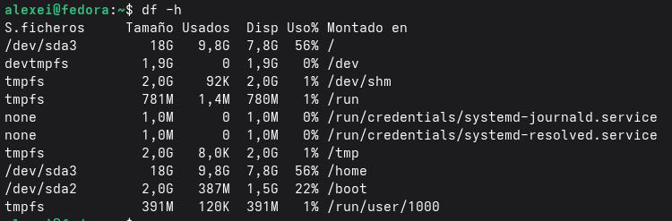

## 2.5.3.Командаfsck

Команда `fsck` (проверка файловой системы) используется для проверки и

восстановленияцелостностифайловыхсистем. Еёбазовыйформат:

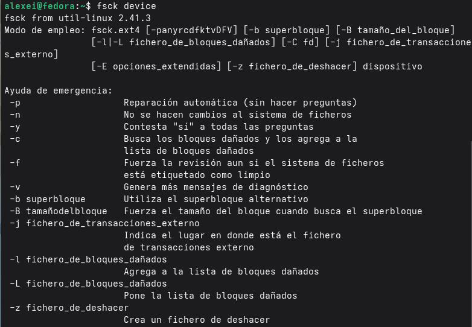

```text
Например,`fsck /dev/sda 1` проверяетфайловуюсистемунаразделе `/dev/sda 1`.Важно,
чтобы файловая система не была смонтирована перед запуском `fsck` во избежание
повреждения. Опция `-y` автоматически отвечает «да» на все вопросы впроцессе
восстановления.
```

## Заданиеипоследовательностьвыполненияработы

---

Вэтом разделе представлены задания, которые необходимо выполнить, иподробные


инструкциипоработесфайламиикаталогамивоперационнойсистеме Linux.

## 3.1. Работасфайламиикаталогами


Шаг 1: Создайтетекстовыйфайлспомощьюкоманды`touch`


Шаг 2: Просмотритесодержимоефайласпомощьюкоманды`cat`

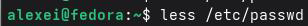

Шаг 3: Просмотритесодержимоефайласпомощьюкоманды`less`

Нажмите`q`длявыхода.

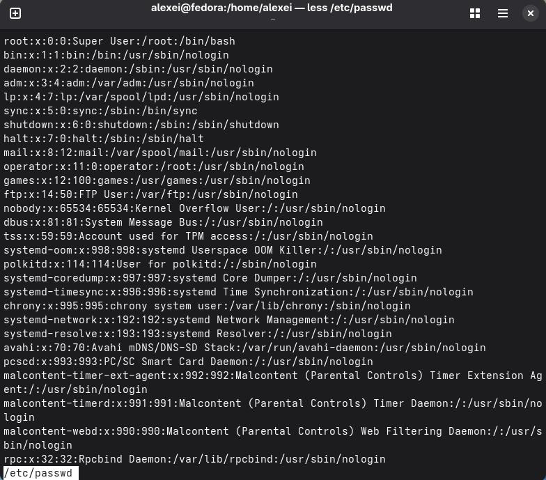

Шаг 4: Просмотритепервыенесколькострокфайласпомощьюкоманды`head`

---

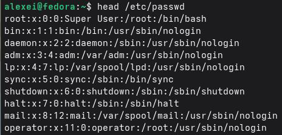

Шаг 5: Просмотритепоследниенесколькострокфайласпомощьюкоманды`tail`

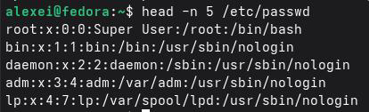

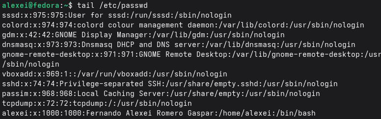

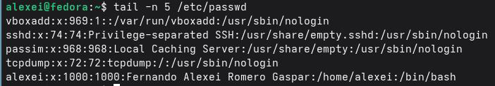

```text
3.2.Копированиефайловикаталогов
Шаг 1: Скопируйтефайлвтужедиректорию
Шаг 2: Создайтедиректориюископируйтевнеёфайлы
```

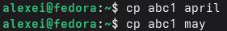

---

Шаг 3: Скопируйтефайлыиздругойдиректории

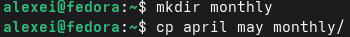


Шаг 4: Скопируйтевсюдиректориюцеликом (используяопцию-r) Шаг 5: Скопируйтедиректориювдругоеместо

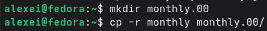

## 3.3.Перемещениеипереименованиефайловикаталогов


Шаг 1: Переименованиефайлавтекущемкаталоге Шаг 2: Перемещениефайлавдругойкаталог Шаг 3: Переименованиекаталога

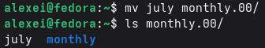

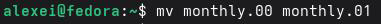

Шаг 4: Перемещениекаталогавдругойкаталог Шаг 5: Переименованиекаталога, отличногооттекущего

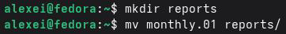

## 3.4.Изменениеправдоступакфайламикаталогам

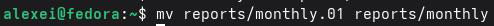

Шаг 1: Просмотртекущихправдоступакфайлу

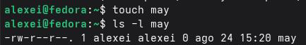

Шаг 2: Добавлениеправнавыполнениедлявладельца

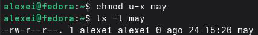

Шаг 3: Удалениеправнавыполнениедлявладельца

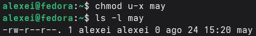

Шаг 4: Созданиекаталогаиизменениеправдоступа

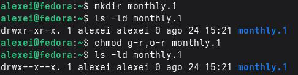

Шаг 5: Добавлениеправназаписьдлягруппы Шаг 6: Практикасразличнымикомбинациямиправдоступа

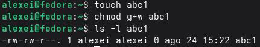

Начальныеправадоступа Команда Конечныеправадоступа drwxr--r-chmodg+x drwxr-xr--drwx--x--x chmodu-w dr-x--x--x \-r-xr--r-chmodu+w \-rwxr--r--\-rw-rw-r-chmodo+w \-rw-rw-rw-\-rw-rw-r-chmodu-x \-rw-rw-r--\-rw-rw-r-chmodg-w \-rw-r--r--\-rw-rw-r-chmodo-r \-rw-rw----\-rw-rw-r-chmoda+rwx \-rwxrwxrwx \-rw-rw-r-chmod755 \-rwxr-xr-x \-rw-rw-r-chmod644 \-rw-r--r--

## 3.5.Анализфайловойсистемы

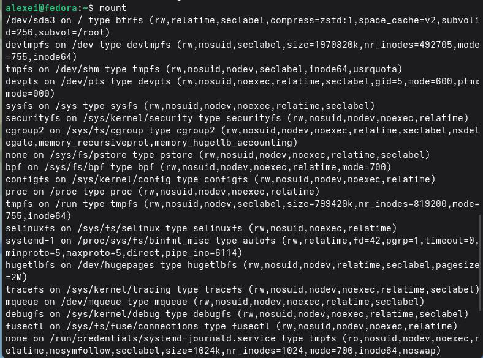

Шаг 1: Просмотрсмонтированныхфайловыхсистемспомощью`mount`

---

```text
Шаг 2: Просмотрдоступногодисковогопространстваспомощью`df`
Шаг 3: Просмотрфайла`/etc/fstab`
```

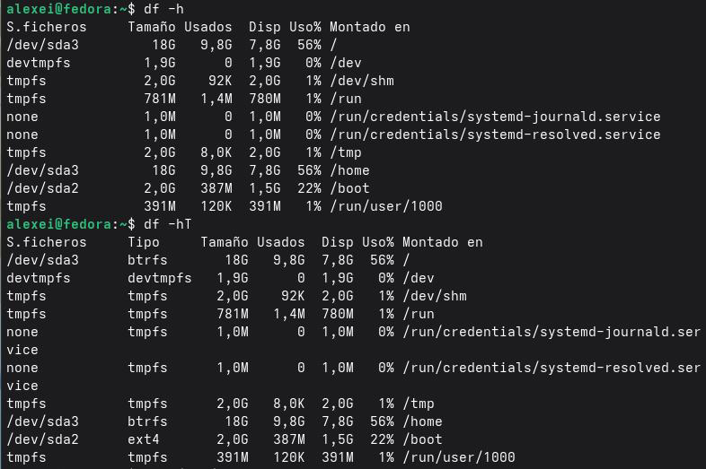

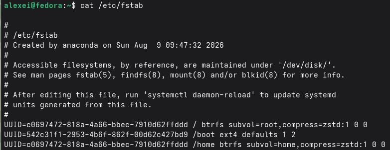

Шаг 4: Проверкафайловойсистемыспомощью`fsck`

---

## Контрольныевопросы

Вэтомразделепредставленыответынаконтрольныевопросы, заданныевконце

1.Чтотакоефайловаясистема? Добропожаловатьвпервуюфайловуюсистему.

лабораторнойработы, которыепозволятвампроверитьпониманиеосновныхконцепций файловойсистемы Linuxикоманддляработысфайламиикаталогами. доступа, владелец, размер, датыит.д.).

Файловая системаэто структураиметод, используемые операционной системой для хранения, организациииуправления файламиикаталогами на устройстве хранения, таком как жесткий диск, SSD или USBнакопитель. Она определяет, как данные записываютсяисчитываются, атакже метаданные, связанныескаждым файлом (права

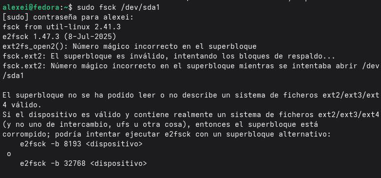

Примерыраспространенныхфайловыхсистем: Файловаясистема Особенности

ext 4 Это наиболееширокоиспользуемая файловая системав

дистрибутивах Linux. Онаобеспечиваетхорошуюстабильность, производительностьиподдержку больших файлов. Включает журналирование для предотвращения повреждения данных в

случае сбоевсистемы.

XFS Высокопроизводительная файловая система,

---

разработанная для обработки больших файлов и крупномасштабных хранилищ. Это файловая система по умолчаниюв Red Hat Enterprise Linux (RHEL).

Btrfs Современная файловая система срасширенными

функциями, такими как снимки, сжатие, контрольные суммыи

поддержкавстроенных RAIDтомов.

FAT 32 Простая файловая система, совместимая с

большинством операционных систем (Windows, mac OS, Linux). Она широко используется на съемных носителях (USB-накопители, SDкарты) благодаря своей широкой совместимости. Ограничение: максимальный размер файла 4 может читатьизаписывать данныевразделы NTFSспомощью

ГБ.

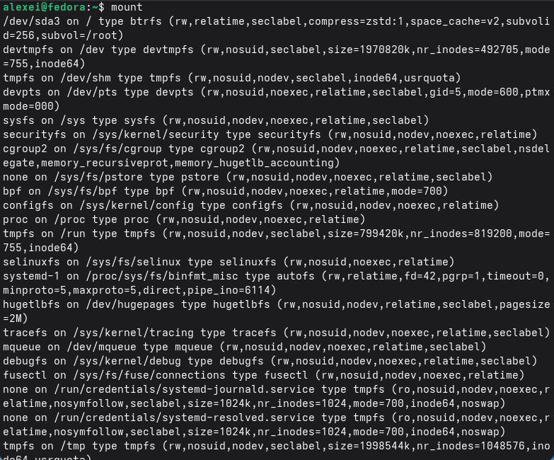

NTFS Файловая система по умолчанию в Windows. Linux

драйверов, такихкакntfs-3g.

2.Какузнать, какиеаппаратныесистемысобраныв США?

Чтобы увидеть, какие файловые системывданный момент смонтированыв Linux,

### используйтеследующиекоманды:

1.`mount`Отображает все смонтированные файловые системысинформацией об

устройстве, точкемонтирования, типефайловойсистемыипараметрахмонтирования:

---

2. `df \-h` Отображает используемое идоступное дисковое пространство на

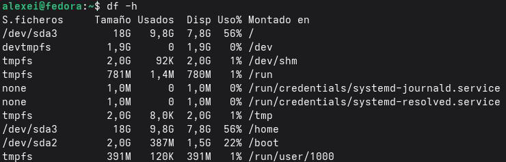

смонтированныхфайловыхсистемахвудобочитаемомформате (КБ, МБ, ГБ):

3.`df \-T`Добавляеттипфайловойсистемыквыводу:

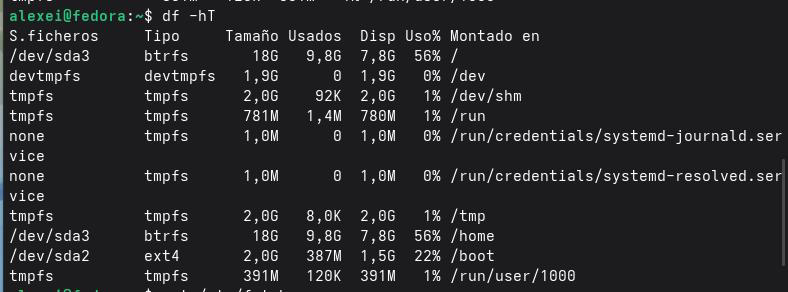

4.`lsblk`Выводитсписокблочныхустройствиихточекмонтирования:

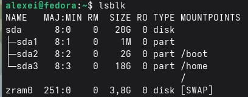

5.`findmnt`Отображаетдеревомонтированияфайловыхсистем: 3.Какзавершитьзаблокированныйпроцесс?

Чтобызавершитьпроцесс, которыйнеотвечаетилизаблокирован, выполните

### следующиедействия:

1.Определитепроцесс: Найдите PID (идентификаторпроцесса) заблокированного

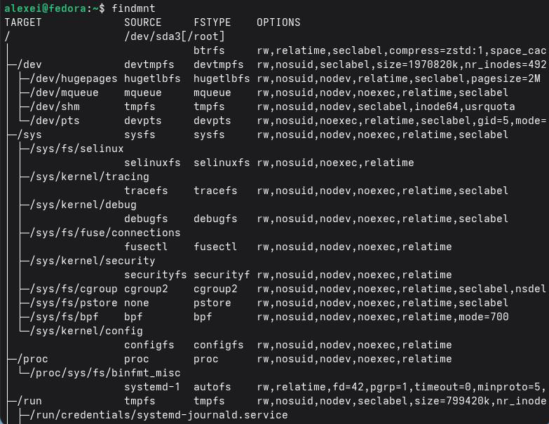

процесса.

> bash
> psaux|grep-i"process_name"#Поискпроцессапоимени
> top#Отображаетзапущенныепроцессывреальномвремени
> htop#Улучшеннаяверсияtop (болееинтерактивная)

### 2.Завершитепроцесс:

Команда Описание kill-9<PID> Принудительнозавершаетпроцесс (безочистки) kill-15<PID> Безопаснозавершаетпроцесс (свозможностьюочистки) pkill<name> Завершаетпроцесспоимени killall<name> Завершаетвсепроцессысопределеннымименем Примеры:

---

> bash
> kill-91234#Принудительнозавершаетпроцессс PID1234
> pkill firefox#Завершаетвсепроцессы Firefox
> killallprocess_name#Завершаетвсепроцессысуказаннымименем

4.Какустановитьсвободноеместовфайловойсистеме?

Чтобы определить свободное местовфайловой системе, используйте команду `df`

### (disk free):

Опция `-h`(удобочитаемый формат) отображает размерывудобочитаемых единицах

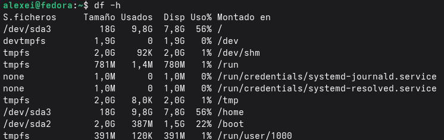

(КБ, МБ, ГБ) вместо блоков. Для каждой файловой системы отображается: общий размер, используемоепространство, доступноепространствоиточкамонтирования.

5.Какпросмотретьсодержимоекаталога?

Дляпросмотрасодержимогокаталогаиспользуйтекоманду`ls`(список):

 `ls`: Отображаетфайлыикаталогивтекущемкаталоге  `ls \-l`: Отображаетподробнуюинформацию (правадоступа, владелец, размер, дата)  `ls \-a`: Отображаетвсефайлы, включаяскрытыефайлы (начинающиесясточки)  `ls \-la`: Объединяет`-l`и`-a`  `ls-R`: Рекурсивноотображаетсодержимоеподкаталогов  `ls \-t`: Сортируетподатеизменения (отсамыхпоследнихксамымстарым) `ls-S`: Сортируетпоразмеру

6.Какововремядоставки? Каковынекоторыеизних?

---

Права доступа определяют, кто может читать, записывать или выполнять файл или

каталогв Linux. Каждыйфайликаталогимеюттринабораправдоступа:  Владелец (u) пользователь, которомупринадлежитфайл  Группа (g) пользователи, принадлежащиекгруппефайла  Другие (o) всеостальныепользователи

Правадоступаобозначаютсяследующимисимволами:

 rчтение  wзапись  xвыполнение

### Какизменитьправадоступа:

Правадоступаизменяютсяспомощьюкомандыchmod (изменитьрежим): Символическаяформа:

```text
 chmodu+xfile: Добавляетправонавыполнениедлявладельца
 chmodg-wfile: Удаляетправоназаписьдлягруппы
 chmodo=rfile: Устанавливаетправотольконачтениедляостальных
 chmoda+rwxfile: Предоставляетвсеправадоступавсем
```

> Числовая (восьмеричная) форма:
> Значение Правадоступа
> 7 rwx (чтение+запись+выполнение)
> 6 rw (чтение+запись)
> 5 r-x (чтение+выполнение)
> 4 r-(толькочтение)
> 3 \-wx (запись+выполнение)
> 2 \-w (толькозапись)

---

```text
1 -x (тольковыполнение)
0 -x (нетправдоступа)
```

bash chmod755файл#rwxr-xr-x chmod644файл#rw-r--r--chmod777файл#rwxrwxrwx chmod700файл#rwx------7.Чтотакоекомандаls-l?

Ввыводекомандыls-lпервыйсимволвпервомстолбцеуказываеттипфайла:

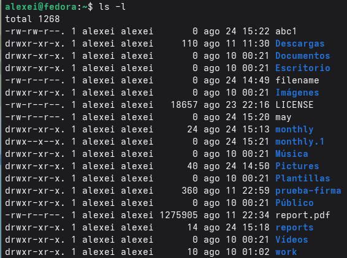

### Символ Типфайла

> Обычныйфайл
> d Каталог
> l Символическаяссылка
> c Символьноеустройство
> b Блочноеустройство
> p Именованныйканал
> s Сокет

### Пример:

---

8.Последниеверсиикоманддлякомандыmvв Linux.

Команда mv (move) используется для перемещения или переименования файлови

### каталогов. Ееосновныефункции:

### 1.Переименованиефайлавтомжекаталоге:

> bash
> mvold_namenew_name

### 2.Перемещениефайлавдругойкаталог:

> bash
> mvfile.txt/path/to/directory/

### 3.Перемещениенесколькихфайловводинкаталог:

> bash
> mvfile1.txt file2.txt file3.txt /path/to/directory/
> 4.Переименованиекаталога:

> bash
> mvold_directory new_directory
> 5.Перемещениекаталогавдругойкаталог:

> bash
> mvsource_directory /path/to/destination_directory/

### Полезныепараметры:

### Параметры Описание

\-i Запрашивает подтверждение перед перезаписью

---

### существующегофайла

```text
-f Принудительноеперемещениебеззапросаподтверждения
-v Отображаетподробнуюинформациюоперемещаемомобъекте.
```

9.Какуюкомандуможноиспользоватьдлясозданиякаталога?

Командадлясозданиякаталоговв Linux`mkdir`(создатькаталог):

bash `mkdirdirectory_name` Полезныепараметры:

### Параметры Описание

`-p` Создает промежуточные каталоги, если они не существуют (создает

### всюиерархию)

```text
`-m` Устанавливаетправадоступаккаталогуприегосоздании
mkdirnew_dir: Создаеткаталогсименем`new_dir`
mkdir-pdir 1/dir 2/dir 3: Создаетвсюиерархию (dir 1, dir 2, dir 3)
mkdir-m700private_dir: Создаеткаталогсправамиrwx
```

### Примеры:

## Выводы

Внастоящее время сотрудники лаборатории называются фанатами. Они изучают систему Linux, её структуру иорганизацию каталога. Также они работали над практическими задачамисиспользованием команд дня: упросмотра файлов; cp для копирования; mv для перемещения ипереименования; chmod для управления правами доступа. Использовались такжекомандыдля анализа беспроводныхсистем: mount, dfиfsck. Вместо отправленных элементов используются удаленные, используются недоработанные элементы. Этонаиболееэффективнаяработапосистеме Linuxиеёадминистрированию.

---

## Списоклитературы

 Tsecurity. (2024).Общиеполезныекоманды Linux.
https://tsecurity.de/de/2387229/IT+Programmierung/COMMON+USEFUL+LINUX+COMMA
NDS/

 Lab Ex.(2025).Файловаясистема Linux: навигацияспомощьюls, mkdir, cp, mv, rm.
https://labex.io/es/tutorials/linux-file-system-navigation-632797

 Wiki Educator. (2025).Пользователь: Manuel Romero/Programacion Web/Comandos Linux.
https://es.wikieducator.org/Usuario: Manuel Romero/Programacion Web/Comandos Linux
 Arch Wiki.(2026).Основныеутилиты (испанский).
https://wiki.archlinux.org/title/Core_utilities_(Espa%C3%B1ol)

 Справочныйцентр Oracle. (2024).Командыдляадминистрированияфайловойсистемы.
https://docs.oracle.com/cd/E19253-01/819-7062/fsoverview-95856/index.html
 Справочнаястраница Ubuntu.(2023). fstab (5) статическаяинформацияофайловых
системах.https://manpages.ubuntu.com/manpages/jammy/es/man 5/fstab.5.html
 S'Arreplec. (2025). 4.3.Командыдляработысфайлами.
https://sarreplec.caib.es/pluginfile.php/10571/mod_resource/content/10/DAM_SI05_Contenido
s_Web/43_comandos_de_ficheros.html
 Network World.(2023).Пониманиетиповфайловыхсистем Linux.
https://www.networkworld.com/article/972156/understanding-linux-file-system-types.html
 Alibaba Cloud.(2026).Проверкаивосстановлениефайловойсистемы Linux.
https://www.alibabacloud.com/help/en/ecs/user-guide/how-to-check-and-fix-the-file-systems-
of-linux-instances
 Network World.(2023).Пониманиетиповфайловыхсистем Linux.
https://www.networkworld.com/article/972156/understanding-linux-file-system-types.html
 Страницаруководства Ubuntu.(2023). fstab (5) статическаяинформацияофайловых
системах.https://manpages.ubuntu.com/manpages/jammy/es/man 5/fstab.5.html