# РОССИЙСКИЙУНИВЕРСИТЕТДРУЖБЫНАРОДОВ

Факультетфизикоматематическихиестественныхнаук

Кафедраприкладнойинформатикиитеориивероятностей

ОТЧЕТ

ПОЛАБОРАТОРНОЙРАБОТЕNo 8 дисциплина: Архитектуракомпьютера

### Студент: Ромеро Гаспар Фернандо Алексей

### Группа: НКАбд-02-25

```text
МОСКВА
2026г.
```

---

## Оглавление

1. Цельработы
2. Теоретическиесведения

> 2.1.Перенаправлениевводавывода
> 2.2.Конвейеры
> 2.3. Поискфайлов (find)
> 2.4. Фильтрациятекста (grep)
> 2.5. Проверкаиспользованиядиска (df, du)
> 2.6. Проверкаиспользованиядиска (df, du)
> 2.7. Управлениепроцессами (ps)

3. Заданиеипоследовательностьвыполненияработы 3.1. Записьназванийфайловвфайл 3.2.Фильтрацияфайловсрасширением.conf 3.3.Поискфайловпоимени 3.4.Постраничныйвыводфайлов 3.5. Запускпроцессавфоновомрежиме 3.6.Управлениепроцессами (ps, kill) 3.7.Анализдисковогопространства (df, du) 3.8.Поискдиректорий (find)

4. Контрольныевопросы
5. Выводы
6. Списоклитературы

---

## Цельработы

Целью данной лабораторной работы является ознакомлениесинструментами поиска файловифильтрации текстовых данных, атакже приобретение практических навыков по управлению процессами (изаданиями), по проверке использования дискаиобслуживанию файловыхсистем.

---

## Теоретическиесведения

Вэтомразделепредставленытеоретическиеосновыперенаправленияввода/вывода,

использованияканалов, поискаифильтрациифайлов, управленияпроцессамиианализа дисковогопространствавсистемах Linux.

## 2.1 Перенаправлениевводавывода

ВLinux по умолчанию каждому процессу соответствуют три стандартных потока

### ввода/вывода:

 stdin (0): стандартныйпотокввода (поумолчанию, клавиатура)  stdout (1): стандартныйпотоквывода (поумолчанию, терминал)  stderr (2): стандартныйпотоквыводаошибок (поумолчанию, терминал)

Этипотокиможноперенаправлятьспомощьюследующихоператоров:


 \>: перенаправляетстандартныйвыводвфайл (перезапись)  \>>: перенаправляетстандартныйвыводвфайл (добавление)  2>: перенаправляетвыводошибоквфайл  &>: перенаправляеткакstdout, такиstderrводинитотжефайл

## 2.2.Конвейеры

Конвейеры позволяют соединять вывод однойкомандысвводом другой, связывая их

### выполнениевцепочку. Базовыйсинтаксис:

Это означает, что вывод команды command 1 становится вводом команды command2.

Конвейеры можно объединять в цепочки несколько раз и комбинировать с перенаправлениемфайлов.

## 2.3.Поискфайлов (find)

---

Команда `find` используется для поиска файлов икаталогов, соответствующих

### определеннымкритериям. Еебазовыйформат:

> bash
> find[путь][параметры]
> Некоторыеполезныепараметры:

 \-name"pattern": поискпоимени (сучетомрегистра)  \-iname "pattern": поискпоимени (безучета регистра)  \-typef: поисктолькофайлов  \-typed: поисктолькокаталогов  \-execcommand{}\\;: выполняеткомандудлякаждогонайденногофайла

## 2.4.Фильтрациятекста (grep)

Команда `grep` (глобальная команда для вывода регулярных выражений) ищет

текстовыешаблонывфайлахиливвыводедругихкоманд. Еёбазовыйформат:

> bash
> grep[параметры] pattern[файл]
> Распространённыепараметры:

 \-i: игнорируетрегистр  \-r: рекурсивноищетвкаталогах  \-n: отображаетномерстроки  \-v: выполняетпоисквобратномпорядке (исключаетшаблон)  \-AN: отображает Nстрокпослесовпадения  \-BN: отображает Nстрокдосовпадения  \-CN: отображает Nстрокдоипослесовпадения

## 2.5.Проверкаиспользованиядиска (df, du)

`df` (свободное место на диске) отображает доступное пространство на

### смонтированныхфайловыхсистемах:

> `bash`
> `df \-h`

---

```text
Опция `-h` отображает размеры вудобочитаемом формате (КБ, МБ, ГБ).`-T`
```

добавляеттипфайловойсистемы.

`du` (использование диска) отображает пространство, используемое файлами и

### каталогами:

> `bash`
> `du \-sh[каталог]`

```text
Опция `-s` суммирует общее пространство, а`-h` отображает еговудобочитаемом
формате.
```

## 2.6.Управлениезадачами (jobs, kill)

Процессэто запущенная программа, которой система присваивает идентификатор

(PID).Фоновыепроцессыназываютсязаданиями.

### Дляуправленияими:

 &: Выполняеткомандувфоновомрежиме  jobs: Выводитсписокфоновыхпроцессов  fg%n: Выводитзаданиенапереднийплан  kill[signal] PID: Отправляетсигналпроцессу

### Распространенныесигналы:

 SIGTERM (15): Запрашиваетупорядоченноезавершение (поумолчанию)

 SIGKILL (9): Принудительнозавершаетпроцесснемедленно

## 2.7.Управлениепроцессами (ps)

Команда`ps`отображаетинформациюозапущенныхпроцессах:

### bash

---

### `ps aux`

Отображает все процессы (включая процессы других пользователей) сподробной информацией об использовании ЦП, использовании памяти, состоянииисвязаннойсними команде.


## Заданиеипоследовательностьвыполненияработы

Вэтом разделе представлены задания, которые необходимо выполнить, иподробные инструкции по работесперенаправлением вводавывода, поиском файлов, фильтрацией текстаиуправлениемпроцессамивоперационнойсистеме Linux.

## 3.1.Записьназванийфайловвфайл


### Шаг 1: Перенаправьтевыводкоманды`ls /etc`вфайл

Шаг 2: Добавьтесписокфайловизвашегодомашнегокаталогавтотжефайл Шаг 3: Проверьтесодержимоефайла

---

## 3.2.Фильтрацияфайловсрасширением.conf

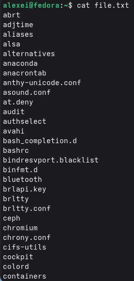

Шаг 1: Отфильтруйтестроки, содержащие.conf, исохранитеихвновыйфайл Шаг 2: Проверьтесодержимоефайлаconf.txt

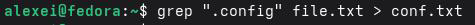

## 3.3.Поискфайловпоимени

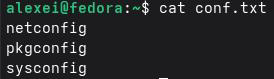

Шаг 1: Найдитевдомашнемкаталогефайлы, начинающиесясбуквыc

---

*b*

Шаг 2: Найдитевдомашнем каталоге файлы, начинающиесясбуквы c, иотобразите

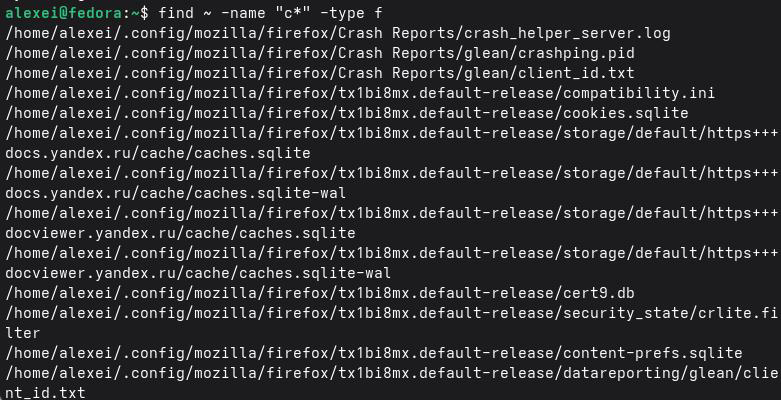

### ихпостранично

*b*

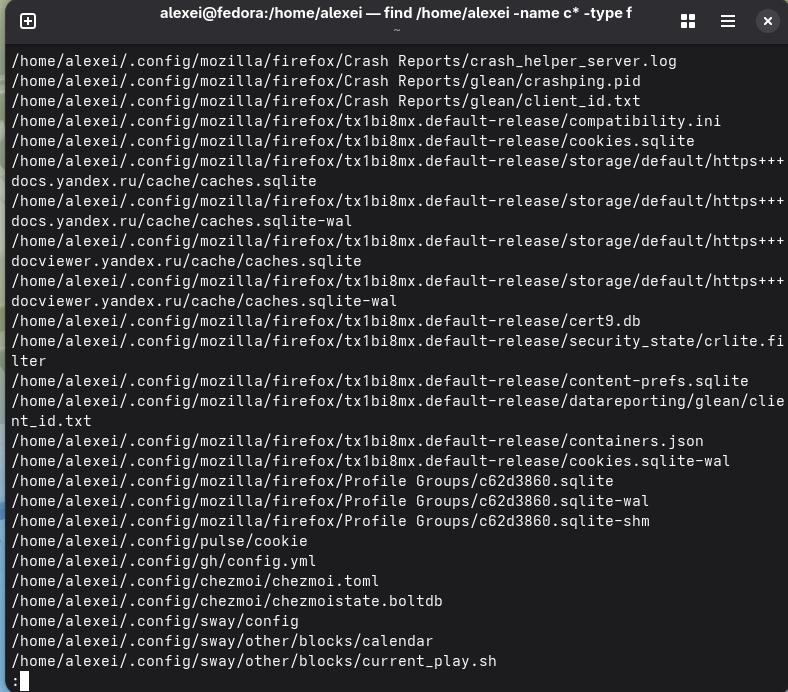

Шаг 3: Подсчитайте, сколькофайловначинаетсясбуквыc

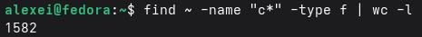

## 3.4.Постраничныйвыводфайлов

Шаг 1: Отобразить имена файлов вкаталоге /etc, начинающиеся сбуквы h, с

---

### постраничнойразбивкой


### Или:


## 3.5.Запускпроцессавфоновомрежиме

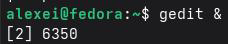

> Шаг 1: Запуститередакторgeditвфоновомрежиме
> Шаг 2: Убедитесь, чтоgeditзапущенвфоновомрежиме

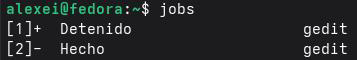

Шаг 3: Запуститепроцесс, которыйзаписываетименафайлов, начинающиесяс"log", вфайл

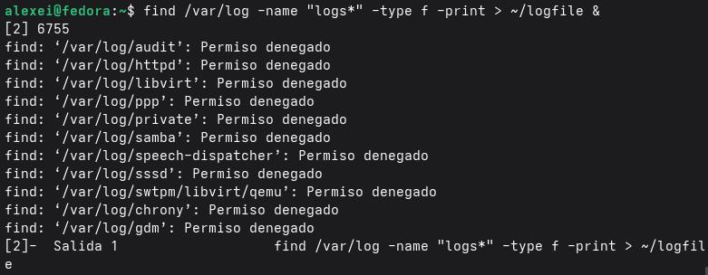

### Шаг 4: Проверьтесодержимоефайлажурнала

---

## 3.6.Управлениепроцессами (ps, kill)

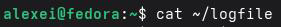

Шаг 1: Определите PIDпроцессаgedit

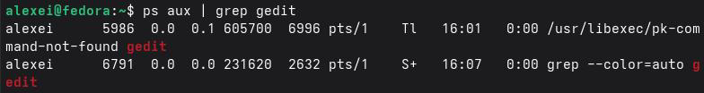

Шаг 2: См.руководствопокоманде`kill`

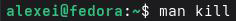

Шаг 3: Завершитепроцессgedit, используя его PID


Шаг 4: Убедитесь, чтопроцессзавершен Шаг 5: Удалитефайлжурнала

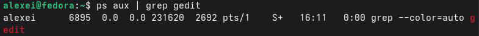

## 3.7.Анализдисковогопространства (df, du)


Шаг 1: Просмотритеруководствапокомандамdfиdu

---

Шаг 2: Запуститеdfспараметрамидляполученияподробнойинформации

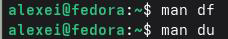

Шаг 3: Запустите du, чтобы увидеть используемое пространствоввашем домашнем каталоге

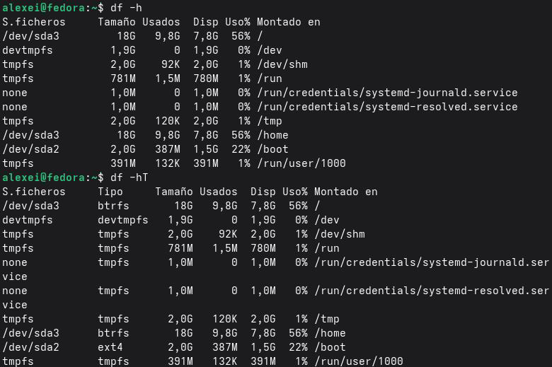

## 3.8.Поискдиректорий (find)

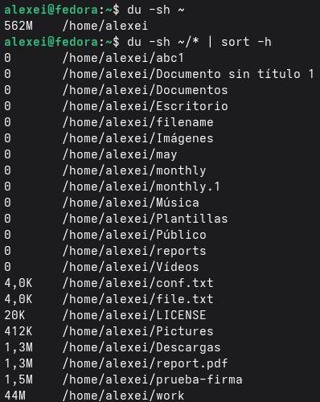

### Шаг 1: Найтивсекаталогивдомашнемкаталоге

---

### Шаг 2: Найтикаталогииотобразитьихпостранично

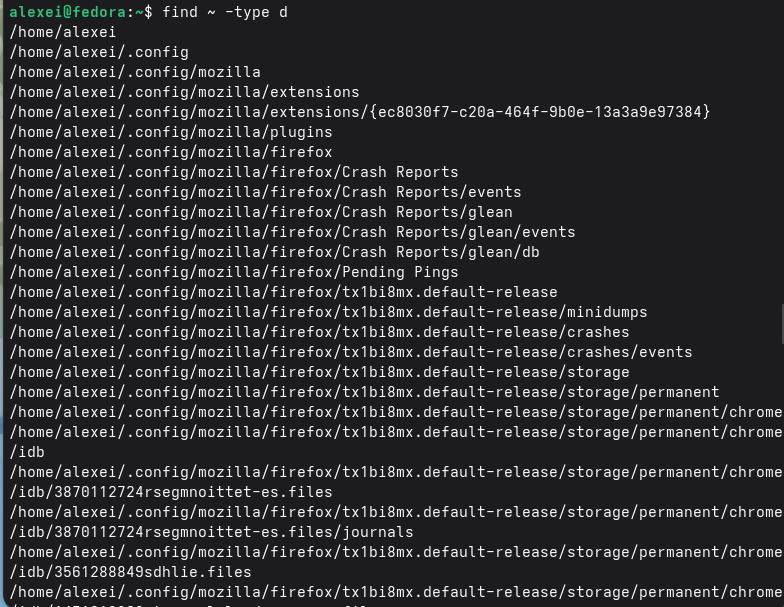

Шаг 3: Подсчитатьколичествокаталоговвдомашнемкаталоге


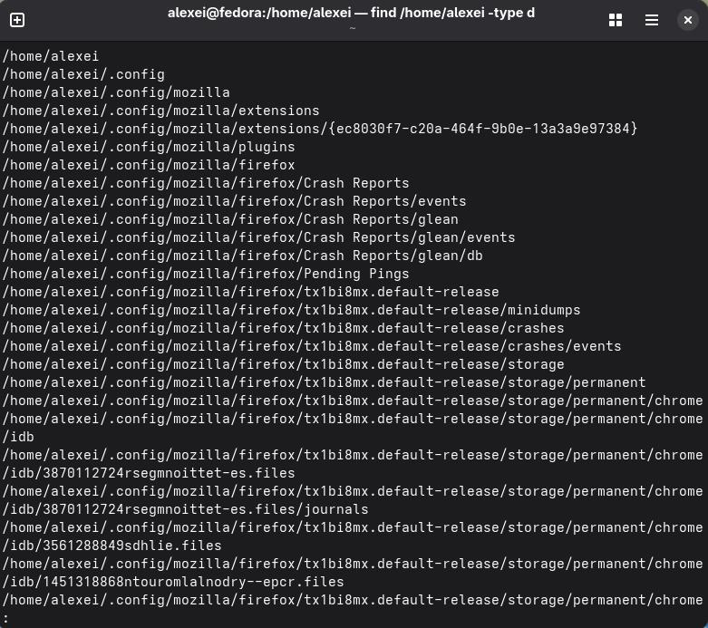

## Контрольныевопросы

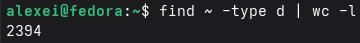

Вэтом разделе представлены ответы на контрольные вопросы, заданныевконце лабораторной работы, которые позволят вам проверить понимание основных концепций перенаправленияввода/вывода, процессов, поискафайловиуправлениядискамив Linux.

1.Какиепотокиввода/выводавызнаете?

ВLinuxкаждомупроцессусоответствуюттристандартныхпотокаввода/вывода:

Потоковаяпередача Дескриптор Устройствопоумолчанию Функция

stdin 0 Клавиатура Стандартный ввод

stdout 1 Терминал Стандартный вывод

stderr 2 Терминал Стандартный

### выводошибок

Этипотокимогутбытьперенаправленывфайлыилинадругиеустройства. 2.Использованиекоманд>и>>.

 \>перенаправляет стандартный вывод (stdout) вфайл. Если файл уже существует, он перезаписывается.

 \>>перенаправляет стандартныйвывод (stdout) вфайл. Если файлужесуществует, он добавляетданныевконец (неперезаписывает).

### Пример:

 echo"Перваястрока">file.txtперезаписывает  echo"Втораястрока">>file.txtдобавляетданныевконец

3.Чтотакоеконвейер?

Конвейерэто механизм, позволяющий соединять вывод одной командысвводом

другой, связываяихвыполнениевцепочку. Синтаксис:

### bash

---

### command 1|command 2

Вывод команды command 1 становится вводом команды command2. Это позволяет

комбинироватьпростыекомандыдлявыполненияболеесложныхзадач.

> Пример:
> bash
> ls-la|sort|less

4.Чтотакоепроцесс? Каковафункцияпрограмм?

### Понятие Определение

Программа Исполняемыйфайл, хранящийсянадиске (статическийкод) Процесс Запущенная программа со своим собственным адресным пространством в

### памяти, PIDисостоянием

Процесс это запущенный экземпляр программы. Несколько процессов могут

одновременнозапускатьоднуитужепрограмму.

5.Чтотакое PIDи GID?

 PID (Process ID) этоуникальныйидентификатор, присваиваемыйкаждомупроцессув системе. Ониспользуетсядляуправленияпроцессами (например, kill, ps).  GID (Group ID) это идентификатор группы, ккоторой принадлежит процесс или пользователь. Онопределяетправадоступакфайламиресурсам.

6.Чтопредставляютсобойэтизадачиикакиекомандыямогуиспользовать?

Задачиэто процессы, которыевыполняютсявфоновомрежимеизтерминала. Ими

### можноуправлятьспомощьюследующихкоманд:

> Команда Функция
> jobs Отображаетсписокфоновыхзадач
> fg%n Выводитзадачуnнапереднийплан

---

bg%n Возобновляетвыполнениезадачиnвфоновомрежиме kill%n Завершаетзадачуn

7.Найдитеинформациюокомандахtopиhttp. Каковыихфункции? topотображает актуальный список запущенных процессоввреальном времени, отсортированный по использованию ЦП.Позволяет отслеживать производительность системы.

httpне является стандартной командойв Linux. Если вы имеетеввиду httpd или htop:

 htopулучшеннаяверсияtopсболееудобныминтерфейсом (цвета, полосыпрокрутки).  httpdвебсервер Apache (демон HTTP).

8.Используйтеиотдавайте команды своему персонажу. Пожалуйста, сначала

проверьтеэтукоманду.

### Основнаякомандадляпоискафайлов`find`:

> bash
> find[путь][параметры]

```text
Параметр Функция Пример
-name Поискпоимени find~name"*.txt"
-iname Поиск по имени (без учета find~-iname"*.jpg"
```

### регистра)

```text
-typef Поисктолькофайлов find /etctypef
-typed Поисктолькокаталогов find~typed
-size Поискпоразмеру find~size+10M
-exec Выполнить команду над find~name "*.log"-
```

найденнымифайлами executerm{}\\;

9.Можноливыполнитьпоисксодержимоговфайле? Еслида, токак?

---

Да, выможете искатьфайлыпо ихсодержимому, используя команду grepсопцией \-r

### (рекурсивныйпоиск):

> bash
> grep-r"text_to_search" /path/to/directory/

```text
Пример: Поискслова"error"вовсехфайлахвкаталоге /var/log:
```

> bash
> grep-r"error" /var/log/

10. Какой параметр является предпочтительным для свободного дискового

пространства?

Чтобыпросмотретьсвободноедисковоепространство, используйтекомандуdf: Bash df-h

Опция \-h отображает размеры вудобочитаемом формате (КБ, МБ, ГБ).Чтобы

### просмотретьданныепоконкретномудиску:

> Bash
> df-h/dev/sda 1

11.Каковоназначениекаталогадомашнихфайлов?

Чтобыувидетьразмердомашнегокаталога, используйтекоманду`du`: Bash du-sh~

Опция`-s`отображаетобщийразмериразмер подкаталогавудобочитаемомформате.

### Чтобыувидетьразмерподкаталогов:

---

> Bash
> du-sh ~/*|sort-h

12.Какзавершитьзависшийпроцесс?

Длязавершениязависшегопроцессавыполнитеследующиедействия: 1.Определитеидентификаторпроцесса (PID):

> bash
> psaux|grep process_name
> 2.Завершитепроцесс:

> bash
> kill-9<PID>

Сигнал-9 (SIGKILL) принудительнозавершаетпроцесснемедленно.

### Альтернативныеварианты:

Команда Описание kill<PID> Отправляетсигнал SIGTERM (упорядоченноезавершение) kill-9<PID> Принудительнозавершаетпроцесс (SIGKILL) pkillprocess_name Завершаетпроцессыпоимени killallprocess_name Завершаетвсепроцессысэтимименем

## Выводы

Входе выполнения лабораторной работыяознакомилсясинструментами поиска файловифильтрации текстовых данныхв Linux. Яосвоил перенаправление потоков ввода-вывода сиспользованием операторов \>, \>>, атакже работу сконвейерами (|) для объединения команд. Яизучил команды find иgrep для поиска файлов по имени и содержимому, атакже команды dfиdu для анализа использования дискового пространства. Кроме того, яприобрел навыки управления процессамиспомощью команд ps, jobsиkill, включая запуск процессов вфоновом режиме. Все поставленные задачи выполнены, полученныенавыкиявляютсяосновойдляэффективнойработывкоманднойстроке Linux.

---

## Списоклитературы

 CCNRS.(с.ф.).Сеанс 4: Процесс.https://perso.liris.cnrs.fr/pierre-
antoine.champin/enseignement/linux/s4.html

 Ясчитаю.(2026, 31марта).Командаgrepв Linux: полноеруководствоспримерами.
https://contabo.com/blog/es/comando-grep-de-linux-tutorial-completo-con-ejemplos/
 Страницыруководства Debian. (2026). df (1) manpages-esтриксибэкпорты Debian.
https://manpages.debian.org/trixie-backports/manpages-es/df.1.es.html

 Страницыруководства Debian. (2025). grep (1) manpages-es Debiantrixie.
https://manpages.debian.org/trixie/manpages-es/grep.1.es.html

 Hostinger. (2025, 12февраля).Какпроверитьсвободноеместонадискев Linuxс
помощьюdfиdu. https://www.hostinger.com/mx/tutoriales/revisar-espacio-en-el-disco-linux
 Lab Ex.(2026).Управлениеимониторингпроцессовв Linux|Comp TIALinux+.
https://labex.io/es/tutorials/comptia-manage-and-monitor-linux-processes-590864

 Справочныйцентр Oracle.(бездаты).Новыепараметрыдляdf, duиls.
https://docs.oracle.com/cd/E19683-01/816-3920/6ma5 tbt 1c/index.html

 Contabo.(2026, 31марта).Командаgrepв Linux: полноеруководствоспримерами.
https://contabo.com/blog/es/comando-grep-de-linux-tutorial-completo-con-ejemplos/
 Страницыруководства Debian. (2026). df (1) manpages-es Debiantrixie-backports.
https://manpages.debian.org/trixie-backports/manpages-es/df.1.es.html