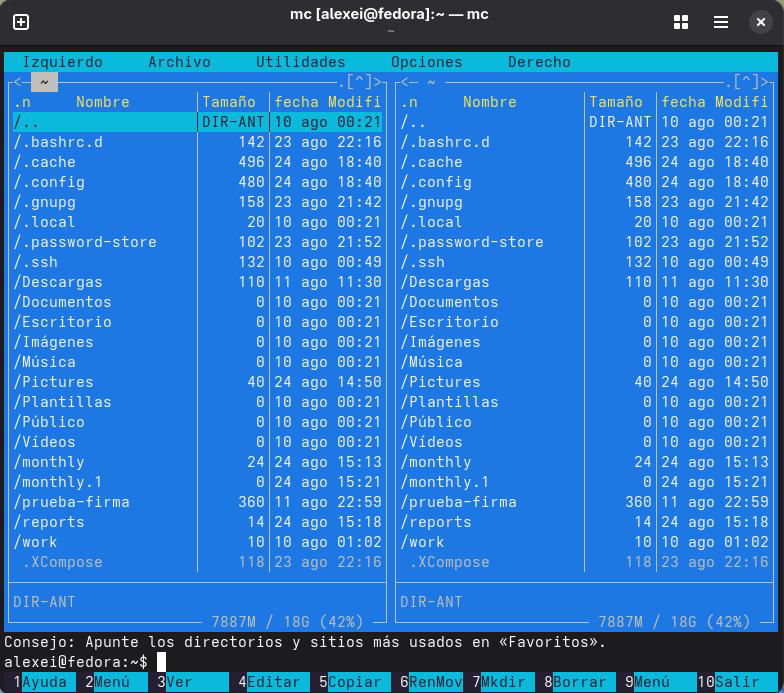

# РОССИЙСКИЙУНИВЕРСИТЕТДРУЖБЫНАРОДОВ

Факультетфизикоматематическихиестественныхнаук

Кафедраприкладнойинформатикиитеориивероятностей

ОТЧЕТ

ПОЛАБОРАТОРНОЙРАБОТЕNo 9 дисциплина: Архитектуракомпьютера

### Студент: Ромеро Гаспар Фернандо Алексей

### Группа: НКАбд-02-25

```text
МОСКВА
2026г.
```

---

## Оглавление

1. Цельработы
2. Теоретическиесведения

```text
2.1.Общиесведенияо Midnight Commander
2.2.Режимыотображенияпанелейиуправлениеими
2.3. Панельменю
2.3.1. Меню«Файл»
2.3.2. Меню«Команда»
2.3.3. Меню«Настройки»
```

```text
3. Заданиеипоследовательностьвыполненияработы
3.1. Работаспанелямиmc
3.2. Работасфайлами
3.3. Работасменю«Команда»
3.4. Работасменю«Настройки»
3.5. Работасредакторомmc
3.6. Работасфайламиисходногокода
```

4. Контрольныевопросы
5. Выводы
6. Списоклитературы

---

## Цельработы

Целью данной лабораторной работы является освоение основных возможностей командной оболочки Midnight Commander. Входе работы необходимо приобрести навыки практическойработыпопросмотрукаталоговифайлов, атакжепоманипуляциямсними.

---

## Теоретическиесведения

Вэтомразделепредставленытеоретическиеосновывизуальногоинтерфейса

Midnight Commander (mc), важногоинструментадляуправленияфайламивсистемах Unix/Linux, атакжеегофункцииирежимыработы.

## 2.1 Общиесведенияо Midnight Commander

Midnight Commander, широко известный как mc, это визуальный файловый менеджерсоткрытым исходным кодом, разработанный для терминальных средв Unix-подобных системах. Вотличие от традиционных команд терминала, требующих ввода команд, mc предоставляет псевдографический интерфейс, облегчающий навигацию и управление файламиспомощьюфункциональных клавирименю. Оноснован на текстовых интерфейсных библиотеках, таких как ncursesи S-Lang, что позволяет ему работать на локальных консолях, эмуляторах терминала под X11иудалённых SSHсоединениях. Его дизайн вдохновлён популярным файловым менеджером Norton Commander из эпохи DOS, стремясь предложить «графический» опыт управления файлами без необходимости использованияграфическойсредырабочегостола.

При запуске из терминала интерфейс mc имеет двухпанельную вертикальную компоновку, отображающую содержимое двух разных каталогов одновременно. Такое расположение является основополагающим для его рабочего процесса, облегчая копированиеиперемещение файлов между местоположениями. Вдополнениекбазовой навигации, mc включаетвсебя встроенные инструменты, такие как средство просмотра файлов (mcview), текстовыйредактор (mcedit) иинструментсравненияфайлов (mcdiff).

## 2.2.Режимыотображенияпанелейиуправлениеими

Две панели вmc являются центральным элементом программы имогут быть настроены дляотображенияинформациивразличныхрежимах, адаптируяськпотребностям пользователя.

 Стандартный список: это режим по умолчанию, отображающий список файлов и каталоговвтекущемкаталоге. Отображаемаяинформацияобычновключаетимя, размер

---

идатуизменения.

 Информация: вэтомрежимеотображается подробнаяинформацияофайле, выбранномв активной панели, такая как права доступа, владелец, группа, размер, атакже даты

доступаиизменения.

 Дерево: вэтомрежиме отображается иерархическое представление структуры каталогов системы, что облегчает навигацию по различным уровням каталогов более наглядным

способом.

 Быстрый просмотр: вэтом режиме панель становится средством просмотра, отображающим содержимое файла, выбранноговдругой панели, что позволяет быстро

просмотретьегосодержимое.

Длянавигациииуправленияпанелямииспользуютсясочетанияклавиш:

 Tab: позволяетпереключатьфокуссоднойпанелинадругую.  Ctrl-u: меняетместамисодержимоедвухпанелей.

 Ctrl-o: Временноскрываетпанели, чтобыотобразитьвыводнижележащеготерминала.

## 2.3.Панельменю

Основные функции mc организованы через верхнее меню, доступноеспомощью клавиши F9, которое содержит следующие пункты:«Влево»,«Файл»,«Командная строка», «Параметры» и«Вправо».Большинство операций также можно выполнять спомощью

функциональныхклавиш.

## 2.3.1.Меню«Файл»

меню «Файл» объединяет основные операции сфайлами икаталогами, которые

активируютсяфункциональнымиклавишамиот F1до F10.

Функциональнаяклавиша Команда Описание

F1 Справка Открываетвстроеннуюсправку

F2 Пользовательскоеменю Открывает настраиваемое

> пользователемменю.
> Отображает содержимое

### F3 Вид

---

выбранного файла во внутреннемокнепросмотра.

F4 Редактировать Открывает выбранный файл во

внутреннем или внешнем редакторе.

F5 Копировать Копирует выбранный (е)

файл (ы) вкаталог на другой панели.

F6 Переименовать/Переместить Перемещает или

переименовывает (ют) выбранный (е) файл (ы).

F7 Создатькаталог Создаётновыйкаталог. F8 Удалить Удаляет выбранный файл или каталог.

F10 Выход Закрывает Midnight Commander.

Кроме того, mc позволяет создавать ссылки на файлы: Ctrl-xlсоздаёт физическую

ссылку, а Ctrl-xsсимволическую.

## 2.3.2.Меню«Команда»

Вэтом меню собраны более продвинутые инструменты управленияисистемные

инструменты.

### Команда Описание

Деревокаталогов Отображаетструктурукаталоговсистемывпанели.

Найтифайл Открывает диалоговое окно для поиска файловвфайловой

системепоимениилисодержимому.

Поменятьместамипанели Меняетместамисодержимоедвухпанелей.

Сравнитькаталоги Сравнивает содержимое каталогов, отображаемых вдвух

панелях.

Историякоманднойстроки Отображаетсписокнедавновыполненныхкомандоболочки.

Избранныйкаталог Обеспечиваетбыстрыйдоступкпредопределеннымкаталогам.

---

## 2.3.3.Меню«Настройки»

Меню«Параметры» позволяетнастраиватьвнешнийвидиповедениеmc.

### Команда Описание

Конфигурация Открывает диалоговое окно для настройки общих

параметров, такихкак панели, команднаястрокаиповедение программ.

Внешнийвид Позволяетизменитьцветовуюсхемуинтерфейса (скины). Редакторфайловрасширений Определяет, какие программы запускаются при открытии

файловсопределённымирасширениями.



Редакторменю Позволяет настроить пользовательское меню,

открывающеесяпринажатииклавиши F2.

## Заданиеипоследовательностьвыполненияработы

Вэтом разделе представлены задания, которые необходимо выполнить, иподробные инструкциипоработес Midnight Commander (mc) дляуправленияфайламиидиректориямив операционнойсистеме Linux.

## 3.1.Работаспанелямиmc

### Шаг 1: Запустите Midnight Commander

---

### Шаг 2: Изучитепанелиирежимыотображения

```text
 Переключениемеждупанелями: Нажмите Tab.
 Сменапанелей: Ctrl-u.
 Скрытиепанелей: Ctrl-o (отображаеттерминал; нажмитеещераз, чтобывернуться).
```

### Шаг 3: Изменениережимаотображенияпанели

1. Нажмите F9, чтобыоткрытьменю.
2. Выберите Леваяили Правая→Режимсписка....
3. Попробуйтеразныережимы:
a) Стандартный (стандартныйвид)
b) Краткий (сводныйвид)
c) Подробный (подробныйвидсправамидоступа, размером, датой)
d) Пользовательский (пользовательскийвид)

### Шаг 4: Сравнениекаталогов

1. Убедитесь, чтодвепанелиотображаютразныекаталоги.
2. Нажмите F9→Command→Сравнитькаталоги (или Ctrl-x d).

## 3.2.Работасфайлами

### Шаг 1: Созданиекаталога

 Выберитепанель, вкоторойвыхотитесоздатькаталог.  Нажмите F7.  Введитеимякаталога (например, newdir) инажмите Enter.

### Шаг 2: Созданиетекстовогофайла

```text
 F9→Файл→Создать (илииспользуйтевстроенныйредакторспомощью F4).
 Введитеимяфайла (например, text.txt) инажмите Enter.
```

---

 Введитетекст, сохранитефайлспомощью F2ивыйдитеспомощью F10.

### Шаг 3: Копированиефайлов

1. Выберитефайлспомощьюклавишсострелками.
2. Нажмите F5 (Копировать).
3. Впоявившемсядиалоговомокнепринеобходимостиизменитецелевойкаталог.
4. Нажмите Enterдлякопирования.

### Шаг 4: Перемещение/переименованиефайлов

 Выберитефайлинажмите F6.  Вдиалоговомокневведитеновоеимяилипуть.*Нажмите Enter.

### Шаг 5: Удалениефайловилипапок

```text
 Выберитефайлилипапкуинажмите F8.
 Подтвердитеудаление.
```

### Шаг 6: Просмотринформацииофайле

```text
 Выберитефайл.
 F9→Файл→Информацияофайле (или Ctrl+X+i).
```

## 3.3.Работасменю«Команда»

### Шаг 1: Поискфайлов

1. F9→Command→Найтифайл (или Ctrl+XF).

2. Введитеимяфайладляпоиска (например,*.txt).
3. Выберитекаталогпоиска.
4. Нажмите Enter, чтобыначатьпоиск.

### Шаг 2: Просмотристориикоманд

---

```text
 F9→Command→Историякоманднойстроки.
```

Шаг 3: Доступкизбраннымкаталогам

```text
 F9→Command→Списокизбранныхкаталогов (или Ctrl+\).
 Добавьтекаталогвсписокипроверьтебыструюнавигацию.
```

### Шаг 4: Просмотрдерева каталогов

```text
 F9→Command→Деревокаталогов.
```

## 3.4.Работасменю«Настройки»

### Шаг 1: Настройкавнешнеговида MC

1. F9→Параметры→Настройки.
2. Попробуйтеразныеварианты:
a) Полноэкранныйрежим
b) Двойнаяширина
c) Показатьскрытыефайлы

3. Применитеизмененияипосмотритенарезультат.

### Шаг 2: Изменениецветовойсхемы

```text
 F9→Параметры→Внешнийвид.
 Попробуйтеразныецветовыесхемы.
```

### Шаг 3: Настройкаредактора

```text
 F9→Параметры→Настройкиредактора.
 Изучитедоступныепараметры.
```

## 3.5.Работасредакторомmc

### УШаг 1: Создайтефайлtext.txt

---

> bash
> touch text.txt

### Шаг 2: Откройтефайлвредакторе MC

 Выделитефайлtext.txt.  Нажмите F4, чтобыоткрытьегововстроенномредакторе.

### Шаг 3: Вставьтетекствфайл

1. Скопируйтефрагменттекста (издругогофайла, интернетаилинаберитеабзац).
2. Вставьтееговредактор, используя Ctrl+Вставкаили Shift+Вставка.

### Шаг 4: Редактируйтетекст

```text
 Удалитестроку: установитекурсорнастрокуинажмите Ctrl+Y.
 Скопируйтефрагменттекста: выделитеегомышьюилииспользуйте Shift+клавишисо
стрелками, затемнажмите F5длякопирования.
```

 Переместитефрагменттекста: выделитеего, затемнажмите F6дляперемещения (вырезатьивставить).  Сохранитефайл: нажмите F2.  Отменитьпоследнеедействие: Ctrl-U (вредакторе).

### Шаг 5: Перемещениепофайлу

```text
 Перейтивконецфайла: Ctrl-End (или Alt-/).
 Перейтивначалофайла: Ctrl-Home (или Alt-*).
 Найтитекст: F7.
 Заменитьтекст: F4 (вредакторе).
```

### Шаг 6: Сохранитьизакрытьфайл

```text
 Сохранить: F2.
 Выйтиизредактора: F10.
```

---

## 3.6.Работасфайламиисходногокода

### Шаг 1: Откройтефайлисходногокода

 Выберитефайлсрасширением.c,.cpp,.java,.pyит.д.  Нажмите F4, чтобыоткрытьегововстроенномредакторе.

### Шаг 2: Включите/отключитеподсветкусинтаксиса

 Вредакторенажмите F9→Подсветкасинтаксиса.  Включитеилиотключитееёпомеренеобходимости.

Шаг 3: Просмотритефайлвовстроенномсредствепросмотра

 Выберитефайл.  Нажмите F3, чтобыпросмотретьего безредактирования.

## Контрольныевопросы

Вэтом разделе представлены ответы на контрольные вопросыо Midnight Commander (mc), которыепозволятвампроверитьвашепониманиеегофункциональныхвозможностейи режимовработы.

1.Какие рабочие процессы существуютв Midnight Commander? Ознакомьтесьс ними.

Midnight Commander предлагает несколько режимов отображения панели, которые

можнонастроитьвсоответствииспотребностямипользователя:

 Стандартный список: Это режим по умолчанию, отображающий список файлов и каталоговвтекущемкаталогесихименем, размеромидатойизменения.  Информация: Отображает подробную информацию отекущем выбранном файле на активной панели, такую как права доступа, владелец, группа, размер, атакже даты доступаиизменения.

---

 Дерево: Отображает иерархическое представление структуры каталогов системы, облегчаявизуальнуюнавигацию.

 Быстрый просмотр: Превращает панель всредство просмотра, отображающее содержимоефайла, выбранногонадругой панели, чтопозволяетбыстропросмотреть его содержимое.

2.Действие этих устройств заключаетсявудалении командной оболочки. Что такоеменю (комбинацияклавиш) mc? Добропожаловатьнапервыенесколькостраниц.

Операциисфайлами можно выполнятьспомощью команд оболочки, атакже через

### менюифункциональныеклавишивmc. Примеры:

```text
Операция Командаоболочки Вmc
Копироватьфайл cpисточникназначения F5
Переместить/Переименовать mvисточникназначения F6
Создатькаталог mkdirимя F7
Удалитьфайл rmфайл F8
Просмотретьсодержимое catфайл F3
Редактироватьфайл nanoфайл F4
```

3.Опишите структуру меню левой (или правой) панели mc, дайте краткую

характеристикукоманды.

Меню панели (Влево/Вправо) активируется клавишей F9 исодержит следующие

### основныеопции:

 Режим списка...(Режим списка): Позволяет изменить формат отображения панели (Стандартный, Краткий, Длинный, Пользовательский).

 Порядок сортировки...(Порядок сортировки): позволяет сортировать файлы по имени, расширению, размеру, датеизмененияит.д.

 Фильтр...(Фильтр): позволяет отображать только те файлы, которые соответствуют определенномушаблону (маске).  Дерево (Дерево): переключаетпанельврежимдерева каталогов.  Быстрый просмотр (Быстрый просмотр): активирует быстрый предварительный просмотрвыбранногофайла.

---

 Информация (Информация): Отображениеподробнойинформацииовыбранномфайле.

4.Опишитеструктуруменю Файлmc, дайтекраткуюрактеристикуcommanders.

Меню«Файл» группируетосновныеоперациисфайламиикаталогами:

### Клавиша Команда Описание

F1 Справка Открываетвстроеннуюсправку

F2 Пользовательскоеменю Открываетнастраиваемоепользователемменю F3 Вид

### Отображаетсодержимоевыбранногофайла

F4 Редактировать Открываетфайлвовстроенномредакторе

F5 Копировать Копируетвыбранныефайлынадругуюпанель F6 Переименовать/Переместить Перемещает или переименовывает выбранные

### файлы

### F7 Создатькаталог Создаётновыйкаталог

F8 Удалить Удаляетвыбранныефайлыиликаталоги F10 Выход Закрывает Midnight Commande

5. Опишите структуру меню Команды mc, дайте краткую актеристику

commanders.

Меню Команды (Команда) содержитрасширенныеинструментыуправления:

 Деревокаталогов (Directory tree): Отображаетструктурукаталоговсистемы.  Найтифайл: Открываетдиалоговоеокнодляпоискафайловпоимениилисодержимому.  Поменятьместамипанели: Меняетместамисодержимоедвухпанелей (Ctrl-u).  Сравнитькаталоги: Сравниваетсодержимоекаталоговвобеихпанелях (Ctrl-x d).  История: Отображает недавно выполненные команды оболочки (Meta-h). Быстрый доступккаталогам (Hotlist): Обеспечиваетбыстрыйдоступкизбраннымкаталогам (Ctrl-\\).

6. Опишите структуру меню Настройки mc, дайте краткую характеристику

команды.

Меню«Параметры»(Настройки) позволяетнастроитьповедениеивнешнийвидmc:

---

 Конфигурация (Configuration): настройка общих параметров, таких как полноэкранный режим, двойнаяширина, отображениескрытыхфайловит.д.

 Внешнийвид (Внешнийвид): Изменениецветовойсхемы (скинов) интерфейса.  Редактировать расширения файла (Редактировать файл расширения): определяет, какие программызапускатьприоткрытиифайловсопределеннымирасширениями.  Редактировать файл меню (Редактировать файл меню): настраивает пользовательское меню, котороеоткрываетсяспомощью F2.

7.Назовитеизадайтехарактеристики Midnight Commander (mc).

Midnight Commander включает всебя несколько встроенных инструментов,

### доступныхчерез егоинтерфейс:

 Просмотрщик файлов (mcview): Активируется клавишей F3, позволяет просматривать содержимое файлов без возможности их редактирования. Поддерживает различные режимыотображения (текстовый, шестнадцатеричный).

 Текстовый редактор (mcedit): Активируется клавишей F4, позволяет редактировать текстовые файлыспомощью таких функций, как копирование, вырезание, вставка, поискизамена.

```text
 Сравнитель файлов (mcdiff): Позволяет сравнивать содержимое двух файлов
одновременно (Ctrl+X+D). Поиск файлов: Позволяет искать файлы по имени или
содержимомувсистеме (Ctrl-x f).
```

8.Назовитеизадайтехарактеристикиредактораmc.

Встроенныйредакторmc (mcedit) предлагаетследующиефункции:

> Команда Описание
> F2 Сохранитьфайл
> F3 Найтитекст
> F4 Заменитьтекст
> F7 Найти (вредакторе)
> F10 Выйтиизредактора

---

> Ctrl-Y Удалитьтекущуюстроку
> Ctrl-U Отменитьпоследнеедействие
> F5 Скопироватьвыделенныйблок
> F6 Переместитьвыделенныйблок (вырезатьивставить)
> Ctrl-Home Перейтивначалофайла
> Ctrl-End Перейтивконецфайла
> Shift-F4 Создатьновыйфайл

9. Дайте характеристики средств mc, которые позволяют создать меню,

соответствующеепользовательскомуинтерфейсу.

Midnight Commander позволяет настраивать пользовательское меню, открывающееся при нажатии клавиши F2, путем редактирования файла меню. Это меню может содержать определяемые пользователем командыидействия для автоматизации часто выполняемых задач.

### Дляредактирования:

1. Нажмите F9 → Command → Редактировать файл меню (или F9 → Параметры →
Редактироватьфайлменю).

2. Это откроет файл конфигурации меню, где вы можете определить пользовательские
записи, используясоответствующийсинтаксис.

```text
Вы также можете настроить ассоциации файлов (расширения), чтобы определить,
какая программа запускается при открытии файловсопределенными расширениями. Это
делаетсянажатием F9→Параметры→Редактироватьфайлрасширений.
```

10. Благодаря особенностям MC, они могут использоваться для действий,

определяемыхпользователем, надтекущимифайлами.

Действия, определяемые пользователем, над текущим файлом могут выполняться

### следующимиспособами:

3. Пользовательское меню (F2): Позволяет выполнять пользовательские команды над
выбраннымфайлом. Вфайлеменюможноопределитьнесколькопунктов.

---

4. Файл расширений файлов (mc.ext): Определяет автоматические действия на основе расширенияфайла. Например, открытиефайла.txtвопределенномредактореилизапуск скриптадляфайлов.sh.

5. Командыоболочкиизкоманднойстроки: Внижнейчастиmcможноввестиивыполнить
любуюкомандуоболочкинадвыбраннымфайлом.

6. Стандартные функциональные клавиши: F3 (просмотр), F4 (редактирование), F5
(копирование), F6 (перемещение/переименование), F8 (удаление).

## Выводы

Входе выполнения лабораторной работыяосвоил основные возможностикомандной оболочки Midnight Commander. Янаучился работатьсдвумя панелями, изменятьрежимыих отображения (стандартный, информация, дерево, быстрый просмотр) иуправлять имис помощьюфункциональныхклавишикомбинацийклавиш. Яприобрел практическиенавыки выполненияоперацийсфайламиикаталогами: копирование, перемещение, переименование, созданиеиудаление, как через меню, такичерез команды shell. Такжеяизучил структуру менюmc (Файл, Команда, Настройки) иосвоил работу совстроенным редактором, включая операциистекстом, навигациюинастройку подсветки синтаксиса. Всепоставленные задачи выполнены, полученные навыки являются основой для эффективной работысфайловой системойвкоманднойоболочке Midnight Commander.

---

## Списоклитературы

 Arch Wiki.(2026). Midnight Commander.
https://wiki.archlinux.org/title/Midnight_Commander
 Ubuntu Manpages.(s.f.).mc (1) Midnight Commander.
https://manpages.ubuntu.com/manpages/stonking/es/man 1/mc.1.html
 Debian Manpages.(2025).mc (1) mc-data Debianbookworm-backports.
https://manpages.debian.org/bookworm-backports/mc-data/mc.1.es.html

 Archmanualpages. (s.f.).mc (1). https://man.archlinux.org/man/extra/mc/mc.1.es
 Red Hat. (2022, 5октября).Заменитесвойфайловыйменеджер Linuxна Midnight
Commander.https://www.redhat.com/en/blog/midnight-commander-file-manager
 Storage-Insider. (2025, 16июля).Эффективноеобновлениеданныхдля Linuxиmac OSна
консоли.https://www.storage-insider.de/

 Полуночныйкомандир.(2026).Частозадаваемыевопросы.http://midnight-
commander.org/wiki/ru/faq

 Стад Файлы.(с.ф.).5.3 Процедурыконтроля.https://studfile.net/preview/5083017/page: 12/
 Стад Файлы.(с.ф.).4.4 Содержаниеотчета.https://studfile.net/preview/5083017/page: 9/
 ВУнивере.ру.(с.ф.).Контрольипроцедурылабораторныхиспытаний No2«Программа
Midnight Commander».https://vunivere.ru/work28143
 Полуночныйкомандир.(2025).mc/doc/FAQна Git Hub.
https://github.com/Midnight Commander/mc